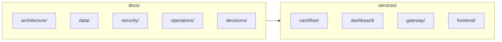

# Documentação — Arch Challenge

Documentação viva do monorepo (bounded contexts **CashFlow** e **Dashboard**, gateway, frontend e infraestrutura local). Os artefatos em **`docs/`** descrevem arquitetura, dados, segurança, operações e decisões (ADRs).

---

## Mapa do repositório

| Área em `docs/` | Conteúdo |
|-----------------|----------|
| [architecture/](./architecture/README.md) | Visão C4, diagramas e documentação **por camadas do CashFlow** (`architecture/cashflow/`) |
| [data/](./data/README.md) | Modelo de dados por capacidade (relacional, documentos, imutável) e convenções |
| [security/](./security/README.md) | Autenticação (Keycloak), autorização no gateway, comunicação entre serviços |
| [operations/](./operations/) | Observabilidade, Kubernetes, deploy manual |
| [decisions/](./decisions/) | ADRs (decisões arquiteturais registradas) |

---

## Serviços principais (código)

| Serviço | Pasta | Função resumida |
|---------|--------|------------------|
| **CashFlow** | `services/cashflow` | Contas correntes, lançamentos (fila + SSE), projeção MongoDB, outbox RabbitMQ |
| **Dashboard** | `services/dashboard` | Leitura de consolidados / extrato (consome eventos do CashFlow) |
| **Gateway** | `services/gateway` | Ocelot — JWT, roles, rate limit, roteamento `/cashflow/v1/*` e `/dashboard/v1/*` |
| **Frontend** | `services/frontend` | SPA Angular (módulos por feature) |

Requisitos do desafio e escopo de produto: [`Challange.md`](../Challange.md) na raiz do repositório.

---

## Leitura recomendada por objetivo

| Objetivo | Onde começar |
|----------|----------------|
| Entender o fluxo HTTP → fila → projeção | [architecture/cashflow/README.md](./architecture/cashflow/README.md) |
| Endpoints e rotas reais da API CashFlow | [architecture/cashflow/layer-01-api.md](./architecture/cashflow/layer-01-api.md) |
| PostgreSQL / MongoDB / ImmuDB | [data/README.md](./data/README.md) |
| Gateway vs API (JWT e roles) | [decisions/ADR-009-api-gateway-ocelot.md](./decisions/ADR-009-api-gateway-ocelot.md), [security/authorization.md](./security/authorization.md) |
| Eventos RabbitMQ | [decisions/ADR-003-comunicacao-assincrona-rabbitmq.md](./decisions/ADR-003-comunicacao-assincrona-rabbitmq.md), [decisions/ADR-007-formato-mensagens-json.md](./decisions/ADR-007-formato-mensagens-json.md) |

---

## Convenções

- **Rotas na borda externa:** prefixo do gateway (`/cashflow/v1/...`), mapeadas para `/api/...` nos serviços ASP.NET Core.
- **Nomes de evento no domínio CashFlow:** o handler usa `TransactionExecuted` como nome de negócio/outbox; o contrato publicado na exchange `cashflow.events` é `TransactionRegisteredIntegrationEvent` (projeto `shared/Contracts`).
- **Documentação e código:** quando houver divergência, o código em `services/*` é a fonte de verdade; esta pasta deve ser atualizada junto com mudanças de API ou contratos.
