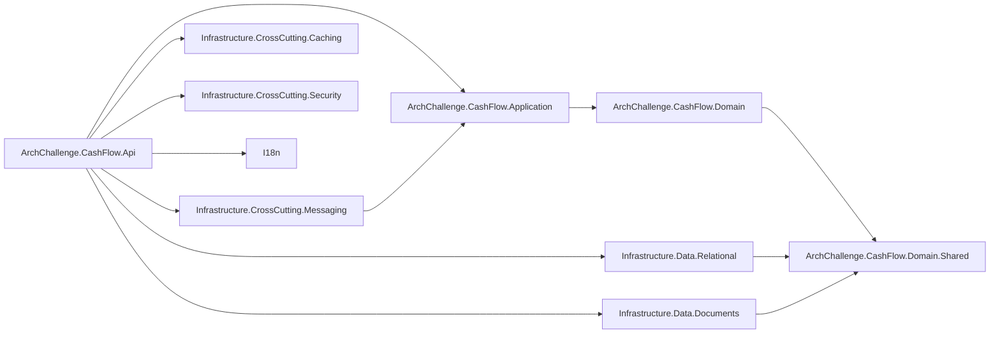
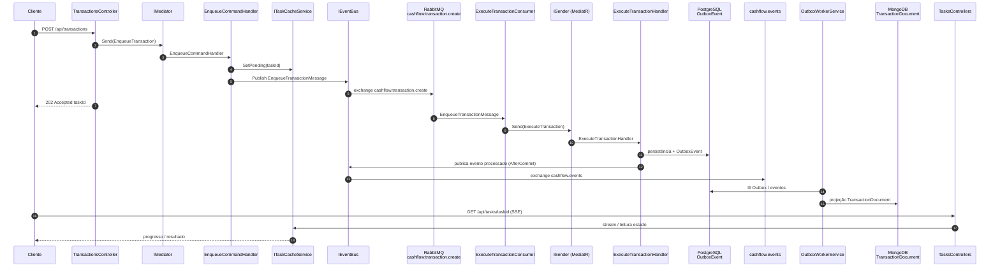

# Cashflow API — Arquitetura por Camadas

Este serviço é o **bounded context** de lançamentos financeiros (débitos e créditos), conforme o desafio técnico descrito em [`Challange.md`](../../../Challange.md) na raiz do repositório. Os requisitos não funcionais relevantes orientam o desenho: a **escrita assíncrona** dos lançamentos garante **independência** do serviço de consolidado diário (falhas ou indisponibilidade do consolidado não derrubam o registro de transações); em paralelo, o consolidado deve suportar **50 requisições por segundo** com **no máximo 5% de perda** de requisições em picos, o que reforça a separação de responsabilidades e o uso de mensageria e projeções.

---

## Dados — visão por capacidade (relacional, documentos, imutável)

A visão transversal de **dados por capacidade** (relacional, documentos, imutável) está em **[data/README.md](../../data/README.md)** — válida para microsserviços futuros; o **Cashflow** é a implementação de referência documentada nas camadas abaixo.

---

## Mapa de camadas

O diagrama abaixo mostra os projetos .NET e as **dependências de projeto a projeto** (referências entre assemblies).

**Notas:**

- **Application** depende de **Domain**, que por sua vez depende de **Domain.Shared**.
- A **Api** referencia camadas de infraestrutura (dados relacional, documentos, mensageria, cache, segurança) e **I18n** para composição na borda da aplicação (detalhe em [layer-10-i18n.md](./layer-10-i18n.md)).
- **Infrastructure.Data.Relational** e **Infrastructure.Data.Documents** dependem de **Domain.Shared** (tipos e contratos compartilhados).
- **Infrastructure.CrossCutting.Messaging** referencia **Application** porque os consumidores MassTransit disparam comandos/consultas MediatR (`ISender`, `IRequest`).
- **`AuditContext`** (responsabilidade de auditoria) vive em **Application** (`Application.Common.Audit`), registrado como scoped na composição da aplicação. Não há projeto separado de auditoria.

---

## Fluxo de negócio end-to-end

Visão do fluxo desde a aceitação da requisição HTTP até a projeção em documento e o acompanhamento da tarefa pelo cliente.

---

## Índice das camadas

| # | Camada | Arquivo |
|---|--------|---------|
| — | **Dados (capacidade)** — resumo relacional / documentos / imutável | [data/README.md](../../data/README.md) |
| 1 | Api | [layer-01-api.md](./layer-01-api.md) |
| 2 | Application | [layer-02-application.md](./layer-02-application.md) |
| 3 | Domain + Shared | [layer-03-domain.md](./layer-03-domain.md) |
| 4 | Infrastructure.Data.Relational | [layer-04-relational.md](./layer-04-relational.md) |
| 5 | Infrastructure.Data.Documents | [layer-05-documents.md](./layer-05-documents.md) |
| 6 | Infrastructure.CrossCutting.Messaging | [layer-06-messaging.md](./layer-06-messaging.md) |
| 7 | Infrastructure.CrossCutting.Caching | [layer-07-caching.md](./layer-07-caching.md) |
| 8 | Infrastructure.CrossCutting.Security | [layer-08-security.md](./layer-08-security.md) |
| 9 | Imutável — auditoria (Application + Immutable + OutboxAudit) | [layer-09-immutable.md](./layer-09-immutable.md) |
| 10 | Infrastructure.CrossCutting.I18n | [layer-10-i18n.md](./layer-10-i18n.md) |

---

## Decisões arquiteturais relacionadas

| ADR | Título |
|-----|--------|
| [ADR-002](../../decisions/ADR-002-separacao-cashflow-dashboard.md) | Separação CashFlow e Dashboard (bounded contexts) |
| [ADR-003](../../decisions/ADR-003-comunicacao-assincrona-rabbitmq.md) | Comunicação assíncrona via RabbitMQ |
| [ADR-004](../../decisions/ADR-004-backend-aspnet-core.md) | Backend com ASP.NET Core |
| [ADR-006](../../decisions/ADR-006-postgresql-database-per-service.md) | PostgreSQL e database per service |
| [ADR-008](../../decisions/ADR-008-autenticacao-autorizacao-keycloak.md) | Autenticação e autorização com Keycloak |
| [ADR-012](../../decisions/ADR-012-specification-pattern-read-repository.md) | Specification pattern e repositório de leitura |
| [ADR-015](../../decisions/ADR-015-segregacao-schemas-postgresql.md) | Segregação de schemas PostgreSQL por responsabilidade e controle de acesso |
| [ADR-016](../../decisions/ADR-016-immudb-armazenamento-imutavel-auditoria.md) | ImmuDB como armazenamento imutável para auditoria |
