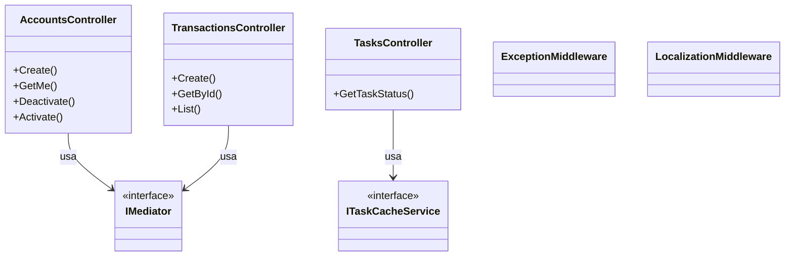
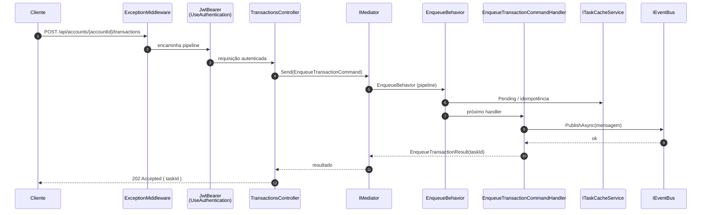
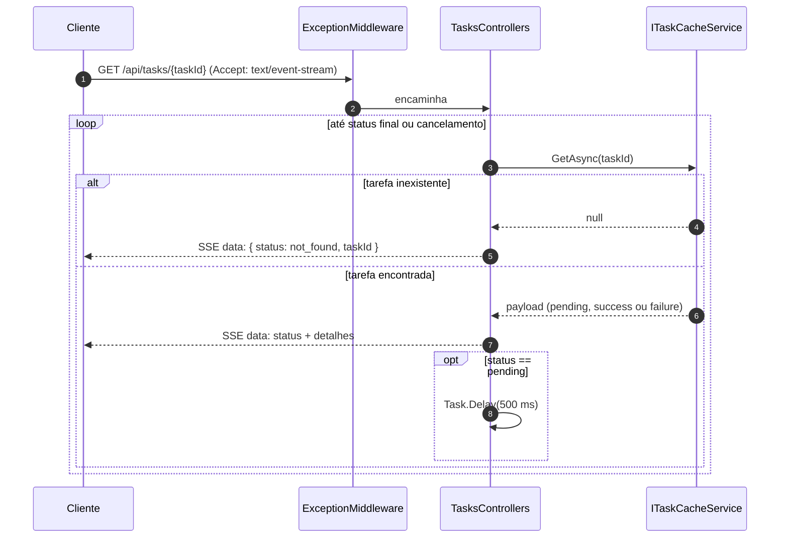

# Camada Api — ArchChallenge.CashFlow.Api

O projeto **ArchChallenge.CashFlow.Api** é o host ASP.NET Core do serviço Cashflow: expõe endpoints HTTP, compõe middlewares e extensões de infraestrutura (segurança, cache, dados, mensageria, observabilidade) e delega regras de aplicação ao **MediatR**.

---

## Responsabilidades

### Escopo da camada

- Ponto de entrada HTTP da aplicação.
- Roteamento de requisições para controllers e delegação de comandos e consultas via **MediatR** (`IMediator` / `ISender`).
- Pipeline ASP.NET Core: autenticação JWT (Bearer), autorização, métricas HTTP expostas pelo **prometheus-net** no endpoint **`/metrics`**, e health checks em **`/health/liveness`** (processo vivo, sem checagens de dependência) e **`/health/readiness`** (PostgreSQL, MongoDB, Redis e RabbitMQ).
- **Swagger/OpenAPI** com documentação interativa dos endpoints (configuração via extensões dedicadas).
- **Localização** de mensagens conforme cabeçalho **Accept-Language**, aplicada por middleware na pipeline (especificação e links para o código em [layer-10-i18n.md](./layer-10-i18n.md)).
- **Middleware de exceções** centralizado (`ExceptionMiddleware`), que captura falhas não tratadas e devolve resposta HTTP consistente.
- **Migração automática** do banco relacional na inicialização (`MigrateAsync`), garantindo schema atualizado antes de servir tráfego.
- Cabeçalho **`Idempotency-Key`** obrigatório no **POST** de transação (valor vazio = nova operação; UUID = deduplicação).
- Endpoint **SSE** em **`GET /api/tasks/{taskId}`** para acompanhamento assíncrono do processamento de lançamentos enfileirados (stream `text/event-stream` com polling no cache a intervalos curtos até estado final).

---

## Diagrama de Classes

### Visão estática

Visão simplificada dos controllers da borda HTTP, middlewares e contratos injetados.

**Notas:**

- `TransactionsController` aplica `[Authorize]` nas rotas de transações; comandos e consultas são enviados ao **MediatR**.
- `TasksController` não exige JWT no código atual: o cliente acompanha o `taskId` retornado no **202 Accepted** do POST.
- `ExceptionMiddleware` e `LocalizationMiddleware` participam da pipeline global configurada em `Program.cs` e extensões.

---

## Endpoints

### Rotas expostas

| Método | Rota | Autenticado | Descrição | Retorno |
|--------|------|-------------|-----------|---------|
| POST | `/api/accounts` | Sim | Cria a conta do usuário (`sub`); 409 se já existir | `201` com envelope `Result<CreateAccountResult>` |
| GET | `/api/accounts/me` | Sim | Dados da conta corrente do usuário | `200` com `GetMyAccountResult`; `404` |
| PATCH | `/api/accounts/me/deactivate` | Sim | Desativa conta (soft-delete) | `204` ou erro via `ToActionResult()` |
| PATCH | `/api/accounts/me/activate` | Sim | Reativa conta | `204` ou erro via `ToActionResult()` |
| POST | `/api/accounts/{accountId}/transactions` | Sim | Enfileira lançamento; header **`Idempotency-Key` obrigatório** (vazio ou UUID) | `202` com `{ taskId }`; `400` / `404` |
| GET | `/api/accounts/{accountId}/transactions/{id}` | Sim | Detalhe do lançamento | `200` com `GetTransactionByIdResult`; `404` |
| GET | `/api/accounts/{accountId}/transactions` | Sim | Lista (Mongo) com filtros de query | `200` com `GetAllTransactionsResult`; `400` / `404` |
| GET | `/api/tasks/{taskId}` | Não | Stream SSE com status da tarefa | `text/event-stream`; evento inicial `not_found` se não houver tarefa |
| GET | `/metrics` | Não | Métricas no formato Prometheus | `text/plain` |
| GET | `/health/liveness` | Não | Liveness: processo respondendo, sem testar dependências | `200` JSON |
| GET | `/health/readiness` | Não | Readiness: agrega checagens marcadas como prontas (SQL, Mongo, Redis, RabbitMQ) | `200` ou `503` JSON |

**Borda com gateway:** com o prefixo configurado no Ocelot, as mesmas rotas aparecem externamente como `/cashflow/v1/accounts`, `/cashflow/v1/accounts/{accountId}/transactions`, etc. (o segmento `/api/` é substituído pelo prefixo `/cashflow/v1/`).

---

## Diagrama de Sequência — POST `/api/accounts/{accountId}/transactions`

### Enfileiramento e resposta 202

Fluxo simplificado do aceite do lançamento: validação pipeline, **`EnqueueBehavior`** (cache/idempotência/`TaskId`) e **`EnqueueTransactionCommandHandler`** (publicação na fila).

---

## Diagrama de Sequência — SSE `GET /api/tasks/{taskId}`

### Polling a cada 500 ms

O controller mantém a conexão aberta, lê o estado no cache e envia eventos SSE; enquanto o status for pendente, aguarda **500 ms** e repete.

Se o cliente fechar a conexão, o cancelamento do `CancellationToken` encerra o loop sem erro explícito no fluxo feliz.

---

## Decisões

### ADRs de referência

- **[ADR-004 — Backend com ASP.NET Core](../../decisions/ADR-004-backend-aspnet-core.md)** — fundamenta o uso de ASP.NET Core como stack do host, convenções de pipeline e extensibilidade via `Program.cs` e serviços.
- **[ADR-008 — Autenticação e autorização com Keycloak](../../decisions/ADR-008-autenticacao-autorizacao-keycloak.md)** — alinha a validação de JWT na API com o Identity Provider corporativo e o modelo de claims usado na autorização dos endpoints protegidos.
