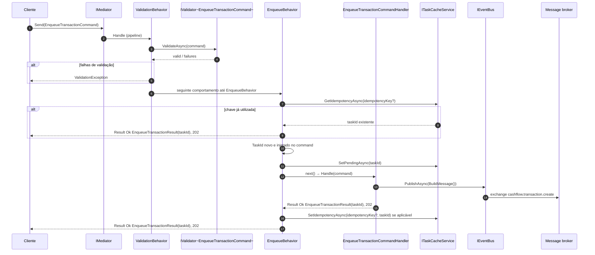
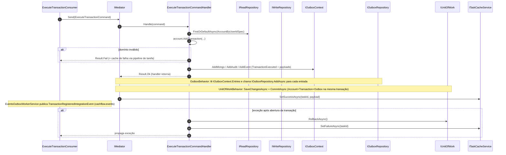
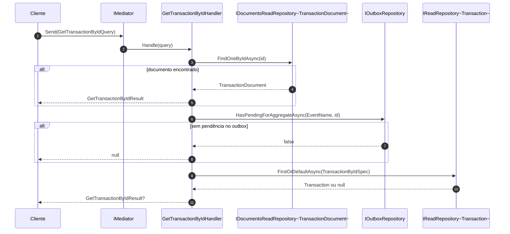

# Camada Application — ArchChallenge.CashFlow.Application

O projeto **ArchChallenge.CashFlow.Application** concentra os **casos de uso** do bounded context Cashflow: orquestração de comandos e consultas, integração com cache de tarefas, mensageria e repositórios de leitura/escrita expostos por interfaces da infraestrutura. A camada não contém regras de domínio puras (ficam no Domain); aqui ficam **handlers MediatR**, **comportamentos de pipeline**, **DTOs de resultado** e **contratos de integração** usados pela Api e pelos consumidores de mensagens.

---

## Responsabilidades

A camada Application adota **CQRS leve** com **MediatR**: comandos e consultas são representados por `IRequest` / `IRequest<TResponse>`, cada um com um handler dedicado. Isso mantém os fluxos explícitos e testáveis sem impor um framework de CQRS completo.

O **enqueue** de transações combina dois pontos no MediatR: o **`EnqueueBehavior<TCommand, TResponse>`** (`IPipelineBehavior`), que centraliza **idempotência**, **geração/injeção do `taskId`**, marcação **`Pending`** no **`ITaskCacheService`** antes do handler e vínculo chave→`taskId` após sucesso; e o **`EnqueueTransactionCommandHandler`**, que apenas **`BuildMessage()`** e **`IEventBus.PublishAsync`** (sem Unit of Work/outbox neste fluxo).

A **validação** de entrada é aplicada de forma transversal pelo **`ValidationBehavior`**, um `IPipelineBehavior` que executa todos os `IValidator<TRequest>` registrados (FluentValidation) **antes** do pipeline seguir até o comportamento de enqueue e o handler, lançando `ValidationException` quando há falhas. Os validators podem usar **`IStringLocalizer<Messages>`** e **`MessageKeys`** para mensagens nos recursos `.resx` — ver [layer-10-i18n.md](./layer-10-i18n.md).

Comandos **`IAuditable`** recebem **`UserId`** e **`OccurredAt`** no pipeline antes do handler através do **`IdentityBehavior`** (e, na borda HTTP, do **`IdentityCommandFilter`** quando aplicável — ver [layer-08-security.md](./layer-08-security.md)). Persistência da auditoria imutável, outboxes e **ImmuDB** seguem o desenho de [layer-09-immutable.md](./layer-09-immutable.md).

O **tratamento de idempotência** no enqueue combina a chave opcional `IEnqueueCommand.IdempotencyKey` com **`ITaskCacheService`**: requisições repetidas com a mesma chave recebem o mesmo `taskId` já associado, dentro da janela de TTL configurada (por exemplo, **24 horas**).

As **consultas** exploram **leitura híbrida** quando necessário: em especial, `GetTransactionById` consulta primeiro o **repositório de documentos** (MongoDB); se o documento ainda não existir mas houver **evento de outbox pendente** para o agregado, o handler faz **fallback** ao repositório **relacional** via specification, evitando retorno vazio durante a janela entre persistência e projeção.

---

## Padrões adotados

| Padrão | Implementação |
|--------|---------------|
| CQRS (Command/Query Separation) | Commands: `EnqueueTransactionCommand`, `ExecuteTransactionCommand`; Queries: `GetAllTransactionsQuery`, `GetTransactionByIdQuery` |
| Pipeline Behavior (validação) | `ValidationBehavior<TRequest,TResponse>` — validação automática via FluentValidation antes de cada handler |
| Pipeline Behavior (identidade em comandos `IAuditable`) | `IdentityBehavior<TRequest,TResponse>` — preenche `UserId` e `OccurredAt` quando vierem vazios (ex.: comandos vindos só do RabbitMQ já preenchidos na mensagem) |
| Pipeline Behavior (enqueue: taskId, cache, idempotência) | `EnqueueBehavior<TCommand,TResponse>` — executa antes do handler para comandos `IEnqueueCommand<TResponse>` |
| Publicação assíncrona (integração) | Entradas em `IOutboxContext` + `OutboxBehavior`; `EventsOutboxWorkerService` publica `TransactionRegisteredIntegrationEvent` via `IEventBus` |
| Idempotência | `IEnqueueCommand.IdempotencyKey` + `ITaskCacheService` com TTL 24h |
| Leitura Híbrida | `GetTransactionByIdHandler`: Mongo → Outbox pendente → Relacional |

---

## Diagrama de Classes

```mermaid
classDiagram
  direction TB

  class EnqueueCommand~TResponse~ {
    <<abstract record>>
    +string UserId
    +DateTime OccurredAt
    +Guid IdempotencyKey
    +Guid TaskId
  }

  class IEnqueueCommand~TResponse~ {
    <<interface>>
    +Guid? IdempotencyKey
    +Guid TaskId
  }

  class TrackedCommand~TResponse~ {
    <<abstract record>>
    +Guid TaskId
    +string UserId
    +DateTime OccurredAt
  }

  class EnqueueTransactionCommand {
    +TransactionType Type
    +decimal Amount
    +string? Description
    +Guid? IdempotencyKey
    +BuildMessage() EnqueueTransactionMessage
  }

  class ExecuteTransactionCommand {
    <<record>>
    +TransactionType Type
    +decimal Amount
    +string? Description
  }

  class EnqueueBehavior~TCommand,TResponse~ {
    <<sealed>>
    idempotencia + TaskId + cache Pending
  }

  class EnqueueTransactionCommandHandler {
    <<sealed>>
    BuildMessage() + IEventBus.PublishAsync
  }

  class ExecuteTransactionCommandHandler {
    <<sealed>>
    ValidateBusiness + AddTransaction + outboxes
  }

  class CreateAccountCommandHandler {
    <<sealed>>
    verifica duplicidade + AddAsync + outboxes
  }

  class GetAllTransactionsHandler {
  }

  class GetTransactionByIdHandler {
    leitura hibrida: Mongo to Outbox to Relacional
  }

  class ValidationBehavior~TRequest,TResponse~ {
    <<sealed>>
  }

  class IRequestHandler~TRequest,TResponse~ {
    <<interface>>
  }

  class IPipelineBehavior~TRequest,TResponse~ {
    <<interface>>
  }

  class IOutboxContext {
    <<interface>>
    +AddAudit(eventName, payload)
    +AddMongo(eventName, payload)
    +AddEvent(eventName, payload)
  }

  class IOutboxRepository {
    <<interface>>
  }

  class IWriteRepository~TEntity~ {
    <<interface>>
  }

  class IUnitOfWork {
    <<interface>>
  }

  class ITaskCacheService {
    <<interface>>
  }

  class IEventBus {
    <<interface>>
  }

  class IDocumentsReadRepository~TDocument~ {
    <<interface>>
  }

  class IReadRepository~TEntity~ {
    <<interface>>
  }

  EnqueueTransactionCommand --|> EnqueueCommand~TResponse~ : herda
  ExecuteTransactionCommand --|> TrackedCommand~TResponse~ : herda
  IEnqueueCommand~TResponse~ <|.. EnqueueCommand~TResponse~ : implementa
  IPipelineBehavior~TRequest,TResponse~ <|.. EnqueueBehavior~TCommand,TResponse~ : implementa
  IPipelineBehavior~TRequest,TResponse~ <|.. ValidationBehavior~TRequest,TResponse~ : implementa
  IRequestHandler~TRequest,TResponse~ <|.. EnqueueTransactionCommandHandler : implementa
  IRequestHandler~TRequest,TResponse~ <|.. ExecuteTransactionCommandHandler : implementa
  IRequestHandler~TRequest,TResponse~ <|.. CreateAccountCommandHandler : implementa

  EnqueueTransactionCommandHandler ..> IEventBus : PublishAsync
  EnqueueTransactionCommandHandler ..> ITaskCacheService : usa via EnqueueBehavior

  ExecuteTransactionCommandHandler ..> IReadRepository~TEntity~ : carrega Account
  ExecuteTransactionCommandHandler ..> IOutboxContext : registra outboxes

  CreateAccountCommandHandler ..> IReadRepository~TEntity~ : verifica duplicidade
  CreateAccountCommandHandler ..> IWriteRepository~TEntity~ : AddAsync nova conta
  CreateAccountCommandHandler ..> IOutboxContext : registra outboxes

  GetAllTransactionsHandler ..> IDocumentsReadRepository~TDocument~ : ListAsync
  GetAllTransactionsHandler ..> IReadRepository~TEntity~ : verifica conta

  GetTransactionByIdHandler ..> IDocumentsReadRepository~TDocument~ : FindOneByIdAsync
  GetTransactionByIdHandler ..> IReadRepository~TEntity~ : verifica conta + fallback
  GetTransactionByIdHandler ..> IOutboxRepository : HasPendingForAggregateAsync
```

---

## Diagrama de Sequência — EnqueueTransactionCommand

Fluxo completo do enqueue: verificação de idempotência, registro da tarefa como pendente, montagem da mensagem, publicação no broker e amarração chave de idempotência ao `taskId`.

---

## Diagrama de Sequência — `ExecuteTransactionCommand`

Persistência transacional com **outbox** (`IOutboxContext` + `OutboxBehavior` + `UnitOfWorkBehavior`), atualização do cache de tarefa após sucesso e **publicação assíncrona** dos eventos de integração pelo **`EventsOutboxWorkerService`** (lê outbox → `IEventBus` → RabbitMQ).

---

## Diagrama de Sequência — GetTransactionByIdQuery (leitura híbrida)

Ordem de resolução: documento projetado; em seguida verificação de pendência no outbox; por fim leitura relacional por specification.

---

## Decisões

- **[ADR-003 — Comunicação assíncrona via RabbitMQ](../../decisions/ADR-003-comunicacao-assincrona-rabbitmq.md)** — fundamenta o uso de **EDA**, filas e o papel do **enqueue** + consumidores na arquitetura do Cashflow; os handlers de aplicação orquestram publicação e consumo alinhados a essa decisão.

- **[ADR-012 — Specification pattern e repositório de leitura](../../decisions/ADR-012-specification-pattern-read-repository.md)** — justifica consultas como `TransactionByIdSpec` no **fallback relacional** de `GetTransactionByIdHandler`, mantendo critérios de leitura encapsulados e composíveis com o repositório de leitura.
