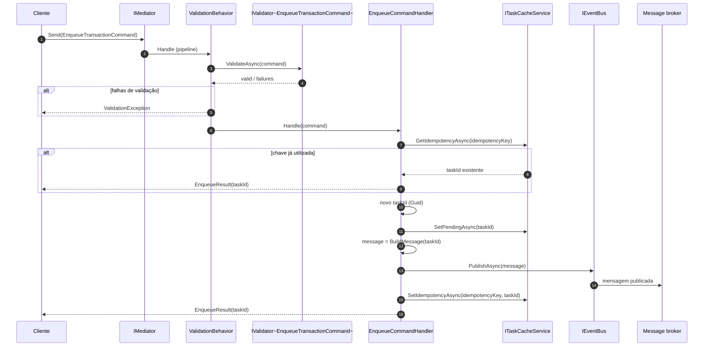
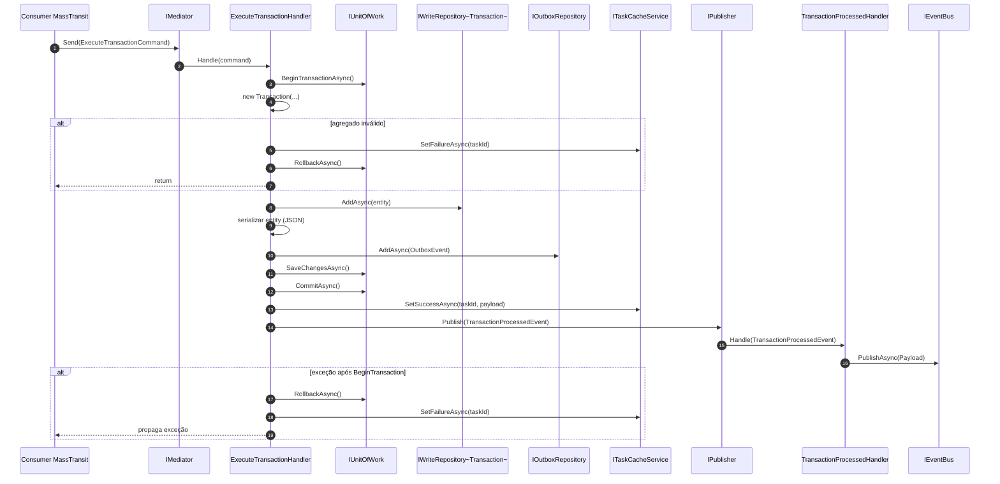
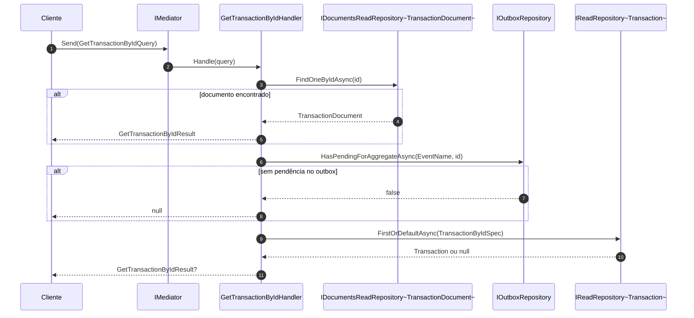

# Camada Application — ArchChallenge.CashFlow.Application

O projeto **ArchChallenge.CashFlow.Application** concentra os **casos de uso** do bounded context Cashflow: orquestração de comandos e consultas, integração com cache de tarefas, mensageria e repositórios de leitura/escrita expostos por interfaces da infraestrutura. A camada não contém regras de domínio puras (ficam no Domain); aqui ficam **handlers MediatR**, **comportamentos de pipeline**, **DTOs de resultado** e **contratos de integração** usados pela Api e pelos consumidores de mensagens.

---

## Responsabilidades

A camada Application adota **CQRS leve** com **MediatR**: comandos e consultas são representados por `IRequest` / `IRequest<TResponse>`, cada um com um handler dedicado. Isso mantém os fluxos explícitos e testáveis sem impor um framework de CQRS completo.

O **enqueue** de transações é tratado por um **handler genérico** (`EnqueueCommandHandler<TCommand, TMessage>`), reutilizável para qualquer comando que implemente `IEnqueueCommand<TMessage>`. Assim, a lógica de **geração de `taskId`**, marcação de tarefa como pendente no cache, **publicação no broker** e registro de **idempotência** fica centralizada.

A **validação** de entrada é aplicada de forma transversal pelo **`ValidationBehavior`**, um `IPipelineBehavior` que executa todos os `IValidator<TRequest>` registrados (FluentValidation) **antes** do handler correspondente, lançando `ValidationException` quando há falhas.

O **tratamento de idempotência** no enqueue combina a chave opcional `IEnqueueCommand.IdempotencyKey` com **`ITaskCacheService`**: requisições repetidas com a mesma chave recebem o mesmo `taskId` já associado, dentro da janela de TTL configurada (por exemplo, **24 horas**).

As **consultas** exploram **leitura híbrida** quando necessário: em especial, `GetTransactionById` consulta primeiro o **repositório de documentos** (MongoDB); se o documento ainda não existir mas houver **evento de outbox pendente** para o agregado, o handler faz **fallback** ao repositório **relacional** via specification, evitando retorno vazio durante a janela entre persistência e projeção.

---

## Padrões adotados

| Padrão | Implementação |
|--------|---------------|
| CQRS (Command/Query Separation) | Commands: `EnqueueTransactionCommand`, `ExecuteTransactionCommand`; Queries: `GetAllTransactionsQuery`, `GetTransactionByIdQuery` |
| Pipeline Behavior | `ValidationBehavior<TRequest,TResponse>` — validação automática via FluentValidation antes de cada handler |
| Generic Enqueue Handler | `EnqueueCommandHandler<TCommand,TMessage>` — reutilizável para qualquer command que implemente `IEnqueueCommand<TMessage>` |
| Application Event (MediatR INotification) | `TransactionProcessedEvent` desacopla persistência de publicação no broker |
| Idempotência | `IEnqueueCommand.IdempotencyKey` + `ITaskCacheService` com TTL 24h |
| Leitura Híbrida | `GetTransactionByIdHandler`: Mongo → Outbox pendente → Relacional |

---

## Diagrama de Classes

```mermaid
classDiagram
  direction TB

  class IEnqueueCommand~TMessage~ {
    +Guid? IdempotencyKey
    +BuildMessage(Guid taskId) TMessage
  }

  class EnqueueTransactionCommand {
    +TransactionType Type
    +decimal Amount
    +string? Description
    +Guid? IdempotencyKey
    +BuildMessage(Guid taskId) EnqueueTransactionMessage
  }

  class EnqueueCommandHandler~TCommand,TMessage~ {
    <<sealed>>
  }

  class IRequestHandler~TRequest,TResponse~ {
    <<interface>>
  }

  class IPipelineBehavior~TRequest,TResponse~ {
    <<interface>>
  }

  class ValidationBehavior~TRequest,TResponse~ {
  }

  class ExecuteTransactionHandler {
    <<sealed>>
  }

  class IWriteRepository~TEntity~ {
    <<interface>>
  }

  class IOutboxRepository {
    <<interface>>
  }

  class IPublisher {
    <<interface>>
  }

  class IUnitOfWork {
    <<interface>>
  }

  class ITaskCacheService {
    <<interface>>
  }

  class GetAllTransactionsHandler {
  }

  class IDocumentsReadRepository~TDocument~ {
    <<interface>>
  }

  class GetTransactionByIdHandler {
  }

  class IReadRepository~TEntity~ {
    <<interface>>
  }

  class TransactionProcessedHandler {
    <<sealed>>
  }

  class IEventBus {
    <<interface>>
  }

  IEnqueueCommand~TMessage~ <|.. EnqueueTransactionCommand : implementa
  IRequestHandler~TRequest,TResponse~ <|.. EnqueueCommandHandler~TCommand,TMessage~ : implementa
  IRequestHandler~TRequest,TResponse~ <|.. ExecuteTransactionHandler : implementa
  IPipelineBehavior~TRequest,TResponse~ <|.. ValidationBehavior~TRequest,TResponse~ : implementa

  note for EnqueueCommandHandler~TCommand,TMessage~
    Especialização: TResponse = EnqueueResult.
  end note

  note for ExecuteTransactionHandler
    Especialização: TRequest = ExecuteTransactionCommand; TResponse = Unit (MediatR).
  end note

  ExecuteTransactionHandler ..> IWriteRepository~Transaction~ : usa
  ExecuteTransactionHandler ..> IOutboxRepository : usa
  ExecuteTransactionHandler ..> IPublisher : usa
  ExecuteTransactionHandler ..> IUnitOfWork : usa
  ExecuteTransactionHandler ..> ITaskCacheService : usa

  GetAllTransactionsHandler ..> IDocumentsReadRepository~TransactionDocument~ : usa

  GetTransactionByIdHandler ..> IDocumentsReadRepository~TransactionDocument~ : usa
  GetTransactionByIdHandler ..> IReadRepository~Transaction~ : usa
  GetTransactionByIdHandler ..> IOutboxRepository : usa

  TransactionProcessedHandler ..> IEventBus : usa
```

---

## Diagrama de Sequência — EnqueueTransactionCommand

Fluxo completo do enqueue: verificação de idempotência, registro da tarefa como pendente, montagem da mensagem, publicação no broker e amarração chave de idempotência ao `taskId`.



---

## Diagrama de Sequência — ExecuteTransactionCommand

Persistência transacional com **outbox**, atualização do cache de tarefa em sucesso e notificação de domínio repassada ao broker via `TransactionProcessedHandler`.



---

## Diagrama de Sequência — GetTransactionByIdQuery (leitura híbrida)

Ordem de resolução: documento projetado; em seguida verificação de pendência no outbox; por fim leitura relacional por specification.



---

## Decisões

- **[ADR-003 — Comunicação assíncrona via RabbitMQ](../../decisions/ADR-003-comunicacao-assincrona-rabbitmq.md)** — fundamenta o uso de **EDA**, filas e o papel do **enqueue** + consumidores na arquitetura do Cashflow; os handlers de aplicação orquestram publicação e consumo alinhados a essa decisão.

- **[ADR-012 — Specification pattern e repositório de leitura](../../decisions/ADR-012-specification-pattern-read-repository.md)** — justifica consultas como `TransactionByIdSpec` no **fallback relacional** de `GetTransactionByIdHandler`, mantendo critérios de leitura encapsulados e composíveis com o repositório de leitura.
