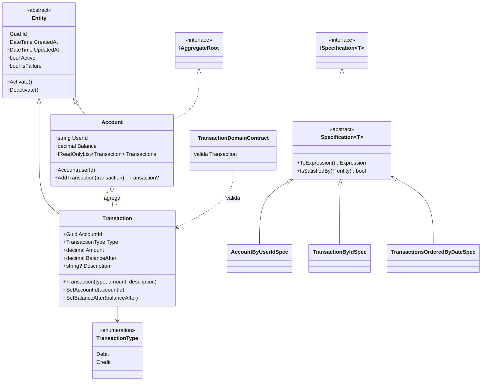
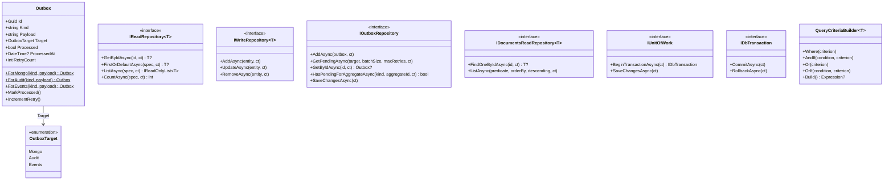
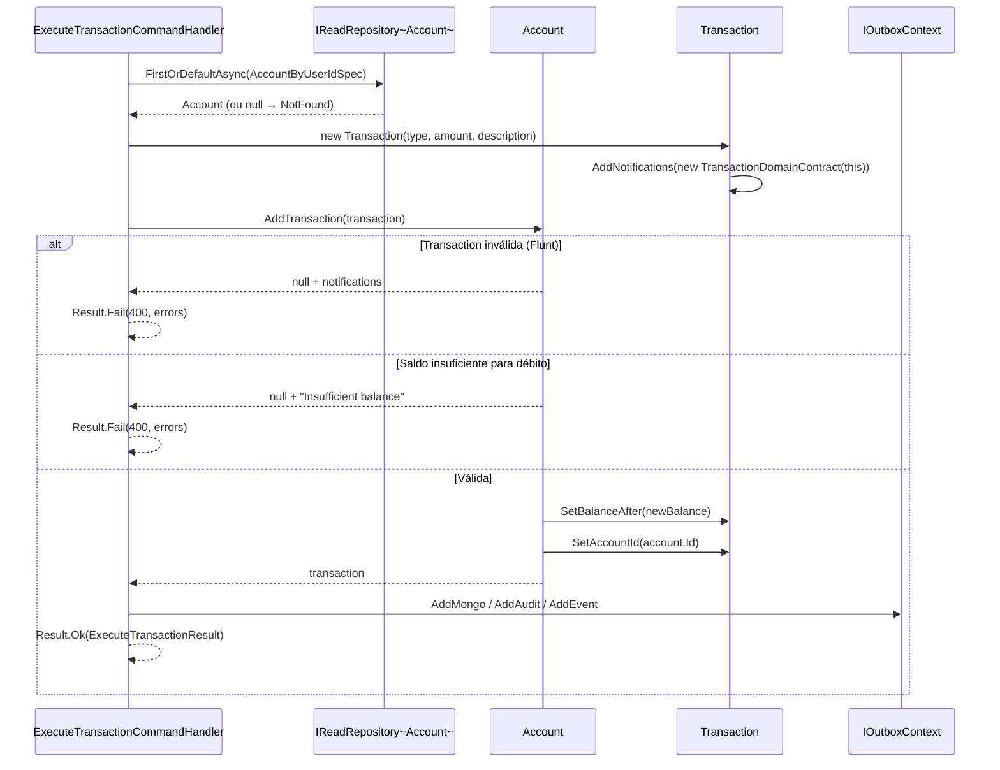

# Camada Domain + Shared — ArchChallenge.CashFlow.Domain / Domain.Shared

Este documento descreve o núcleo de domínio (`ArchChallenge.CashFlow.Domain`) e os contratos e utilitários compartilhados (`ArchChallenge.CashFlow.Domain.Shared`) do serviço Cashflow.

---

## Responsabilidades

### Núcleo de negócio

A camada **Domain** concentra entidades, agregados, contratos de validação (Flunt) e especificações de consulta alinhadas ao modelo de negócio. O estado relevante é exposto com **setters privados** ou **protected**, favorecendo invariantes explícitas e evitando mutação acidental fora dos métodos de domínio.

### Imutabilidade e encapsulamento

Propriedades como `Type`, `Amount` e `Description` em `Transaction` são alteradas apenas por construtores ou métodos internos ao agregado. A classe base `Entity` controla `Id`, auditoria (`CreatedAt`, `UpdatedAt`) e o flag `Active` por meio de métodos como `Activate()` e `Deactivate()`.

### Agregado Account

`Account` é a **raiz de agregação** do bounded context: um usuário (identificado pelo claim `sub` do JWT) possui exatamente uma conta. Toda transação é criada através de `Account.AddTransaction(transaction)`, que aplica as invariantes de negócio — por exemplo, verificação de **saldo suficiente** antes de confirmar um débito — e define os campos denormalizados `BalanceAfter` e `AccountId` na transação. Sem passar pelo método do agregado, a `Transaction` não pode ser persistida corretamente.

### Validação por contratos Flunt

Na criação de `Transaction`, o construtor chama `AddNotifications(new TransactionDomainContract(this))`. Os contratos Flunt avaliam o agregado e acumulam **notificações** em vez de lançar exceções no construtor, permitindo que a camada de aplicação decida como tratar falhas (por exemplo, falha de comando sem exception de domínio).

### Specification Pattern

`Specification<T>` (e `ISpecification<T>`) encapsulam critérios reutilizáveis (`ToExpression()`, `IsSatisfiedBy`). Especificações concretas como `AccountByUserIdSpec`, `TransactionByIdSpec` e `TransactionsOrderedByDateSpec` isolam filtros e ordenação do restante da infraestrutura.

### Contratos de repositório e unidade de trabalho

Em **Shared**, interfaces como `IReadRepository<T>`, `IWriteRepository<T>`, `IOutboxRepository`, `IDocumentsReadRepository<T>`, `IUnitOfWork` e `IDbTransaction` definem o **contrato** de persistência e transações sem acoplar o domínio a EF Core ou MongoDB.

### Entidade unificada de Outbox

A entidade `Outbox` (em `Domain.Shared`) representa **qualquer entrada do Transactional Outbox Pattern**, com um campo `Target` do tipo `OutboxTarget` (`Mongo`, `Audit`, `Events`) como discriminador. Todos os três destinos compartilham a mesma tabela `TB_OUTBOX` no PostgreSQL. Isso evita proliferação de tabelas e simplifica o `OutboxRepository`, que filtra por `Target` em `GetPendingAsync`. Os três workers — `MongoOutboxWorkerService`, `EventsOutboxWorkerService` e `AuditOutboxWorkerService` — leem da mesma entidade com targets distintos.

### Utilitários de consulta

`QueryCriteriaBuilder<T>` compõe expressões `Expression<Func<T, bool>>` com `Where`, `AndIf`, `Or`, `OrIf` e `Build`, permitindo montar predicados de forma fluente nos handlers ou repositórios que aceitam critérios dinâmicos.

---

## Diagrama de Classes — Domínio

---

## Diagrama de Classes — Shared (contratos e utilitários)

---

## Diagrama de Sequência — Fluxo de negócio no ExecuteTransactionCommandHandler

O handler aplica as regras de negócio do domínio: carrega o agregado `Account`, cria a `Transaction` (que valida via `TransactionDomainContract`) e delega a aplicação das invariantes ao `Account.AddTransaction`.

---

## Regras de negócio

| Regra | Validação | Onde |
|-------|-----------|------|
| Amount obrigatório e > 0 | FluentValidation + Flunt | `EnqueueTransactionValidator` (Application) + `TransactionDomainContract` (Domain) |
| Description com no máximo 255 caracteres | Flunt | `TransactionDomainContract` |
| Type deve ser Debit ou Credit | FluentValidation | `EnqueueTransactionValidator` |
| Description opcional, máx. 255 caracteres | Flunt | `TransactionDomainContract` |
| Conta deve existir para registrar transação | Handler | `ExecuteTransactionCommandHandler.ValidateBusiness` (via `AccountByUserIdSpec`) |
| Conta deve estar ativa | Handler | `ExecuteTransactionCommandHandler.ValidateBusiness` |
| Saldo suficiente para débito | Domínio | `Account.AddTransaction` — "Insufficient balance for debit." |
| Entidade inativa não é removida fisicamente | Comportamento | `Entity.Deactivate()` |

---

## Decisões

- **Flunt para notificações:** o construtor de `Transaction` não lança exceção por regra de negócio; em vez disso, acumula notificações via Flunt (`TransactionDomainContract`). Isso mantém o domínio previsível e delega o tratamento de erro à aplicação (por exemplo, comando inválido sem stack trace de domínio).

- **`Account` como raiz de agregação:** `Transaction` só pode ser criada e adicionada através de `Account.AddTransaction()`, que aplica invariantes de saldo e retorna `null` com notificações em caso de violação. Isso garante que regras de negócio como saldo insuficiente sejam sempre respeitadas, independente do caminho de escrita.

- **Specification Pattern para consultas reutilizáveis:** critérios como filtro por identificador e ordenação por data ficam em classes dedicadas, alinhadas ao [ADR-012 — Specification Pattern no ReadRepository](../../decisions/ADR-012-specification-pattern-read-repository.md), evitando espalhar `Expression` ou lógica de query ad hoc pelos handlers.

- **Entidade `Outbox` unificada com discriminador `Target`:** uma única classe `Outbox` e tabela `TB_OUTBOX` cobrem todos os três destinos (MongoDB, auditoria, eventos de integração). O campo `OutboxTarget` atua como discriminador para os workers de polling. Isso evita proliferação de tabelas e simplifica o repositório de outbox, que filtra por `Target` para cada worker.
