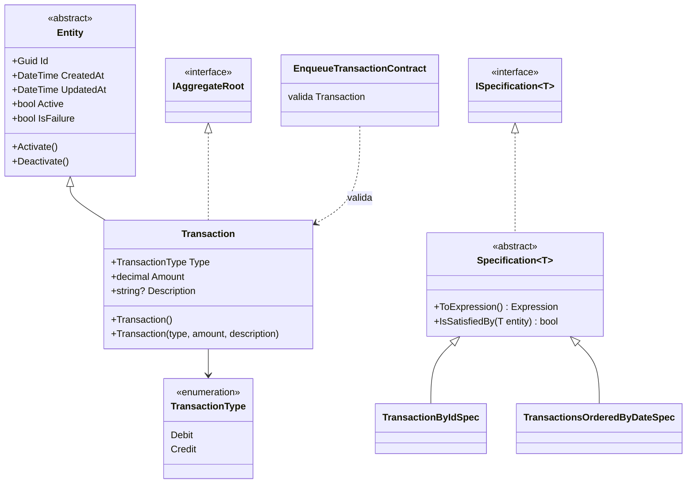
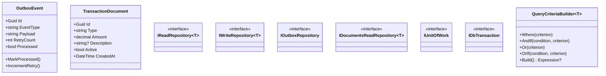
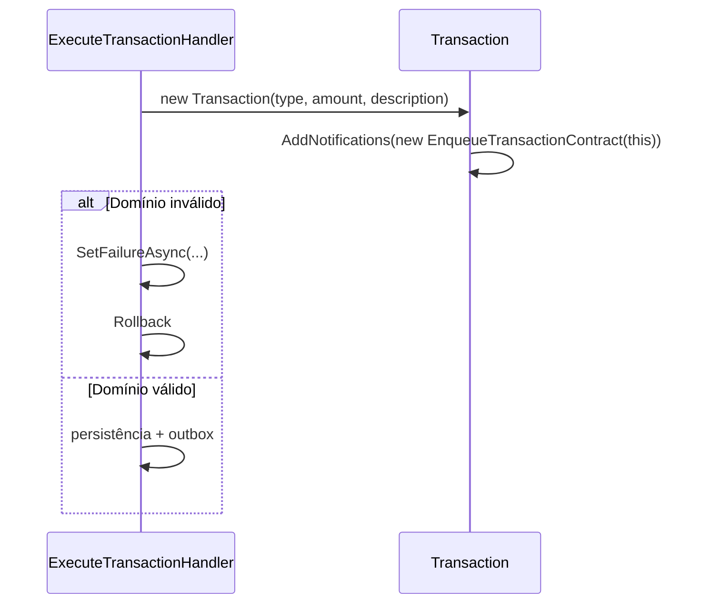

# Camada Domain + Shared — ArchChallenge.CashFlow.Domain / Domain.Shared

Este documento descreve o núcleo de domínio (`ArchChallenge.CashFlow.Domain`) e os contratos e utilitários compartilhados (`ArchChallenge.CashFlow.Domain.Shared`) do serviço Cashflow.

---

## Responsabilidades

### Núcleo de negócio

A camada **Domain** concentra entidades, agregados, contratos de validação (Flunt) e especificações de consulta alinhadas ao modelo de negócio. O estado relevante é exposto com **setters privados** ou **protected**, favorecendo invariantes explícitas e evitando mutação acidental fora dos métodos de domínio.

### Imutabilidade e encapsulamento

Propriedades como `Type`, `Amount` e `Description` em `Transaction` são alteradas apenas por construtores ou métodos internos ao agregado. A classe base `Entity` controla `Id`, auditoria (`CreatedAt`, `UpdatedAt`) e o flag `Active` por meio de métodos como `Activate()` e `Deactivate()`.

### Validação por contratos Flunt

Na criação de `Transaction`, o construtor chama `AddNotifications(new EnqueueTransactionContract(this))`. Os contratos Flunt avaliam o agregado e acumulam **notificações** em vez de lançar exceções no construtor, permitindo que a camada de aplicação decida como tratar falhas (por exemplo, falha de comando sem exception de domínio).

### Specification Pattern

`Specification<T>` (e `ISpecification<T>`) encapsulam critérios reutilizáveis (`ToExpression()`, `IsSatisfiedBy`). Especificações concretas como `TransactionByIdSpec` e `TransactionsOrderedByDateSpec` isolam filtros e ordenação do restante da infraestrutura.

### Contratos de repositório e unidade de trabalho

Em **Shared**, interfaces como `IReadRepository<T>`, `IWriteRepository<T>`, `IOutboxRepository`, `IDocumentsReadRepository<T>`, `IUnitOfWork` e `IDbTransaction` definem o **contrato** de persistência e transações sem acoplar o domínio a EF Core ou MongoDB.

### Read model para projeções MongoDB

`TransactionDocument` é um **documento de leitura** (DTO de persistência de consulta) com propriedades simples (por exemplo, `Type` como `string`), desacoplado do agregado `Transaction` e adequado a projeções em armazenamento orientado a documentos.

### Utilitários de consulta

`QueryCriteriaBuilder<T>` compõe expressões `Expression<Func<T, bool>>` com `Where`, `AndIf`, `Or`, `OrIf` e `Build`, permitindo montar predicados de forma fluente nos handlers ou repositórios que aceitam critérios dinâmicos.

---

## Diagrama de Classes — Domínio

---

## Diagrama de Classes — Shared (contratos e utilitários)

---

## Diagrama de Sequência — Validação na criação do agregado

---

## Regras de negócio

| Regra | Validação | Onde |
|-------|-----------|------|
| Amount obrigatório e > 0 | FluentValidation + Flunt | EnqueueTransactionValidator + EnqueueTransactionContract |
| Type deve ser Debit ou Credit | FluentValidation | EnqueueTransactionValidator |
| Description opcional | — | — |
| Entidade inativa não é removida fisicamente | `Deactivate()` | `Entity.Deactivate()` |

---

## Decisões

- **Flunt para notificações:** o construtor de `Transaction` não lança exceção por regra de negócio; em vez disso, acumula notificações via Flunt. Isso mantém o domínio previsível e delega o tratamento de erro à aplicação (por exemplo, comando inválido sem stack trace de domínio).

- **Specification Pattern para consultas reutilizáveis:** critérios como filtro por identificador e ordenação por data ficam em classes dedicadas, alinhadas ao [ADR-012 — Specification Pattern no ReadRepository](../../decisions/ADR-012-specification-pattern-read-repository.md), evitando espalhar `Expression` ou lógica de query ad hoc pelos handlers.

- **`TransactionDocument` como read model:** o documento de leitura representa uma projeção estável para consultas (por exemplo, MongoDB), com tipos serializáveis (`Type` como string), sem expor o agregado nem forçar o mesmo modelo em escrita e leitura.
