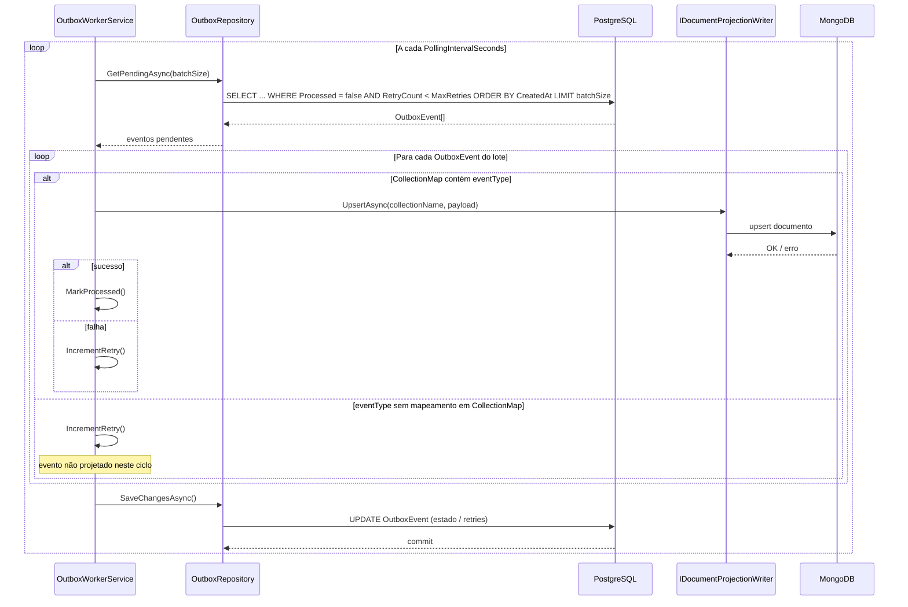
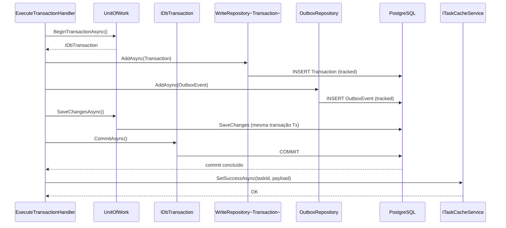
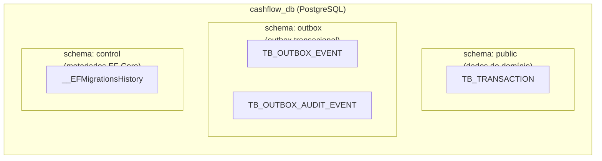

# Camada Infrastructure.Data.Relational — ArchChallenge.CashFlow.Infrastructure.Data.Relational

> **Contexto:** esta camada cobre o pilar **dados relacionais** na visão por capacidade. Mapa dos três tipos de armazenamento (PostgreSQL, MongoDB, ImmuDB): **[data/README.md](../../data/README.md)**.

Este documento descreve a camada **Infrastructure.Data.Relational** (`ArchChallenge.CashFlow.Infrastructure.Data.Relational`) do serviço Cashflow: persistência relacional com EF Core e Npgsql, repositórios de leitura e escrita, unidade de trabalho com transações explícitas, **Transactional Outbox** para projeção em MongoDB e migração automática do banco na inicialização da aplicação.

---

## Responsabilidades

- **Persistência EF Core + Npgsql**: `CashFlowDbContext` mapeia entidades como `Transaction` e `OutboxEvent` para PostgreSQL, com configuração via Fluent API (por exemplo, `TransactionConfiguration`).
- **Consultas tipadas com Specification**: `ReadRepository<T>` usa `SpecificationEvaluator<T>` para traduzir `ISpecification<T>` em `IQueryable<T>`, aplicando filtros de forma reutilizável e testável.
- **Unit of Work com transações explícitas**: `UnitOfWork` expõe `BeginTransactionAsync` e `SaveChangesAsync`, permitindo agrupar escrita de agregado e eventos de outbox na mesma transação de banco quando necessário.
- **Transactional Outbox**: eventos são gravados na tabela `OutboxEvent` no PostgreSQL; um `BackgroundService` (`OutboxWorkerService`) processa filas pendentes e projeta no MongoDB via `IDocumentProjectionWriter`, garantindo consistência eventual sem saga distribuída entre os dois armazenamentos.
- **Migração automática na startup**: a extensão `MigrateAsync` em `DependencyInjection` aplica `Database.MigrateAsync()` ao subir o host, mantendo o esquema alinhado às migrações EF Core.

O registro em DI inclui `DbContext` com connection string `DefaultConnection`, repositórios genéricos de leitura/escrita, `IUnitOfWork`, `IOutboxRepository`, opções validadas `OutboxWorkerOptions` e o worker hospedado `OutboxWorkerService`.

---

## Padrão Transactional Outbox

O **Transactional Outbox** foi adotado para que a gravação do estado transacional no PostgreSQL e o registro do evento a ser projetado ocorram de forma **atômica** no mesmo commit relacional. O worker consome a tabela de outbox de forma assíncrona e aplica **upserts** no MongoDB, o que permite **at-least-once** na entrega: falhas temporárias são tratadas com retentativas; após exceder o máximo de tentativas, o evento deixa de ser reprocessado conforme a política configurada.

Esse desenho evita coordenação distribuída complexa (por exemplo, saga explícita entre PostgreSQL e MongoDB) enquanto mantém um caminho claro para reconciliar o modelo de leitura com o que foi persistido como fonte de verdade relacional.

Referência: [Transactional Outbox — Microservices.io](https://microservices.io/patterns/data/transactional-outbox.html).

---

## Diagrama de Classes

```mermaid
classDiagram
    class DbContext {
        <<EF Core>>
    }

    class CashFlowDbContext {
        +DbSet~Transaction~ Transactions
        +DbSet~OutboxEvent~ OutboxEvents
        +DbSet~AuditEvent~ AuditOutboxEvents
    }

    class IReadRepository~T~ {
        <<interface>>
    }

    class ReadRepository~T~ {
        +GetByIdAsync(id)
        +FirstOrDefaultAsync(spec)
        +ListAsync(spec)
        +CountAsync(spec)
    }

    class IWriteRepository~T~ {
        <<interface>>
    }

    class WriteRepository~T~ {
        +AddAsync(entity)
        +UpdateAsync(entity)
        +RemoveAsync(entity)
    }

    class IUnitOfWork {
        <<interface>>
    }

    class UnitOfWork {
        +BeginTransactionAsync()
        +SaveChangesAsync()
    }

    class IOutboxRepository {
        <<interface>>
    }

    class OutboxRepository {
        +AddAsync(OutboxEvent)
        +GetPendingAsync(batchSize)
        +HasPendingForAggregateAsync(eventType, aggregateId)
        +SaveChangesAsync()
    }

    class BackgroundService {
        <<abstract>>
    }

    class IDocumentProjectionWriter {
        <<interface>>
    }

    class OutboxWorkerService {
        -IOutboxRepository outboxRepository
        -IDocumentProjectionWriter projectionWriter
        -OutboxWorkerOptions options
    }

    class OutboxWorkerOptions {
        +int PollingIntervalSeconds
        +int BatchSize
        +int MaxRetries
        +Dictionary CollectionMap
    }

    class SpecificationEvaluator~T~ {
        <<static>>
        +GetQuery(queryable, spec) IQueryable~T~
    }

    CashFlowDbContext --|> DbContext
    ReadRepository~T~ ..|> IReadRepository~T~
    WriteRepository~T~ ..|> IWriteRepository~T~
    UnitOfWork ..|> IUnitOfWork
    OutboxRepository ..|> IOutboxRepository
    OutboxWorkerService --|> BackgroundService
    OutboxWorkerService ..> IOutboxRepository
    OutboxWorkerService ..> IDocumentProjectionWriter
    OutboxWorkerService ..> OutboxWorkerOptions
```

---

## Diagrama de Sequência — Ciclo do Outbox Worker

O worker cria um **novo escopo de serviços** por ciclo (por exemplo, via `IServiceScopeFactory`) para não compartilhar instância de `DbContext` entre iterações concorrentes ou longas.

---

## Diagrama de Sequência — ExecuteTransaction (escrita transacional)

O fluxo abaixo corresponde ao `ExecuteTransactionHandler`: escrita **transacional** que persiste o agregado e o evento de outbox no mesmo `IDbTransaction`, depois atualiza o cache de tarefa com sucesso (o handler publica o evento de domínio após o commit; não está no diagrama para manter o foco na camada relacional).

`SaveChangesAsync` grava as mudanças **dentro** da transação aberta; `CommitAsync` no `IDbTransaction` finaliza o commit de forma **atômica** para `Transaction` e `OutboxEvent` antes da projeção assíncrona no MongoDB pelo worker e antes de `SetSuccessAsync`.

---

## Configuração

As opções do worker de outbox são ligadas à seção `Outbox` da configuração (`BindConfiguration("Outbox")`) e validadas na inicialização (`ValidateOnStart` + `OutboxWorkerOptionsValidator`).

| Chave | Descrição | Exemplo |
|-------|-----------|---------|
| `Outbox:PollingIntervalSeconds` | Intervalo em segundos entre ciclos de polling do worker | `5` |
| `Outbox:BatchSize` | Número máximo de eventos buscados por ciclo | `50` |
| `Outbox:MaxRetries` | Tentativas antes de o evento ser considerado esgotado (não reprocessado) | `3` |
| `Outbox:CollectionMap:TransactionProcessed` | Nome da coleção MongoDB de destino para o tipo de evento `TransactionProcessed` | `transactions` |

A chave aninhada em `CollectionMap` segue o padrão `Outbox:CollectionMap:{EventType}` — o exemplo usa `TransactionProcessed` como nome ilustrativo de `eventType`; o valor é o nome da coleção no MongoDB.

---

## Segregação de Schemas e Controle de Acesso

O banco `cashflow_db` é organizado em três schemas com responsabilidades distintas, o que permite aplicar **privileges mínimos por role** de forma direta e semanticamente clara:

| Schema | Finalidade | Quem acessa |
|--------|------------|-------------|
| `public` | Tabelas de domínio da aplicação | API (`cashflow_app`), pipeline de deploy (`cashflow_deploy`) |
| `outbox` | Tabelas do Transactional Outbox Pattern | Workers de outbox (`cashflow_outbox`), API apenas para INSERT dentro da transação |
| `control` | Histórico de migrations do EF Core | Pipeline de deploy (`cashflow_deploy`) exclusivamente |

### Justificativa

Dois riscos concretos motivam essa separação:

1. **Migration acidental em ambiente compartilhado**: com `__EFMigrationsHistory` em `control` e o role de desenvolvedor sem privilégio nesse schema, `dotnet ef database update` apontando para um ambiente remoto falha imediatamente — mesmo que o desenvolvedor tenha acesso às tabelas de domínio.

2. **Isolamento dos workers de outbox**: o role `cashflow_outbox`, que executa o `OutboxWorkerService` e o `AuditOutboxWorkerService`, recebe `SELECT/UPDATE` apenas em `outbox`. Sem `USAGE` em `public`, esse processo não consegue ler nem escrever em `TB_TRANSACTION`, limitando o raio de impacto em caso de falha ou comprometimento.

> Os roles e grants **não** são aplicados pelas migrations EF (o `EnsureSchema` apenas cria o schema). O provisionamento dos roles e a concessão de privilégios devem ocorrer no script de inicialização de infraestrutura (init SQL do Docker, Terraform, Ansible, etc.). Consulte [ADR-015](../../decisions/ADR-015-segregacao-schemas-postgresql.md) para o exemplo de grants de referência.

---

## Decisões

- **PostgreSQL como banco por serviço**: a escolha de PostgreSQL para o estado relacional do Cashflow está registrada em [ADR-006 — PostgreSQL (database per service)](../../decisions/ADR-006-postgresql-database-per-service.md).
- **Segregação de schemas por responsabilidade e controle de acesso**: o desenho dos três schemas (`public`, `outbox`, `control`) e os perfis de roles associados estão detalhados em [ADR-015 — Segregação de Schemas PostgreSQL](../../decisions/ADR-015-segregacao-schemas-postgresql.md).
- **Specification no repositório de leitura**: o uso de `ISpecification<T>` com avaliador em consultas está alinhado a [ADR-012 — Specification Pattern no Read Repository](../../decisions/ADR-012-specification-pattern-read-repository.md).

---
