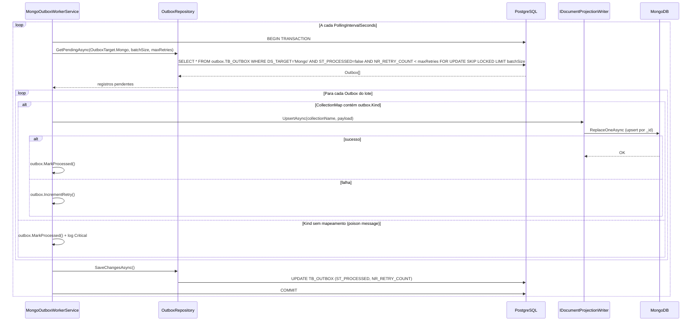
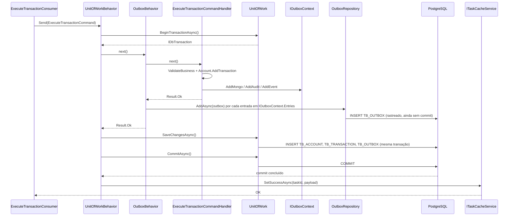
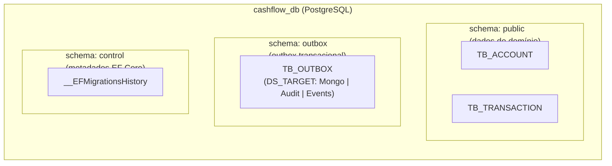

# Camada Infrastructure.Data.Relational — ArchChallenge.CashFlow.Infrastructure.Data.Relational

> **Contexto:** esta camada cobre o pilar **dados relacionais** na visão por capacidade. Mapa dos três tipos de armazenamento (PostgreSQL, MongoDB, ImmuDB): **[data/README.md](../../data/README.md)**.

Este documento descreve a camada **Infrastructure.Data.Relational** (`ArchChallenge.CashFlow.Infrastructure.Data.Relational`) do serviço Cashflow: persistência relacional com EF Core e Npgsql, repositórios de leitura e escrita, unidade de trabalho com transações explícitas, **Transactional Outbox** para projeção em MongoDB e migração automática do banco na inicialização da aplicação.

---

## Responsabilidades

- **Persistência EF Core + Npgsql**: `CashFlowDbContext` mapeia entidades como `Account`, `Transaction` e `Outbox` para PostgreSQL, com configuração via Fluent API (por exemplo, `TransactionConfiguration`, `AccountConfiguration`, `OutboxConfiguration`).
- **Consultas tipadas com Specification**: `ReadRepository<T>` usa `SpecificationEvaluator<T>` para traduzir `ISpecification<T>` em `IQueryable<T>`, aplicando filtros de forma reutilizável e testável.
- **Unit of Work com transações explícitas**: `UnitOfWork` expõe `BeginTransactionAsync` e `SaveChangesAsync`, permitindo agrupar escrita de agregado e eventos de outbox na mesma transação de banco quando necessário.
- **Transactional Outbox**: registros são gravados na tabela `TB_OUTBOX` no PostgreSQL com um campo `Target` (`Mongo`, `Audit`, `Events`) como discriminador. Três `BackgroundService` distintos — `MongoOutboxWorkerService`, `EventsOutboxWorkerService` e `AuditOutboxWorkerService` — vivem no projeto separado `Agents/Outbox` e processam cada destino de forma independente com `SELECT … FOR UPDATE SKIP LOCKED`, garantindo consistência eventual sem saga distribuída.
- **Migração automática na startup**: a extensão `MigrateAsync` em `DependencyInjection` aplica `Database.MigrateAsync()` ao subir o host, mantendo o esquema alinhado às migrações EF Core.

O registro em DI inclui `DbContext` com connection string `DefaultConnection`, repositórios genéricos de leitura/escrita, `IUnitOfWork` e `IOutboxRepository`. Os workers (`MongoOutboxWorkerService`, `EventsOutboxWorkerService`, `AuditOutboxWorkerService`) e suas opções (`OutboxWorkerOptions`, `AuditWorkerOptions`) são registrados no projeto `Agents/Outbox`, que tem o seu próprio `Program.cs` hospedado como um worker service independente.

---

## Padrão Transactional Outbox

O **Transactional Outbox** foi adotado para que a gravação do estado transacional no PostgreSQL e o registro do evento a ser projetado ocorram de forma **atômica** no mesmo commit relacional. O worker consome a tabela de outbox de forma assíncrona e aplica **upserts** no MongoDB, o que permite **at-least-once** na entrega: falhas temporárias são tratadas com retentativas; após exceder o máximo de tentativas, o evento deixa de ser reprocessado conforme a política configurada.

Esse desenho evita coordenação distribuída complexa (por exemplo, saga explícita entre PostgreSQL e MongoDB) enquanto mantém um caminho claro para reconciliar o modelo de leitura com o que foi persistido como fonte de verdade relacional.

Referência: [Transactional Outbox — Microservices.io](https://microservices.io/patterns/data/transactional-outbox.html).

---

## Diagrama de Classes

```mermaid
classDiagram
    class DbContext {
        <<EF Core>>
    }

    class CashFlowDbContext {
        +DbSet~Account~ Accounts
        +DbSet~Transaction~ Transactions
        +DbSet~Outbox~ Outboxes
    }

    class IReadRepository~T~ {
        <<interface>>
    }

    class ReadRepository~T~ {
        +GetByIdAsync(id)
        +FirstOrDefaultAsync(spec)
        +ListAsync(spec)
        +CountAsync(spec)
    }

    class IWriteRepository~T~ {
        <<interface>>
    }

    class WriteRepository~T~ {
        +AddAsync(entity)
        +UpdateAsync(entity)
        +RemoveAsync(entity)
    }

    class IUnitOfWork {
        <<interface>>
    }

    class UnitOfWork {
        +BeginTransactionAsync()
        +SaveChangesAsync()
    }

    class IOutboxRepository {
        <<interface>>
    }

    class OutboxRepository {
        +AddAsync(Outbox)
        +GetPendingAsync(target, batchSize, maxRetries) IReadOnlyList~Outbox~
        +GetByIdAsync(id) Outbox?
        +HasPendingForAggregateAsync(kind, aggregateId) bool
        +SaveChangesAsync()
    }

    class OutboxWorkerBase {
        <<abstract BackgroundService>>
        #WorkerName string
        #PollingIntervalSeconds int
        #BatchSize int
        #MaxRetries int
        +FetchPendingAsync(scope, ct)*
        +ProcessSingleAsync(outbox, ct)*
        +PersistChangesAsync(scope, ct)*
    }

    class MongoOutboxWorkerService {
        -IDocumentProjectionWriter projectionWriter
        -OutboxWorkerOptions options
    }

    class EventsOutboxWorkerService {
        -IEventBus eventBus
        -OutboxWorkerOptions options
    }

    class AuditOutboxWorkerService {
        -IAuditWriter writer
        -AuditWorkerOptions options
    }

    class OutboxWorkerOptions {
        +int PollingIntervalSeconds
        +int BatchSize
        +int MaxRetries
        +Dictionary CollectionMap
        +Dictionary TypeMap
    }

    class AuditWorkerOptions {
        +int PollingIntervalSeconds
        +int BatchSize
        +int MaxRetries
    }

    class SpecificationEvaluator~T~ {
        <<static>>
        +GetQuery(queryable, spec) IQueryable~T~
    }

    CashFlowDbContext --|> DbContext
    ReadRepository~T~ ..|> IReadRepository~T~
    WriteRepository~T~ ..|> IWriteRepository~T~
    UnitOfWork ..|> IUnitOfWork
    OutboxRepository ..|> IOutboxRepository
    OutboxWorkerBase <|-- MongoOutboxWorkerService
    OutboxWorkerBase <|-- EventsOutboxWorkerService
    OutboxWorkerBase <|-- AuditOutboxWorkerService
    MongoOutboxWorkerService ..> IOutboxRepository
    MongoOutboxWorkerService ..> OutboxWorkerOptions
    EventsOutboxWorkerService ..> IOutboxRepository
    EventsOutboxWorkerService ..> OutboxWorkerOptions
    AuditOutboxWorkerService ..> IOutboxRepository
    AuditOutboxWorkerService ..> AuditWorkerOptions
```

> **Projeto dos workers:** `MongoOutboxWorkerService`, `EventsOutboxWorkerService` e `AuditOutboxWorkerService` vivem no projeto `Agents/Outbox` (com `Program.cs` próprio), separado da camada `Relational`. Isso isola o ciclo de vida dos workers, permite escalar os destinos de forma independente e restringe as permissões de banco do processo worker (role `cashflow_outbox` com acesso apenas ao schema `outbox`).

---

## Diagrama de Sequência — Ciclo do MongoOutboxWorkerService

Cada worker é executado em uma **thread dedicada** (não no pool de threads do .NET) para isolar os destinos. O ciclo abaixo ilustra o `MongoOutboxWorkerService`; os demais workers (`EventsOutboxWorkerService` e `AuditOutboxWorkerService`) seguem o mesmo padrão, diferindo apenas no `OutboxTarget` e no processamento.

> O `GetPendingAsync` usa `SELECT … FOR UPDATE SKIP LOCKED` dentro de uma transação, garantindo que múltiplas instâncias concorrentes do mesmo worker nunca processem o mesmo lote (**at-most-once locking** + **at-least-once delivery** com idempotência no destino).

---

## Diagrama de Sequência — `ExecuteTransactionCommand` (escrita transacional)

O fluxo de escrita é coordenado pelo pipeline de behaviors do **MediatR** (não diretamente pelo handler). O **`UnitOfWorkBehavior`** abre a transação e faz commit/rollback; o **`OutboxBehavior`** lê o `IOutboxContext` após o handler e persiste as entradas de outbox; o handler apenas registra as intenções de outbox em `IOutboxContext`.

> **Atomicidade:** `Account`, `Transaction` e todos os registros `Outbox` (Mongo, Audit, Events) são commitados na mesma transação PostgreSQL. Os workers de outbox só veem esses registros **após** o commit, garantindo que uma falha antes do `COMMIT` não gere eventos sem agregado persistido.

---

## Configuração

As opções do worker de outbox são ligadas à seção `Outbox` da configuração (`BindConfiguration("Outbox")`) e validadas na inicialização (`ValidateOnStart` + `OutboxWorkerOptionsValidator`).

| Chave | Serviço | Descrição | Exemplo |
|-------|---------|-----------|------|
| `Outbox:PollingIntervalSeconds` | `MongoOutboxWorkerService`, `EventsOutboxWorkerService` | Intervalo entre ciclos de polling | `5` |
| `Outbox:BatchSize` | `MongoOutboxWorkerService`, `EventsOutboxWorkerService` | Máx. de registros por ciclo | `50` |
| `Outbox:MaxRetries` | `MongoOutboxWorkerService`, `EventsOutboxWorkerService` | Tentativas antes de descartar | `3` |
| `Outbox:CollectionMap:TransactionExecuted` | `MongoOutboxWorkerService` | Coleção MongoDB para `Kind = "TransactionExecuted"` | `transactions` |
| `Outbox:TypeMap:TransactionExecuted` | `EventsOutboxWorkerService` | Tipo CLR (assembly-qualified) do evento para deserialização | *(registrado em DI, não via appsettings)* |
| `AuditWorker:PollingIntervalSeconds` | `AuditOutboxWorkerService` | Intervalo entre ciclos do worker de auditoria | `3` |
| `AuditWorker:BatchSize` | `AuditOutboxWorkerService` | Máx. de registros por ciclo | `50` |
| `AuditWorker:MaxRetries` | `AuditOutboxWorkerService` | Tentativas antes de descartar | `5` |

---

## Segregação de Schemas e Controle de Acesso

O banco `cashflow_db` é organizado em três schemas com responsabilidades distintas, o que permite aplicar **privileges mínimos por role** de forma direta e semanticamente clara:

| Schema | Finalidade | Quem acessa |
|--------|------------|-------------|
| `public` | Tabelas de domínio (`TB_ACCOUNT`, `TB_TRANSACTION`) | API (`cashflow_app`), pipeline de deploy (`cashflow_deploy`) |
| `outbox` | Tabela unificada `TB_OUTBOX` com coluna discriminadora `DS_TARGET` | Workers de outbox (`cashflow_outbox`), API apenas para INSERT dentro da transação |
| `control` | Histórico de migrations do EF Core | Pipeline de deploy (`cashflow_deploy`) exclusivamente |

### Justificativa

Dois riscos concretos motivam essa separação:

1. **Migration acidental em ambiente compartilhado**: com `__EFMigrationsHistory` em `control` e o role de desenvolvedor sem privilégio nesse schema, `dotnet ef database update` apontando para um ambiente remoto falha imediatamente — mesmo que o desenvolvedor tenha acesso às tabelas de domínio.

2. **Isolamento dos workers de outbox**: o role `cashflow_outbox`, usado pelo processo `Agents/Outbox` (que hospeda `MongoOutboxWorkerService`, `EventsOutboxWorkerService` e `AuditOutboxWorkerService`), recebe `SELECT/UPDATE` apenas no schema `outbox`. Sem `USAGE` em `public`, esse processo não consegue ler nem escrever em `TB_ACCOUNT` ou `TB_TRANSACTION`, limitando o raio de impacto em caso de falha ou comprometimento.

> Os roles e grants **não** são aplicados pelas migrations EF (o `EnsureSchema` apenas cria o schema). O provisionamento dos roles e a concessão de privilégios devem ocorrer no script de inicialização de infraestrutura (init SQL do Docker, Terraform, Ansible, etc.). Consulte [ADR-015](../../decisions/ADR-015-segregacao-schemas-postgresql.md) para o exemplo de grants de referência.

---

## Decisões

- **PostgreSQL como banco por serviço**: a escolha de PostgreSQL para o estado relacional do Cashflow está registrada em [ADR-006 — PostgreSQL (database per service)](../../decisions/ADR-006-postgresql-database-per-service.md).
- **Segregação de schemas por responsabilidade e controle de acesso**: o desenho dos três schemas (`public`, `outbox`, `control`) e os perfis de roles associados estão detalhados em [ADR-015 — Segregação de Schemas PostgreSQL](../../decisions/ADR-015-segregacao-schemas-postgresql.md).
- **Specification no repositório de leitura**: o uso de `ISpecification<T>` com avaliador em consultas está alinhado a [ADR-012 — Specification Pattern no Read Repository](../../decisions/ADR-012-specification-pattern-read-repository.md).

---
