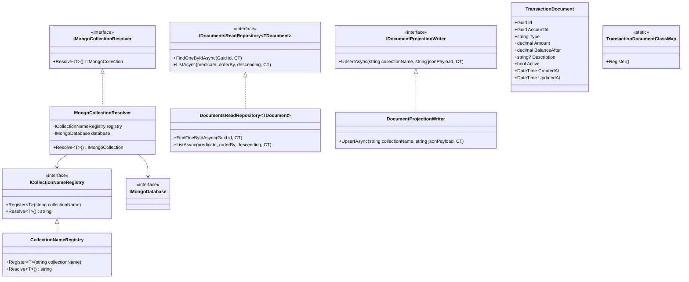
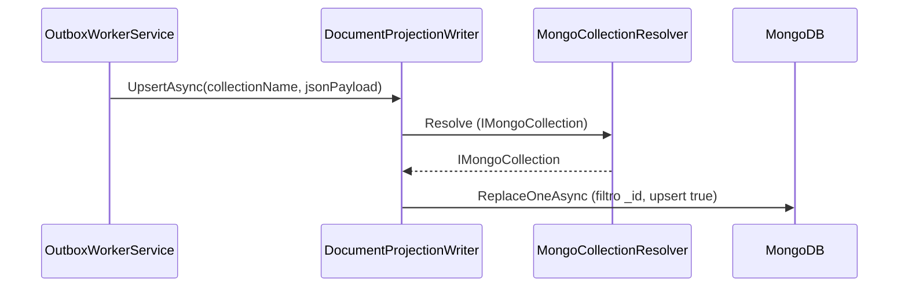
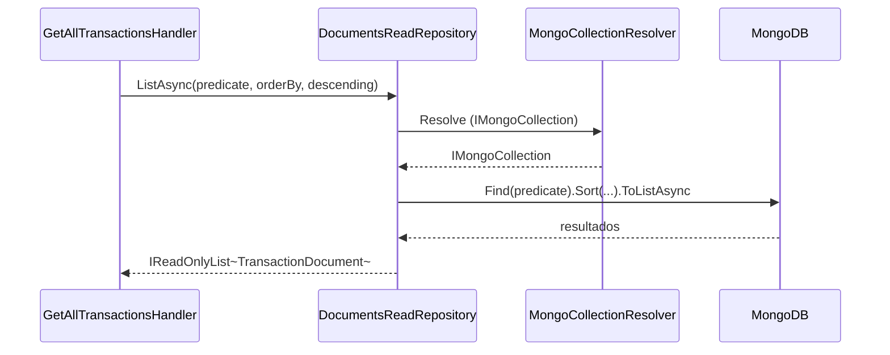

# Camada Infrastructure.Data.Documents — ArchChallenge.CashFlow.Infrastructure.Data.Documents

> **Contexto:** esta camada cobre o pilar **dados não relacionais (documentos)** na visão por capacidade. Mapa dos três tipos de armazenamento: **[data/README.md](../../data/README.md)**.

---

## Responsabilidades

A camada **Infrastructure.Data.Documents** concentra a persistência e a leitura de **read models** em **MongoDB**, além da **projeção** de eventos processados pelo Outbox para documentos BSON.

- **Leitura de read models**: repositórios genéricos expõem consultas sobre documentos (`FindOneByIdAsync`, `ListAsync` com predicado, ordenação e direção), delegando a resolução da coleção ao registry.
- **Projeção idempotente**: o `DocumentProjectionWriter` materializa payloads JSON em documentos na coleção alvo, com **upsert** por `_id`, alinhado ao fluxo do **OutboxWorkerService**.
- **Resolução dinâmica de coleções**: `ICollectionNameRegistry` associa cada tipo de documento ao nome da coleção; `IMongoCollectionResolver` obtém `IMongoCollection<TDocument>` a partir do banco registrado.
- **Class maps BSON**: `TransactionDocumentClassMap` (e setup relacionado como `MongoBsonGuidSetup`) garantem serialização consistente (por exemplo, `Guid`) e mapeamento campo ↔ propriedade para `TransactionDocument`.

---

## Read Model vs Agregado

| Aspecto | Agregado de escrita (`Transaction`) | Read model (`TransactionDocument`) |
|--------|--------------------------------------|-------------------------------------|
| Persistência | Entity Framework (relacional), transações e regras de domínio | MongoDB, documento orientado à leitura |
| Papel | Fonte da verdade para alterações de estado | Projeção otimizada para consultas e listagens |

**Separação:**

- **`Transaction`** (entidade EF): modela o agregado sob escrita, invariantes e persistência relacional.
- **`TransactionDocument`**: documento MongoDB usado como **read model** — shape estável para APIs de leitura e relatórios.

**Vantagens dessa separação:**

- **Schema flexível para leitura**: evolução do documento de leitura sem acoplar migrações pesadas ao modelo transacional.
- **Consultas sem joins**: filtros e ordenação diretamente sobre o documento, adequados a listagens e buscas.
- **Desacoplamento de escrita**: a projeção pode ser reconstruída ou reprocessada (Outbox) sem bloquear o caminho de comando.

---

## Diagrama de Classes

---

## Diagrama de Sequência — Projeção do Outbox

Fluxo resumido: o worker envia o nome da coleção e o JSON do evento; o writer deserializa para `BsonDocument` e executa **ReplaceOne** com **upsert**, garantindo **idempotência** ao reprocessar mensagens do Outbox.

---

## Diagrama de Sequência — Consulta com filtros (GetAllTransactions)

---

## Configuração

| Chave | Descrição | Exemplo |
|-------|-----------|---------|
| `ConnectionStrings:MongoConnection` | Connection string do MongoDB | `mongodb://mongo:27017` |
| `MongoDB:Database` | Nome do banco de dados lógico | `cashflow` |

O registro em DI (`AddDocumentsData`) lê `MongoConnection` e `MongoDB:Database`, registra `IMongoClient` e `IMongoDatabase`, o registry de nomes de coleção (por exemplo, `TransactionDocument` → `"transactions"`), o resolver de coleções, repositórios de leitura com escopo **scoped** e o **singleton** `DocumentProjectionWriter`.

---

## Decisões

**MongoDB para read models**

- **Schema menos rígido** na camada de leitura facilita evoluir o documento exposto à API sem arrastar o mesmo grau de mudança no modelo transacional.
- **Consultas eficientes por campo** e **sem joins** alinham-se a listagens com filtros e ordenação (`GetAllTransactions` e similares).
- Separação clara entre **escrita relacional** (EF) e **leitura documental** (MongoDB).

**Idempotência do upsert**

- O **Outbox** pode entregar o mesmo evento mais de uma vez; `ReplaceOneAsync` com **upsert** e filtro por `_id` garante que reprocessamentos **não dupliquem** documentos e mantenham o estado final consistente com o último payload processado.

---
