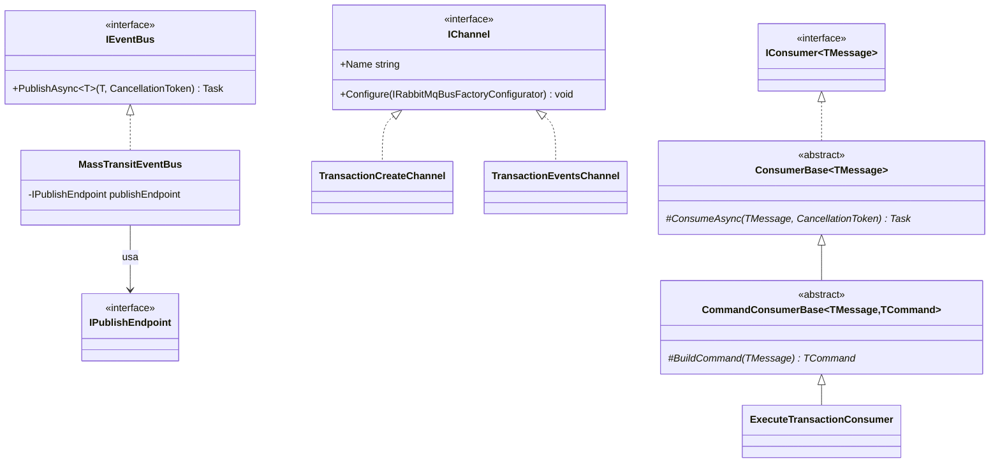
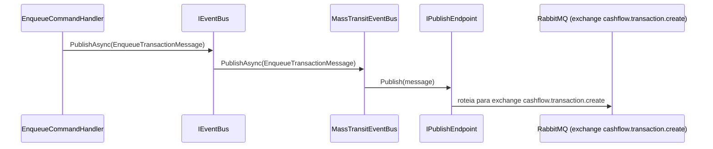
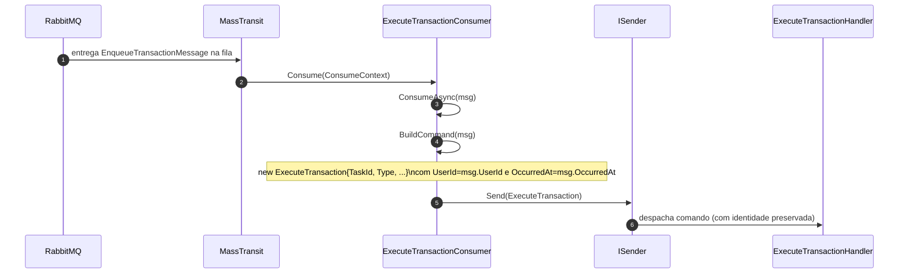
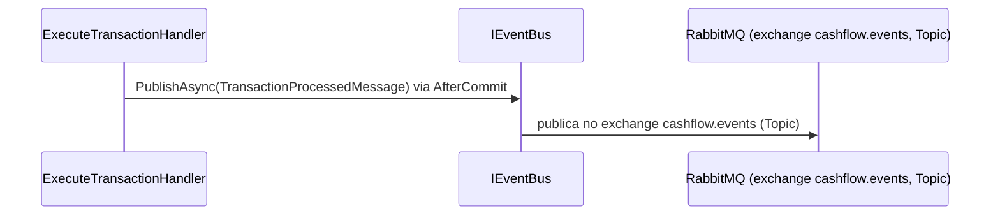

# Camada Infrastructure.CrossCutting.Messaging — ArchChallenge.CashFlow.Infrastructure.CrossCutting.Messaging

O projeto **ArchChallenge.CashFlow.Infrastructure.CrossCutting.Messaging** concentra a integração com **MassTransit** e **RabbitMQ**: publicação de mensagens via contrato de aplicação (`IEventBus`), definição de canais (comando versus evento de integração), consumidores desacoplados do `ConsumeContext` e registro automático de endpoints a partir de atributos e reflection.

---

## Responsabilidades

### Escopo da camada

- **Adaptador MassTransit + RabbitMQ**: configuração do barramento (`AddMassTransit`), host RabbitMQ (credenciais e virtual host), e publicação tipada através de `IPublishEndpoint` encapsulada em `MassTransitEventBus`.
- **Definição de canais (`IChannel`)**: cada canal nomeia um endpoint lógico e aplica `Configure(IRabbitMqBusFactoryConfigurator)` para mapear mensagens a exchanges e filas. Há distinção entre **canal de comando** (fila consumida localmente) e **canal de evento** (exchange topic para integração, sem consumer local no Cashflow).
- **Hierarquia de consumers desacoplada**: `ConsumerBase<TMessage>` implementa `IConsumer<TMessage>` do MassTransit e delega para `ConsumeAsync(TMessage, CancellationToken)`, evitando vazar `ConsumeContext` nas classes derivadas. `CommandConsumerBase<TMessage, TCommand>` traduz a mensagem em um comando **MediatR** e chama `ISender.Send`.
- **Descoberta automática**: `RegisterConsumers` descobre implementações de `IConsumer<>` por reflection; `DiscoverChannels` localiza implementações de `IChannel` e aplica cada `Configure` no bus. `ConsumerChannelAttribute` e `AttributeConsumerDefinition<TConsumer>` associam o consumer ao canal e definem o endpoint (fila alinhada ao `IChannel.Name`).
- **Publicação global de notificações de domínio**: `cfg.Publish<INotification>(p => p.Exclude = true)` evita criar exchange desnecessário para o tipo base de notificações MediatR no pipeline MassTransit.

---

## Topologia RabbitMQ

A tabela resume o papel de cada canal em termos de exchange, tipo e produtores/consumidores.

| Canal | Exchange | Tipo | Producer | Consumer |
|-------|----------|------|----------|----------|
| `cashflow.transaction.create` | `cashflow.transaction.create` | Fanout (padrão MassTransit) | `EnqueueCommandHandler` via `IEventBus` | `ExecuteTransactionConsumer` |
| `cashflow.events` | `cashflow.events` | Topic | `CommandHandlerBase` via `IEventBus` (AfterCommit) | Serviços externos (ex: Dashboard) |

---

## Diagrama de Classes

### Mensageria, canais e consumers

**Notas:**

- `MassTransitEventBus` é o único adaptador de `IEventBus` para o MassTransit; qualquer handler que publique mensagens de integração depende desse contrato.
- `TransactionCreateChannel` e `TransactionEventsChannel` centralizam nomes e binding (direct versus topic) para as mensagens correspondentes.
- `ExecuteTransactionConsumer` é anotado com o canal de criação de transação; a definição do endpoint usa o nome do canal como fila.

---

## Diagrama de Sequência — Publicação de EnqueueTransactionMessage

---

## Diagrama de Sequência — Consumo e despacho para MediatR

O consumer reconstrói `UserId` e `OccurredAt` da mensagem no comando, garantindo que a identidade do usuário original seja propagada para o pipeline de auditoria mesmo após cruzar o boundary assíncrono.

---

## Diagrama de Sequência — Publicação de TransactionProcessedMessage (Integration Event)

`CommandHandlerBase` publica diretamente no `IEventBus` após o commit, via callback `AfterCommit`. Não há `IPublisher` (MediatR) nem handler intermediário neste fluxo.

---

## Contrato das mensagens

| Mensagem | Campos | Observação |
|----------|--------|------------|
| `EnqueueTransactionMessage` | `TaskId`, `UserId`, `OccurredAt`, `Type`, `Amount`, `Description` | Publicada pelo `EnqueueCommandHandler`; `UserId` e `OccurredAt` propagam identidade HTTP para o worker assíncrono |
| `TransactionProcessedMessage` | `EventId`, `OccurredAt`, `Payload` (JSON do agregado) | Publicada pelo `CommandHandlerBase` via callback `AfterCommit`; consumida por serviços externos (ex: Dashboard) |

---

## Decisões

- A escolha de **RabbitMQ** como broker e o uso de MassTransit para abstrair transporte e endpoints estão registrados no [ADR-003 — Comunicação assíncrona com RabbitMQ](../../decisions/ADR-003-comunicacao-assincrona-rabbitmq.md).
- O **formato JSON** das mensagens de integração e convenções associadas estão no [ADR-007 — Formato de mensagens JSON](../../decisions/ADR-007-formato-mensagens-json.md).
- **Propagação de identidade pela mensagem**: `UserId` e `OccurredAt` são carregados em `EnqueueTransactionMessage` para que o consumer reconstrua a identidade do usuário no `ExecuteTransaction`, habilitando auditoria correta mesmo após o boundary assíncrono (detalhes em [layer-09-immutable.md](./layer-09-immutable.md)).
