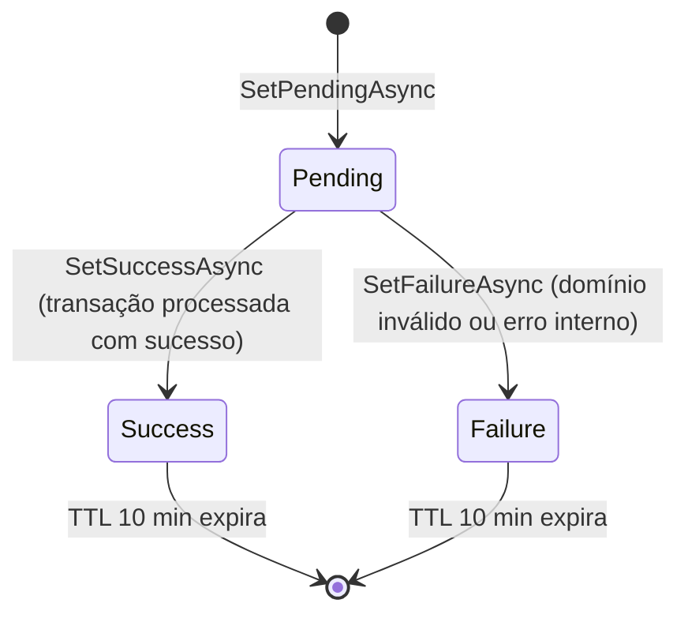
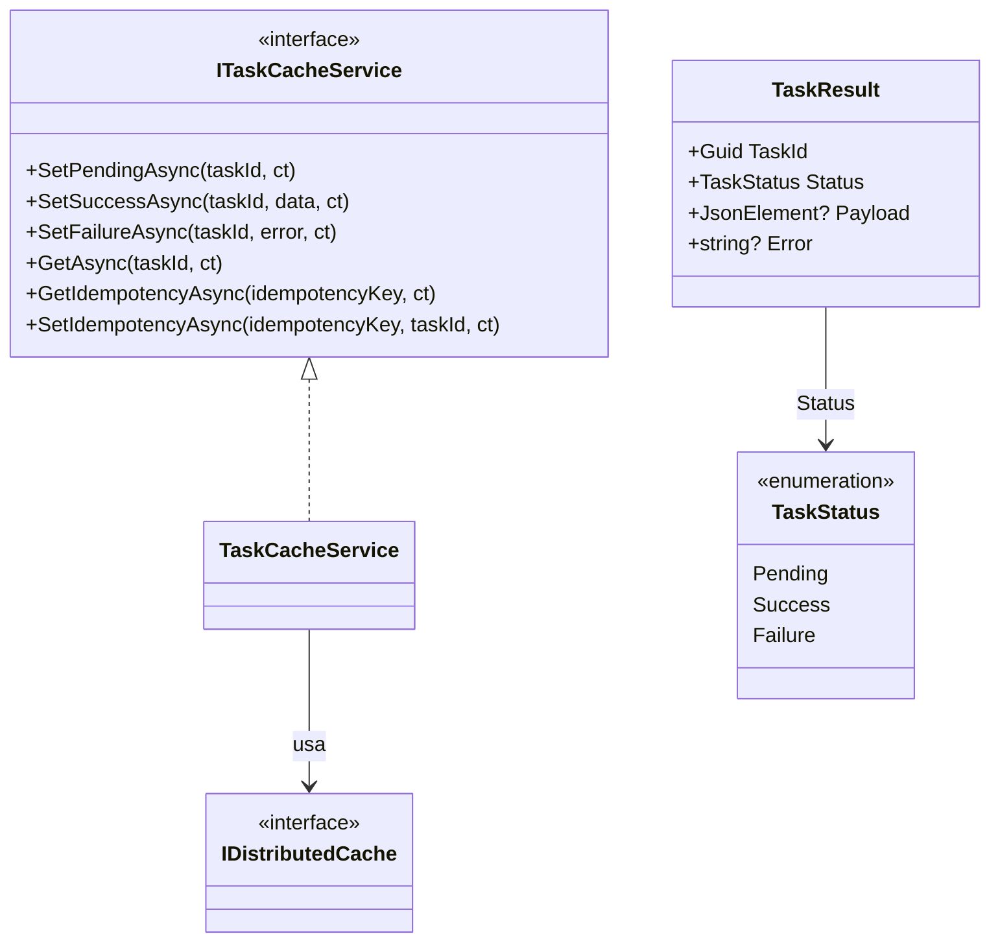
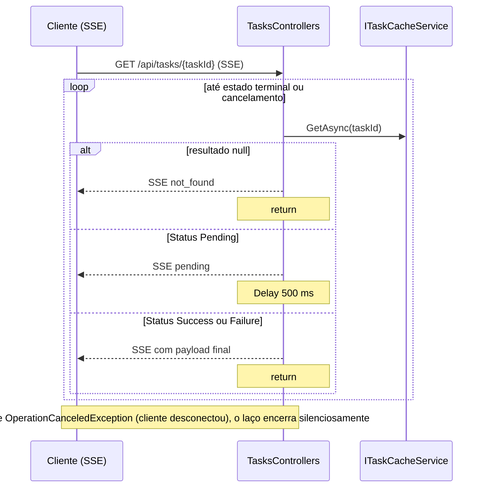

# Camada Infrastructure.CrossCutting.Caching — ArchChallenge.CashFlow.Infrastructure.CrossCutting.Caching

Este documento descreve a camada **Infrastructure.CrossCutting.Caching** do serviço Cashflow, responsável por cache distribuído voltado ao rastreamento de tarefas assíncronas e à idempotência de comandos.

---

## Responsabilidades

- Rastrear o **ciclo de vida** de tarefas assíncronas, desde o estado inicial até conclusão com sucesso ou falha (`Pending` → `Success` ou `Failure`).
- Oferecer **idempotência** de comandos: mapear uma chave de idempotência (`Idempotency-Key`) a um `taskId` já existente, evitando reprocessamento duplicado quando o cliente repete a requisição.
- Persistir resultados de forma **temporária**, com **TTL** distinto para o registro da tarefa e para o mapeamento de idempotência.
- Utilizar **Redis** como backend do `IDistributedCache`, permitindo cache **distribuído** compartilhado entre instâncias da API.

O registro de dependências (`DependencyInjection` da camada Caching) configura `IDistributedCache` via **StackExchange.Redis** (`AddStackExchangeRedisCache`) e registra `ITaskCacheService` → `TaskCacheService` com escopo **Scoped**.

**Uso no fluxo da aplicação:**

- `EnqueueCommandHandler`: chama `SetPendingAsync` e, quando aplicável, `GetIdempotencyAsync` / `SetIdempotencyAsync`.
- `ExecuteTransactionHandler`: atualiza o cache com `SetSuccessAsync` ou `SetFailureAsync` conforme o resultado do processamento.
- `TasksController` (SSE): consulta `GetAsync` em loop com intervalo de aproximadamente **500 ms** até estado terminal ou cancelamento.

---

## Ciclo de vida de uma tarefa

O estado da tarefa evolui a partir de `SetPendingAsync` até `Success` ou `Failure`. Os registros de tarefa concluída permanecem disponíveis até a expiração do **TTL de 10 minutos** imposto pelo cache.

---

## Diagrama de Classes

Na implementação, `SetSuccessAsync` sanitiza o payload JSON com `EntityProjectionJson.RemoveRuntimeFields` para remover campos internos do Entity Framework antes de armazenar.

---

## Idempotência

Quando o cliente envia um cabeçalho **`Idempotency-Key`**, o handler de enfileiramento consulta o cache com `GetIdempotencyAsync`: se já existir um **`taskId`** associado àquela chave (dentro do **TTL de 24 horas**), o fluxo **retorna o mesmo `taskId`** sem criar nem re-enfileirar uma nova tarefa.

Isso protege contra **retries duplicados** do cliente (timeouts, falhas de rede ou cliques repetidos): a segunda chamada com a mesma chave reutiliza a tarefa já registrada. O mapeamento chave → `taskId` é gravado com `SetIdempotencyAsync` quando uma nova tarefa é criada.

---

## Diagrama de Sequência — SSE polling (`/api/tasks/{taskId}`)

O controlador de tarefas mantém um laço que consulta o cache e envia eventos SSE ao cliente até obter estado terminal ou cancelamento.

---

## Configuração

| Chave | Descrição | Exemplo |
|-------|-----------|---------|
| `ConnectionStrings:Redis` | Connection string do Redis usado por `AddStackExchangeRedisCache` | `redis:6379` |
| TTL task | Tempo de vida do registro da tarefa no cache (**fixo no código**: 10 minutos) | — |
| TTL idempotency | Tempo de vida do mapeamento idempotência → `taskId` (**fixo no código**: 24 horas) | — |

---

## Decisões

- **Redis como backend de `IDistributedCache`**: o estado de tarefas e de idempotência fica **distribuído**, com **TTL nativo** no servidor de cache e comportamento consistente quando há **várias instâncias** da API atrás de um balanceador.
- **TTL separados por finalidade**: o registro da **tarefa** expira em **10 minutos** (curto, suficiente para acompanhar o fluxo SSE); o mapeamento de **idempotência** permanece **24 horas**, alinhado a janelas típicas de retry do cliente sem manter chaves indefinidamente.
