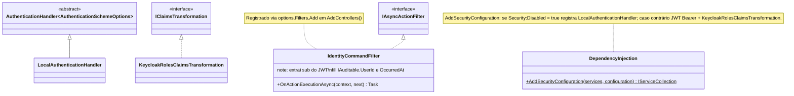
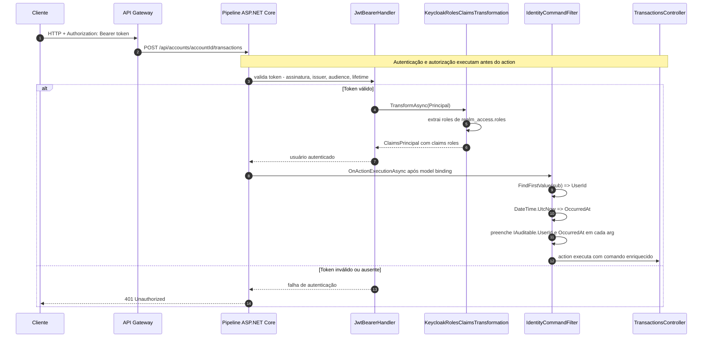

# Camada Infrastructure.CrossCutting.Security — ArchChallenge.CashFlow.Infrastructure.CrossCutting.Security

O projeto **ArchChallenge.CashFlow.Infrastructure.CrossCutting.Security** centraliza a configuração de autenticação e autorização do serviço Cashflow: integração com **JWT Bearer** e **Keycloak** em ambientes produtivos, transformação de papéis de realm para claims **`roles`** (valor simples, igual ao Gateway), e um modo **local** sem JWT para desenvolvimento e testes.

---

## Responsabilidades

- **Autenticação JWT Bearer via Keycloak** quando a segurança está habilitada: validação de issuer, audience e tempo de vida do token, com descoberta OIDC a partir da authority configurada.
- **Transformação de claims**: mapear roles presentes em `realm_access.roles` no JWT emitido pelo Keycloak para claims **`roles`** repetíveis (valor por role), o que deixa papéis visíveis após **`KeycloakRolesClaimsTransformation`**. Neste projeto a autorização pela API não duplica RBAC por role como o Gateway; o foco permanece **`[Authorize]`** + JWT válido (`sub`).
- **Modo local para desenvolvimento**: quando JWT está desativado, um handler de autenticação aceita qualquer requisição como autenticada, evitando dependência de Keycloak em máquinas locais (não usar em produção).
- **Autorização declarativa**: uso de `[Authorize]` nos controllers que exigem usuário autenticado; registro de `AddAuthorization()` na composição de serviços.
- **Enriquecimento de comandos com identidade (`IdentityCommandFilter`)**: Action Filter registrado globalmente que extrai o claim `sub` (ou `NameIdentifier`) do JWT e preenche `UserId` e `OccurredAt` em todos os argumentos de action que implementam `IAuditable`, propagando a identidade do usuário para o pipeline de auditoria e para mensagens assíncronas.

---

## Modos de autenticação

| Modo | Condição | Mecanismo | Uso |
|------|----------|-----------|-----|
| JWT Bearer (Keycloak) | `Security:Disabled = false` (padrão) | `JwtBearerDefaults.AuthenticationScheme` + validação de issuer, audience, lifetime | Produção |
| Local | `Security:Disabled = true` | `LocalAuthenticationHandler` aceita qualquer request | Desenvolvimento / testes locais |

---

## Diagrama de Classes

Visão estática dos componentes de segurança e do ponto de extensão na injeção de dependências.

**Notas:**

- Quando **`Security:Disabled`** é verdadeiro, não há validação JWT: o esquema local autentica todas as requisições para facilitar desenvolvimento.
- Quando é falso, o pipeline usa **JWT Bearer** e, após validação do token, **`KeycloakRolesClaimsTransformation`** enriquece o principal com roles derivadas de `realm_access`.
- **`IdentityCommandFilter`** executa após o model binding: itera sobre os action arguments que implementam `IAuditable` e preenche `UserId` (claim `sub` ou `NameIdentifier`) e `OccurredAt` (`DateTime.UtcNow`). É registrado globalmente via `AddControllers(options => options.Filters.Add<IdentityCommandFilter>())` em `Program.cs`.

---

## Diagrama de Sequência — Autenticação JWT e enriquecimento do comando (produção)

Fluxo típico de uma chamada autenticada a um endpoint protegido, incluindo a injeção de identidade no comando pelo `IdentityCommandFilter`.

---

## Configuração

| Chave | Descrição | Exemplo |
|-------|-----------|---------|
| `Security:Disabled` | Desativa JWT (dev/local) | `true` |
| `Keycloak:Authority` | URL do realm Keycloak | `https://keycloak:8080/realms/cashflow` |
| `Keycloak:Audience` | Audience esperado no token | `cashflow-api` |
| `Keycloak:RequireHttpsMetadata` | Exige HTTPS para OIDC discovery | `true` |

O audience padrão no código, quando não informado na configuração, é **`cashflow-api`**.

---

## Endpoints e proteção

| Endpoint | Autenticado | Observação |
|----------|-------------|------------|
| `POST /api/accounts` | Sim | `[Authorize]` |
| `GET /api/accounts/me` | Sim | `[Authorize]` |
| `PATCH /api/accounts/me/deactivate` | Sim | `[Authorize]` |
| `PATCH /api/accounts/me/activate` | Sim | `[Authorize]` |
| `POST /api/accounts/{accountId}/transactions` | Sim | `[Authorize]`; **`Idempotency-Key`** obrigatório (filtro) |
| `GET /api/accounts/{accountId}/transactions/{id}` | Sim | `[Authorize]` |
| `GET /api/accounts/{accountId}/transactions` | Sim | `[Authorize]` |
| `GET /api/tasks/{taskId}` | Não | SSE — polling público por `taskId` opaco |
| `GET /metrics` | Não | Prometheus — protegido por rede/infra |
| `GET /health/liveness` | Não | Liveness |
| `GET /health/readiness` | Não | Readiness |

---

## Decisões

A escolha de **Keycloak** como provedor de identidade e o modelo de **JWT Bearer** para a API estão registrados em [ADR-008 — Autenticação e autorização com Keycloak](../../decisions/ADR-008-autenticacao-autorizacao-keycloak.md).

O endpoint **`GET /api/tasks/{taskId}`** permanece **sem** `[Authorize]` de propósito: o **`taskId`** é um identificador opaco (por exemplo UUID) sem expor dados de negócio na URL; o cliente precisa poder abrir o stream SSE para acompanhar o processamento assim que recebe o identificador no **202 Accepted**, inclusive em cenários em que o token ainda não está disponível ou renovado no cliente. A superfície exposta por esse endpoint é limitada ao status da tarefa associada ao id; proteções adicionais podem ser feitas em rede (gateway, listas de permissão) conforme a política da organização.
