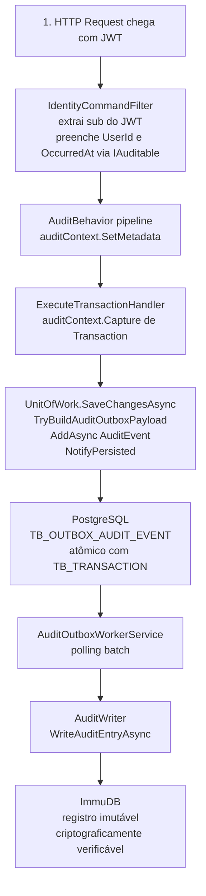
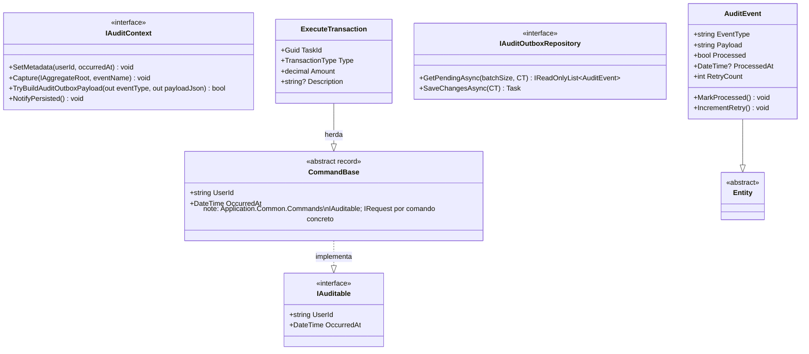
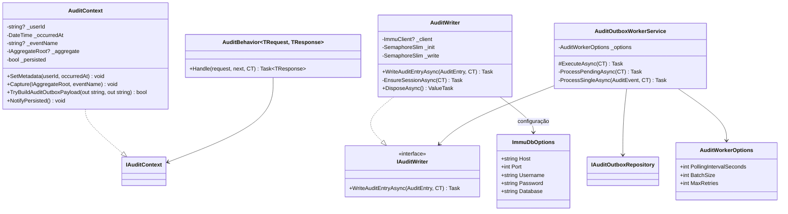
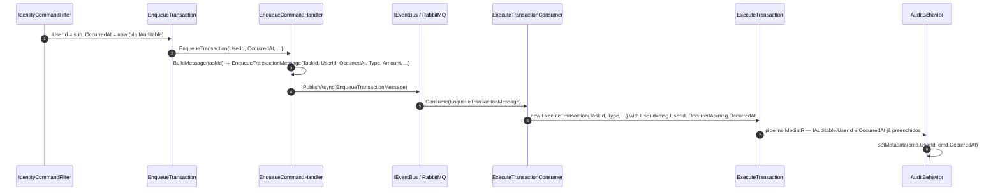
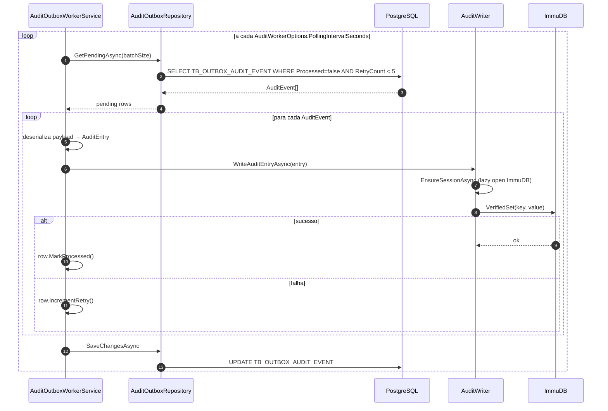

# Imutável — auditoria e rastreio imutável de operações

> **Visão por capacidade (dados):** auditoria entra no pilar **dados imutáveis** (ImmuDB), em conjunto com PostgreSQL (relacional) e MongoDB (documentos). Para um mapa rápido dos três tipos de armazenamento e links para cada abordagem, veja **[data/README.md](../../data/README.md)**.

A auditoria é implementada de forma distribuída em múltiplos projetos — sem uma camada `Infrastructure.CrossCutting.Audit` separada. O mecanismo combina três peças ortogonais: **pipeline de auditoria** (Application), **Outbox transacional** (Relational) e **persistência imutável** (Immutable + OutboxAudit).

---

## Responsabilidades

- Capturar, atomicamente à escrita do agregado, um registro de auditoria no Outbox de auditoria (`TB_OUTBOX_AUDIT_EVENT`) dentro da mesma transação PostgreSQL.
- Enriquecer cada comando com `UserId` (claim JWT `sub`) e `OccurredAt` antes que o handler seja executado.
- Propagar os metadados de auditoria pelo pipeline MediatR sem que os handlers precisem conhecer o mecanismo.
- Gravar os registros de auditoria no **ImmuDB** — banco de dados append-only com verificação criptográfica — garantindo não-repúdio e imutabilidade.

---

## Visão das peças e seus projetos


| Peça                                               | Projeto / Namespace                             | Tipo                                                                                                                                                                                                                                                                                                                                |
| -------------------------------------------------- | ----------------------------------------------- | ----------------------------------------------------------------------------------------------------------------------------------------------------------------------------------------------------------------------------------------------------------------------------------------------------------------------------------- |
| `IAuditable`                                       | `Domain.Shared.Audit`                           | Interface de contrato (com `UserId`/`OccurredAt`)                                                                                                                                                                                                                                                                                   |
| `CommandBase`                                      | `Application.Common.Commands`                   | Record abstrato — implementa `IAuditable`; **não** herda `MediatR.IRequest` (evita conflito com `IRequest<EnqueueResult>`). Cada comando declara `IRequest` / `IRequest<T>` explicitamente (ex.: `ExecuteTransaction : IRequest`; `EnqueueTransaction` via `IEnqueueCommand<>` → `IRequest<EnqueueResult>`)      |
| `IAuditContext`                                    | `Domain.Shared.Audit`                           | Interface (contrato de escopo scoped)                                                                                                                                                                                                                                                                                               |
| `AuditBehavior<TRequest,TResponse>`                | `Application.Common.Behaviors`                  | Pipeline Behavior MediatR                                                                                                                                                                                                                                                                                                           |
| `IdentityCommandFilter`                            | `Infrastructure.CrossCutting.Security.Filters`  | Action Filter ASP.NET Core — extrai identidade JWT                                                                                                                                                                                                                                                                                  |
| `AuditContext`                                     | `Application.Common.Audit`                      | Implementação scoped de `IAuditContext` — reside em **Application**, registrada em `Application.DependencyInjection`                                                                                                                                                                                                        |
| `IAuditWriter`                                     | `Domain.Shared.Audit`                           | Interface do adaptador ImmuDB                                                                                                                                                                                                                                                                                                        |
| `AuditWriter`                                      | `Infrastructure.Data.Immutable.Writers`         | Adaptador ImmuDB (singleton)                                                                                                                                                                                                                                                                                                        |
| `ImmuDbHealthCheck`                                | `Infrastructure.Data.Immutable.Healthcheck`     | `IHealthCheck` para ImmuDB — registrado como singleton via `AddImmutableData()`; extensão `AddImmuDbHealthCheck()` disponível mas **não registrada** no pipeline de health check de nenhum dos serviços atualmente |
| `ImmuDbOptions`                                    | `Infrastructure.Data.Immutable.Options`         | Configuração ImmuDB                                                                                                                                                                                                                                                                                                              |
| `AuditEvent`                                       | `Domain.Shared.Events`                          | Entidade (tabela `TB_OUTBOX_AUDIT_EVENT`)                                                                                                                                                                                                                                                                                           |
| `IAuditOutboxRepository` / `AuditOutboxRepository` | `Relational`                                    | Repositório de auditoria                                                                                                                                                                                                                                                                                                            |
| `AuditOutboxWorkerService`                         | `OutboxAudit`                                   | Background service de polling (worker independente com `Program.cs` próprio)                                                                                                                                                                                                                                                   |
| `UnitOfWork`                                       | `Relational`                                    | Materialização do outbox de auditoria                                                                                                                                                                                                                                                                                               |


---

## Fluxo completo de auditoria

O fluxo atravessa cinco estágios ordenados, todos dentro do ciclo de vida de uma única requisição e de um background worker posterior:




> **Boundary assíncrono:** `UserId` e `OccurredAt` são propagados além da requisição HTTP via `EnqueueTransactionMessage` (que carrega esses campos). O `ExecuteTransactionConsumer` reconstrói o `ExecuteTransaction` com os mesmos valores, garantindo rastreabilidade mesmo quando o handler executa em um worker separado.

---

## Diagrama de Classes — Contratos e base de comandos

As peças de contrato estão distribuídas em três projetos distintos:

- `IAuditable` → `Domain.Shared.Audit`
- `CommandBase` → `Application.Common.Commands`
- `IAuditContext`, `AuditEvent`, `IAuditOutboxRepository` → `Domain.Shared`




---

## Diagrama de Classes — Infraestrutura (Application + Immutable + OutboxAudit)




---

## Diagrama de Sequência — Captura de auditoria na requisição HTTP

Este diagrama detalha como os metadados de auditoria são coletados e persistidos atomicamente durante o processamento de `ExecuteTransaction`.

```mermaid
sequenceDiagram
    autonumber
    participant Req as HTTP Request (JWT)
    participant ICF as IdentityCommandFilter
    participant AB as AuditBehavior
    participant AC as AuditContext (scoped)
    participant H as ExecuteTransactionHandler
    participant UoW as UnitOfWork
    participant PG as PostgreSQL

    Req->>ICF: OnActionExecutionAsync
    ICF->>ICF: extrai claim "sub" → UserId, DateTime.UtcNow → OccurredAt
    ICF->>ICF: itera ActionArguments.OfType~IAuditable~
    ICF->>ICF: arg.UserId = userId; arg.OccurredAt = occurredAt

    ICF->>AB: pipeline MediatR — AuditBehavior executa
    AB->>AB: request is IAuditable?
    alt é auditável (todos Base)
        AB->>AC: SetMetadata(cmd.UserId, cmd.OccurredAt)
    end
    AB->>H: next() → handler executa

    H->>H: new Transaction(...)
    H->>AC: Capture(entity, "TransactionProcessed")
    H->>UoW: SaveChangesAsync

    UoW->>AC: TryBuildAuditOutboxPayload(out eventType, out payload)
    AC-->>UoW: true + payload JSON {auditId, userId, occurredAt, eventName, aggregateType, aggregateId, state}
    UoW->>PG: AddAsync(AuditEvent) + SaveChangesAsync
    Note over PG: Atômico com a escrita do Transaction
    UoW->>AC: NotifyPersisted() — limpa estado scoped
```


---

## Diagrama de Sequência — Propagação de identidade pelo boundary assíncrono

`UserId` e `OccurredAt` precisam cruzar o boundary HTTP → RabbitMQ → Consumer. Para isso, `EnqueueTransactionMessage` carrega esses campos e o consumer os reconstrói no comando.




---

## Diagrama de Sequência — Worker de auditoria (AuditOutboxWorkerService)




---

## Payload de auditoria

Cada entrada gravada no ImmuDB segue o formato JSON abaixo, serializado em `AuditContext.TryBuildAuditOutboxPayload`:

```json
{
  "auditId": "3fa85f64-5717-4562-b3fc-2c963f66afa6",
  "userId": "sub-claim-do-jwt",
  "occurredAt": "2026-04-14T19:00:00Z",
  "eventName": "TransactionProcessed",
  "aggregateType": "Transaction",
  "aggregateId": "3fa85f64-5717-4562-b3fc-2c963f66afa6",
  "state": {
    "id": "3fa85f64-5717-4562-b3fc-2c963f66afa6",
    "type": "Debit",
    "amount": 150.00,
    "description": "Pagamento fornecedor",
    "active": true,
    "createdAt": "2026-04-14T19:00:00Z"
  }
}
```

A chave no ImmuDB segue o padrão `audit:{uuid-do-AuditEvent}`, permitindo recuperação determinística por ID.

---

## Estrutura da tabela `TB_OUTBOX_AUDIT_EVENT`


| Coluna            | Tipo              | Descrição                          |
| ----------------- | ----------------- | ---------------------------------- |
| `ID`              | `uuid`            | Identificador do evento (PK)       |
| `DS_EVENT_TYPE`   | `varchar(100)`    | Tipo do evento (ex: `DomainAudit`) |
| `DS_PAYLOAD`      | `text`            | JSON completo do estado auditado   |
| `ST_PROCESSED`    | `boolean`         | Indica se foi gravado no ImmuDB    |
| `DT_PROCESSED_AT` | `timestamp`       | Instante da gravação no ImmuDB     |
| `NR_RETRY_COUNT`  | `int` (default 0) | Contador de tentativas falhas      |
| `DT_CREATED_AT`   | `timestamp`       | Criado em (herdado de `Entity`)    |


**Índice:** `IX_AUDIT_OUTBOX_EVENT_PROCESSED_CREATED` em `(ST_PROCESSED, DT_CREATED_AT)` — otimiza o polling do worker.

---

## Configuração


| Chave                                | Descrição                        | Default     |
| ------------------------------------ | -------------------------------- | ----------- |
| `ImmuDb:Host`                        | Host do ImmuDB                   | `localhost` |
| `ImmuDb:Port`                        | Porta gRPC do ImmuDB             | `3322`      |
| `ImmuDb:Username`                    | Usuário ImmuDB                   | `immudb`    |
| `ImmuDb:Password`                    | Senha ImmuDB                     | `immudb`    |
| `ImmuDb:Database`                    | Banco ImmuDB                     | `defaultdb` |
| `AuditWorker:PollingIntervalSeconds` | Intervalo entre ciclos do worker | `3`         |
| `AuditWorker:BatchSize`              | Máx. eventos por ciclo           | `50`        |
| `AuditWorker:MaxRetries`             | Tentativas antes de descartar    | `5`         |


### Docker Compose (desenvolvimento local)

No monorepo, o `**docker-compose.yml` na raiz** inclui o serviço `**immudb`** (imagem `codenotary/immudb:latest`, profile `**infra**`):

- **Portas:** `3322` (gRPC / cliente .NET) e `9497` (métricas Prometheus `/metrics`).
- **Volume:** `immudb_data` montado em `/var/lib/immudb`.
- **Healthcheck:** requisição HTTP ao endpoint de métricas em `127.0.0.1:9497/metrics` (para o worker `outbox-audit` poder usar `depends_on: immudb` com condição saudável).

O worker `**outbox-audit**` recebe as variáveis `ImmuDb__Host`, `ImmuDb__Port`, `ImmuDb__Username`, `ImmuDb__Password`, `ImmuDb__Database` apontando para o host `immudb` na rede interna do compose. O serviço `cashflow-api` **não** referencia o projeto `Immutable` e não se conecta ao ImmuDB diretamente.

O scrape do Prometheus para o ImmuDB (`job_name: immudb` → `immudb:9497`) está em `**infra/prometheus/prometheus.yml**` (compose profile `**observability**`).

---

## Garantias e trade-offs


| Garantia                   | Mecanismo                                                                                                                         |
| -------------------------- | --------------------------------------------------------------------------------------------------------------------------------- |
| **Atomicidade**            | `AuditEvent` é inserido no mesmo `SaveChangesAsync` que o agregado — dentro da mesma transação PostgreSQL.                        |
| **Imutabilidade**          | ImmuDB utiliza `VerifiedSet`: cada escrita gera um hash criptográfico que pode ser verificado a qualquer momento.                 |
| **At-least-once**          | Se o worker falhar antes de marcar `Processed`, o evento é re-processado. O `VerifiedSet` é idempotente por chave `audit:{uuid}`. |
| **Resiliência**            | Após `MaxRetries` (5) falhas consecutivas, o evento é descartado do polling (não deletado — permanece auditável em PostgreSQL).   |
| **Rastreabilidade**        | `UserId` (JWT `sub`) + `OccurredAt` + `aggregateId` permitem reconstrução completa da linha do tempo por usuário ou agregado.     |
| **Disponibilidade da API** | Falha do ImmuDB não bloqueia a requisição — apenas o worker de outbox fica pendente até a recuperação.                            |


---

## Decisões

- **ImmuDB como backend imutável:** formalizado em **[ADR-016 — ImmuDB como armazenamento imutável para auditoria](../../decisions/ADR-016-immudb-armazenamento-imutavel-auditoria.md)** — banco append-only com verificação criptográfica nativa (`VerifiedSet`/`VerifiedGet`), alternativa frente a auditoria apenas em tabela relacional (sem garantia criptográfica equivalente).
- **Outbox transacional para auditoria:** garante que nenhuma operação de negócio fique sem registro de auditoria, mesmo em caso de falha após o commit. Segue o mesmo padrão adotado para projeções MongoDB ([ADR-003](../../decisions/ADR-003-comunicacao-assincrona-rabbitmq.md)).
- `**IAuditContext` scoped:** o contexto de auditoria tem tempo de vida por requisição, garantindo isolamento entre requisições concorrentes sem concorrência de estado. `AuditContext` vive em **Application** (não em um projeto de infraestrutura separado), registrado em `AddApplication()`.
- `**CommandBase` implementa `IAuditable`:** todos os records que herdam `CommandBase` expõem `UserId`/`OccurredAt` ao filtro e ao pipeline. `**IRequest` não fica na base** — caso contrário um comando como `EnqueueTransaction` herdaria `IRequest` (void) e `IRequest<EnqueueResult>` via `IEnqueueCommand<>`, quebrando o `Send` do MediatR. Cada comando declara o `IRequest` adequado (`ExecuteTransaction : IRequest`, enqueue apenas via `IEnqueueCommand<>`).
- `**IdentityCommandFilter` em `Security.Filters`:** a responsabilidade de extrair a identidade JWT foi mantida no projeto de segurança, onde é coesa com autenticação/autorização. O filtro itera sobre `IAuditable` (não `CommandBase`), respeitando o princípio de depender de abstrações.
- **Propagação pelo boundary assíncrono via mensagem:** `UserId` e `OccurredAt` são embutidos em `EnqueueTransactionMessage` e reconstruídos pelo consumer no `ExecuteTransaction`. Isso elimina a necessidade de `IHttpContextAccessor` em workers e garante que o registro de auditoria sempre reflita quem iniciou a operação, mesmo após cruzar o broker.

