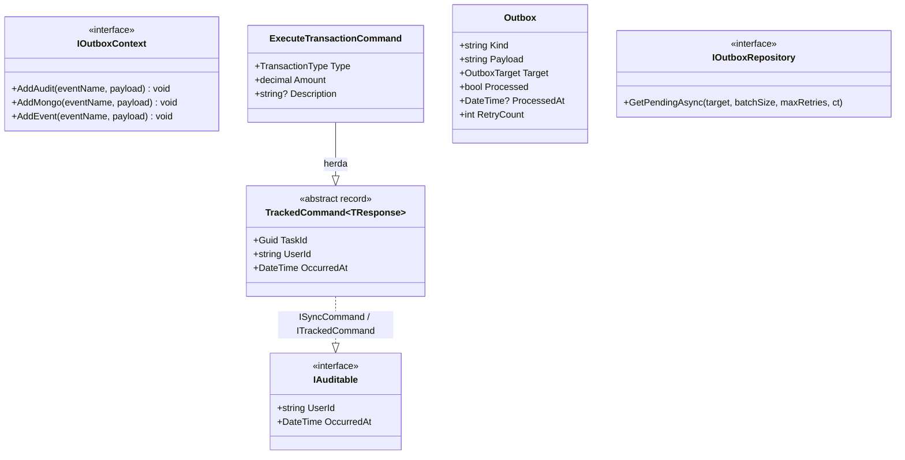
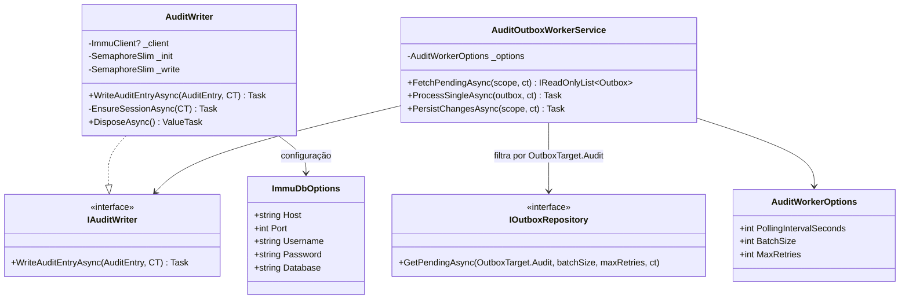
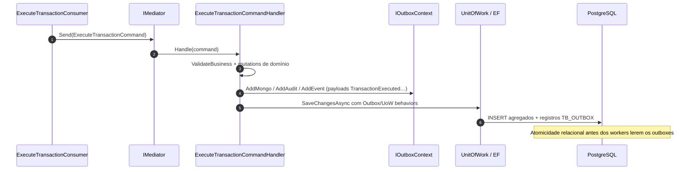
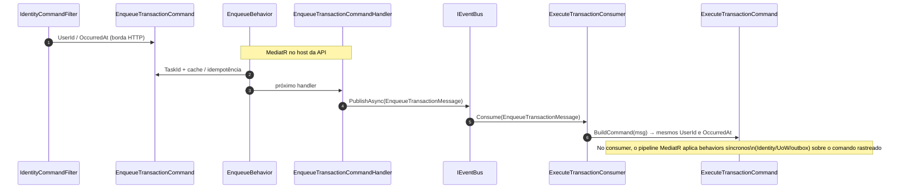
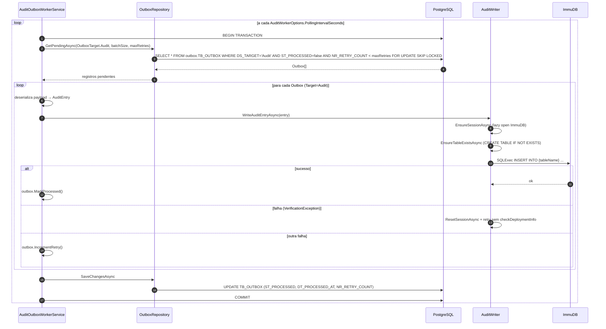

# Imutável — auditoria e rastreio imutável de operações

> **Visão por capacidade (dados):** auditoria entra no pilar **dados imutáveis** (ImmuDB), em conjunto com PostgreSQL (relacional) e MongoDB (documentos). Para um mapa rápido dos três tipos de armazenamento e links para cada abordagem, veja **[data/README.md](../../data/README.md)**.

A auditoria é implementada de forma distribuída em múltiplos projetos — sem uma camada `Infrastructure.CrossCutting.Audit` separada. O mecanismo combina **`IOutboxContext`** na Application (staging de payloads), **pipeline MediatR** (`OutboxBehavior`, `UnitOfWorkBehavior`), **Outbox relacional** (PostgreSQL) e **persistência imutável** (ImmuDB via `AuditOutboxWorkerService`).

---

## Responsabilidades

- Capturar, atomicamente à escrita do agregado, um registro de auditoria na tabela unificada `TB_OUTBOX` (schema `outbox`, `DS_TARGET = 'Audit'`) dentro da mesma transação PostgreSQL.
- Enriquecer cada comando com `UserId` (claim JWT `sub`) e `OccurredAt` antes que o handler seja executado.
- Propagar os metadados de auditoria pelo pipeline MediatR sem que os handlers precisem conhecer o mecanismo.
- Gravar os registros de auditoria no **ImmuDB** — banco de dados append-only com verificação criptográfica — garantindo não-repúdio e imutabilidade.

---

## Visão das peças e seus projetos

| Peça | Projeto / Namespace | Tipo |
| ---- | ------------------- | ---- |
| `IAuditable` | `Domain.Shared.Audit` | Interface de contrato (com `UserId`/`OccurredAt`) |
| `EnqueueCommand<TResponse>` / `TrackedCommand<TResponse>` | `Application.Abstractions.Commands` | Baselines `IAuditable` para enqueue e comandos síncronos rastreados (`EnqueueTransactionCommand`, `ExecuteTransactionCommand`, …) |
| `IOutboxContext` | `Application.Abstractions.Outbox` | Contexto scoped no handler síncrono: `AddAudit` / `AddMongo` / `AddEvent` |
| `OutboxBehavior` / `UnitOfWorkBehavior` | `Application.Abstractions.Behaviors` | Pipeline MediatR — materializa entradas de outbox e transação EF no fluxo `ISyncCommand` |
| `IdentityCommandFilter` | `Infrastructure.CrossCutting.Security.Filters` | Action Filter ASP.NET Core — extrai identidade JWT |
| `Outbox` (entity) | `Domain.Shared.Entities` | Entidade unificada; registros com `Target = Audit` alimentam a auditoria (tabela `TB_OUTBOX`, schema `outbox`) |
| `IOutboxRepository` | `Domain.Shared.Interfaces` | Repositório compartilhado; workers filtram por `OutboxTarget.Audit` |
| `IAuditWriter` | `Domain.Shared.Audit` | Interface do adaptador ImmuDB |
| `AuditWriter` | `Infrastructure.Data.Immutable.Writers` | Adaptador ImmuDB (singleton) |
| `ImmuDbHealthCheck` | `Infrastructure.Data.Immutable.Healthcheck` | `IHealthCheck` para ImmuDB — registrado como singleton via `AddImmutableData()`; extensão `AddImmuDbHealthCheck()` disponível mas **não registrada** no pipeline de health check de nenhum dos serviços atualmente |
| `ImmuDbOptions` | `Infrastructure.Data.Immutable.Options` | Configuração ImmuDB |
| `AuditOutboxWorkerService` | `Agents.Outbox.Workers` | Background service de polling no projeto `Agents/Outbox` (worker independente com `Program.cs` próprio) |
| `UnitOfWork` | `Relational` | Materialização do outbox de auditoria via `SaveChangesAsync` / `CommitAsync` |


---

## Fluxo completo de auditoria

O fluxo vai da produção dos payloads no **`ExecuteTransactionCommand`** até o **worker ImmuDB**, com entrada típica pelo **consumer RabbitMQ** (ou, em paralelo, enriquecimento `IAuditable` na API HTTP antes do enqueue).

```mermaid
flowchart TD
    A[Mensagem EnqueueTransactionMessage\nou comando HTTP já autenticado] --> B[ExecuteTransactionConsumer / Mediator]
    B --> C[ExecuteTransactionCommandHandler\nregistra payloads em IOutboxContext\nAddMongo • AddAudit • AddEvent]
    C --> D[Pipeline OutboxBehavior + UnitOfWorkBehavior\npersiste agregado + Outbox rows na mesma transação]
    D --> E[PostgreSQL — TB_ACCOUNT, TB_TRANSACTION\n+ TB_OUTBOX DS_TARGET=Audit]
    E --> F[AuditOutboxWorkerService\npolling batch via IOutboxRepository.GetPendingAsync(Audit)]
    F --> G[AuditWriter ImmuDB]
    G --> H[entrada append-only verificável]
```


> **Boundary assíncrono:** `UserId` e `OccurredAt` são propagados além da requisição HTTP via `EnqueueTransactionMessage` (que carrega esses campos). O `ExecuteTransactionConsumer` reconstrói o **`ExecuteTransactionCommand`** com os mesmos valores, garantindo rastreabilidade mesmo quando o handler executa em um worker separado.

---

## Diagrama de Classes — Contratos e base de comandos

As peças de contrato relevantes:

- `IAuditable` → `Domain.Shared.Audit` (namespace real: `ArchChallenge.CashFlow.Domain.Shared.Audit`)
- `IOutboxContext` → `Application.Abstractions.Outbox` (Mongo, auditoria, evento de integração)
- `EnqueueCommand<TResponse>` / `TrackedCommand<TResponse>` → comandos concretos como `EnqueueTransactionCommand` e `ExecuteTransactionCommand`




---

## Diagrama de Classes — Infraestrutura (Immutable + Agents.Outbox)




---

## Diagrama de Sequência — Auditoria ligada ao `ExecuteTransactionCommand`

Este diagrama resume o fluxo **síncrono no consumer** (após RabbitMQ): o comando já inclui **`UserId` e `OccurredAt`** vindos de `EnqueueTransactionMessage`. O handler materializa payloads de auditoria/projeção/evento através de **`IOutboxContext`** e a **`UnitOfWork`** persiste agregado e linhas de outbox na mesma transação PostgreSQL (detalhes de behaviors em `Application.DependencyInjection`).



> Na **API HTTP**, comandos **`IAuditable`** podem ter `UserId`/`OccurredAt` preenchidos primeiro pelo **`IdentityCommandFilter`**; no **worker** esse passo ASP.NET não existe — por isso a mensagem propaga explicitamente os campos para o comando.


---

## Diagrama de Sequência — Propagação de identidade pelo boundary assíncrono

`UserId` e `OccurredAt` precisam cruzar o boundary HTTP → RabbitMQ → Consumer. Para isso, `EnqueueTransactionMessage` carrega esses campos e o consumer os reconstrói no comando.




---

## Diagrama de Sequência — Worker de auditoria (AuditOutboxWorkerService)




---

## Payload de auditoria

Cada entrada gravada no ImmuDB segue o formato JSON conceitual abaixo. O texto JSON persistido nas linhas de **`TB_OUTBOX`** (com `DS_TARGET = 'Audit'`) é produzido pelos fluxos registrados pelo **`ExecuteTransactionCommandHandler`** (entre outros comandos síncronos) via **`AccountAuditBuilder` / payloads passados em `outboxContext.AddAudit`**, e pelo worker que lê a tabela e grava em ImmuDB.

```json
{
  "auditId": "3fa85f64-5717-4562-b3fc-2c963f66afa6",
  "userId": "sub-claim-do-jwt",
  "occurredAt": "2026-04-14T19:00:00Z",
  "eventName": "TransactionExecuted",
  "aggregateType": "Account",
  "aggregateId": "3fa85f64-5717-4562-b3fc-2c963f66afa6",
  "state": {
    "accountId": "3fa85f64-5717-4562-b3fc-2c963f66afa6",
    "accountUserId": "sub-claim-do-jwt",
    "balance": 850.00,
    "relatedTransactionId": "9fa85f64-1234-4562-b3fc-2c963f66afa6"
  }
}
```

O payload é produzido por `AccountAuditBuilder.ForAccount(account, eventName, userId, occurredAt, relatedTransactionId)` no `ExecuteTransactionCommandHandler`. O campo `aggregateType` é sempre `"Account"` (raiz de agregação); `state` reflete o estado da conta após o movimento (incluindo saldo atualizado e o ID da transação relacionada).

No ImmuDB, cada tipo de agregado gera uma tabela própria (`TB_AUDIT_{AGGREGATE_TYPE}`, e.g. `TB_AUDIT_ACCOUNT`) com colunas `ID`, `ID_USER`, `ID_AGGREGATE`, `NM_EVENT`, `DT_OCCURRED_AT` e `DS_PAYLOAD`, permitindo consultas SQL e recuperação determinística por ID.

---

## Estrutura da tabela `TB_OUTBOX` (registros de auditoria)

Registros de auditoria ficam na tabela unificada `TB_OUTBOX` (schema `outbox`) com `DS_TARGET = 'Audit'`. As colunas são compartilhadas com os demais targets:

| Coluna | Tipo | Descrição |
| ------ | ---- | --------- |
| `ID` | `uuid` | Identificador do registro de outbox (PK) |
| `DS_KIND` | `varchar(100)` | Tipo do evento (ex.: `TransactionExecuted`) |
| `DS_PAYLOAD` | `jsonb` | JSON completo do estado auditado (payload `AccountAuditBuilder`) |
| `DS_TARGET` | `varchar(20)` | Discriminador do destino (`'Audit'`) |
| `ST_PROCESSED` | `boolean` | Indica se foi gravado no ImmuDB |
| `DT_PROCESSED_AT` | `timestamp` | Instante da gravação no ImmuDB |
| `NR_RETRY_COUNT` | `int` (default 0) | Contador de tentativas falhas |
| `DT_CREATED_AT` | `timestamp` | Criado em (herdado de `Entity`) |
| `DT_UPDATED_AT` | `timestamp` | Atualizado em (herdado de `Entity`) |

**Índice:** `IX_OUTBOX_PROCESSED_TARGET_CREATED` em `(ST_PROCESSED, DS_TARGET, DT_CREATED_AT)` — otimiza o polling do worker ao filtrar por target e evitar full-table scan.

---

## Configuração


| Chave                                | Descrição                        | Default     |
| ------------------------------------ | -------------------------------- | ----------- |
| `ImmuDb:Host`                        | Host do ImmuDB                   | `localhost` |
| `ImmuDb:Port`                        | Porta gRPC do ImmuDB             | `3322`      |
| `ImmuDb:Username`                    | Usuário ImmuDB                   | `immudb`    |
| `ImmuDb:Password`                    | Senha ImmuDB                     | `immudb`    |
| `ImmuDb:Database`                    | Banco ImmuDB                     | `defaultdb` |
| `AuditWorker:PollingIntervalSeconds` | Intervalo entre ciclos do worker | `3`         |
| `AuditWorker:BatchSize`              | Máx. eventos por ciclo           | `50`        |
| `AuditWorker:MaxRetries`             | Tentativas antes de descartar    | `5`         |


### Docker Compose (desenvolvimento local)

No monorepo, o `**docker-compose.yml` na raiz** inclui o serviço `**immudb`** (imagem `codenotary/immudb:latest`, profile `**infra**`):

- **Portas:** `3322` (gRPC / cliente .NET) e `9497` (métricas Prometheus `/metrics`).
- **Volume:** `immudb_data` montado em `/var/lib/immudb`.
- **Healthcheck:** requisição HTTP ao endpoint de métricas em `127.0.0.1:9497/metrics` (para o worker `outbox-audit` poder usar `depends_on: immudb` com condição saudável).

O worker `**outbox-audit**` recebe as variáveis `ImmuDb__Host`, `ImmuDb__Port`, `ImmuDb__Username`, `ImmuDb__Password`, `ImmuDb__Database` apontando para o host `immudb` na rede interna do compose. O serviço `cashflow-api` **não** referencia o projeto `Immutable` e não se conecta ao ImmuDB diretamente.

O scrape do Prometheus para o ImmuDB (`job_name: immudb` → `immudb:9497`) está em `**infra/prometheus/prometheus.yml**` (compose profile `**observability**`).

---

## Garantias e trade-offs


| Garantia                   | Mecanismo                                                                                                                         |
| -------------------------- | --------------------------------------------------------------------------------------------------------------------------------- |
| **Atomicidade** | Registros `Outbox` (Target=Audit) são inseridos no mesmo `SaveChangesAsync` que o agregado — dentro da mesma transação PostgreSQL. |
| **Imutabilidade**          | ImmuDB armazena dados em estrutura append-only com verificação criptográfica nativa; escritas via `SQLExec` (SQL API) garantem integridade verificável.                 |
| **At-least-once**          | Se o worker falhar antes de marcar `Processed`, o evento é re-processado. A inserção SQL com o mesmo `ID` (UUID) garante rastreabilidade em reprocessamento. |
| **Resiliência**            | Após `MaxRetries` (5) falhas consecutivas, o evento é descartado do polling (não deletado — permanece auditável em PostgreSQL).   |
| **Rastreabilidade**        | `UserId` (JWT `sub`) + `OccurredAt` + `aggregateId` permitem reconstrução completa da linha do tempo por usuário ou agregado.     |
| **Disponibilidade da API** | Falha do ImmuDB não bloqueia a requisição — apenas o worker de outbox fica pendente até a recuperação.                            |


---

## Decisões

- **ImmuDB como backend imutável:** formalizado em **[ADR-016 — ImmuDB como armazenamento imutável para auditoria](../../decisions/ADR-016-immudb-armazenamento-imutavel-auditoria.md)** — banco append-only com verificação criptográfica nativa via SQL API (`SQLExec`), alternativa frente a auditoria apenas em tabela relacional (sem garantia criptográfica equivalente).
- **Outbox transacional para auditoria:** garante que nenhuma operação de negócio fique sem registro de auditoria, mesmo em caso de falha após o commit. Segue o mesmo padrão adotado para projeções MongoDB ([ADR-003](../../decisions/ADR-003-comunicacao-assincrona-rabbitmq.md)).
- **Outbox na mesma transação:** o handler de execução registra **`IOutboxContext`** (Mongo, auditoria relacional, integração) antes do commit; workers assíncronos drenam as tabelas de outbox conforme [layer-04](./layer-04-relational.md) / [layer-05](./layer-05-documents.md).
- **Comandos `IAuditable`:** `EnqueueCommand<TResponse>` / `TrackedCommand<TResponse>` e records concretos (`EnqueueTransactionCommand`, `ExecuteTransactionCommand`, …) carregam `UserId`/`OccurredAt` compatíveis com o filtro ASP.NET e com o pipeline (`IdentityBehavior`). Cada comando declara explicitamente o `IRequest`/`IRequest<Result<T>>` adequado para não colidir no `ISender`.
- **IdentityCommandFilter** (`Infrastructure.CrossCutting.Security.Filters`): na borda HTTP, preenche comandos `IAuditable` antes do MediatR; no consumer RabbitMQ a identidade replica-se via **campos da mensagem**.
- **Propagação pelo boundary assíncrono via mensagem:** `UserId` e `OccurredAt` são embutidos em `EnqueueTransactionMessage` e reconstruídos pelo consumer no **`ExecuteTransactionCommand`**. Isso elimina a necessidade de `IHttpContextAccessor` em workers e garante que o registro de auditoria sempre reflita quem iniciou a operação, mesmo após cruzar o broker.

