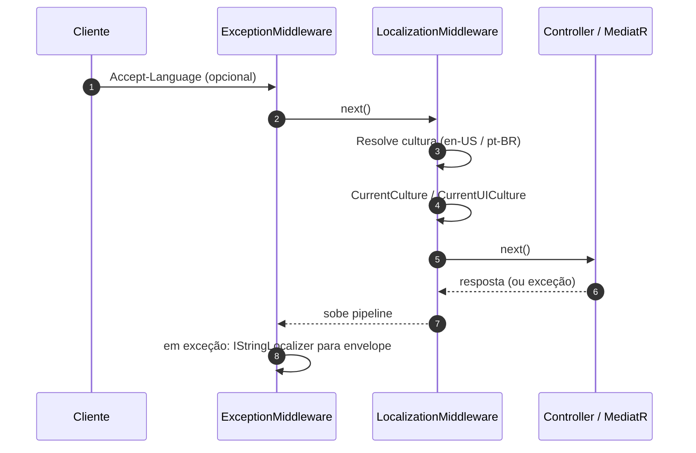
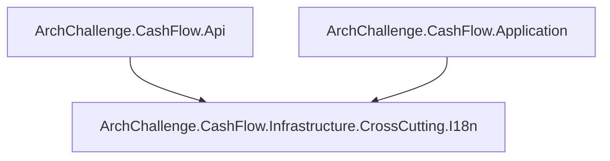

# Camada I18n — ArchChallenge.CashFlow.Infrastructure.CrossCutting.I18n

A camada **I18n** é uma biblioteca de classes (`ArchChallenge.CashFlow.Infrastructure.CrossCutting.I18n`) que centraliza **recursos de mensagens** (`.resx`), **chaves tipadas** (`MessageKeys`) e o tipo marcador **`Messages`** usado por `IStringLocalizer<Messages>` do ASP.NET Core. A **resolução de cultura** por requisição HTTP fica na **Api** (`LocalizationMiddleware`); a **Application** consome o localizador em **FluentValidation** e em **`CommandHandlerBase`** para textos de negócio consistentes com a cultura atual.

---

## Responsabilidades

- Registrar **`AddLocalization`** com pasta de recursos **`Resources`** — [DependencyInjection.cs](../../../../services/cashflow/src/I18n/DependencyInjection.cs).
- Expor **`MessageKeys`** com constantes estáveis alinhadas às entradas dos `.resx` — [MessageKeys.cs](../../../../services/cashflow/src/I18n/MessageKeys.cs).
- Fornecer a classe **`Messages`** apenas como marcador de recurso para `IStringLocalizer<Messages>` — [Messages.cs](../../../../services/cashflow/src/I18n/Messages.cs).
- Manter arquivos **`Messages.resx`** e **`Messages.pt-BR.resx`** em [Resources/](../../../../services/cashflow/src/I18n/Resources/) — entradas nomeadas alinhadas a `MessageKeys` (ex.: [Messages.resx](../../../../services/cashflow/src/I18n/Resources/Messages.resx), [Messages.pt-BR.resx](../../../../services/cashflow/src/I18n/Resources/Messages.pt-BR.resx)).
- Na **Api**, aplicar cultura a partir do cabeçalho **`Accept-Language`** — [LocalizationMiddleware.cs](../../../../services/cashflow/src/Api/Middlewares/LocalizationMiddleware.cs).
- Encadear DI e pipeline via **`AddLocalizationConfiguration`** / **`UseLocalizationConfiguration`** — [LocalizationExtensions.cs](../../../../services/cashflow/src/Api/Extensions/LocalizationExtensions.cs).
- Tratar mensagens genéricas de erro no **`ExceptionMiddleware`** (validação, domínio, interno) com o mesmo localizador — [ExceptionMiddleware.cs](../../../../services/cashflow/src/Api/Middlewares/ExceptionMiddleware.cs).
- Na **Application**, injetar **`IStringLocalizer<Messages>`** em validadores (ex.: `EnqueueTransactionValidator`) e na base de handlers — referência de projeto em [Application.csproj](../../../../services/cashflow/src/Application/Application.csproj).

---

## Referências de projeto

| Consumidor | Referência |
|------------|------------|
| Api | [Api.csproj](../../../../services/cashflow/src/Api/Api.csproj) — `ProjectReference` para `I18n\I18n.csproj` |
| Application | [Application.csproj](../../../../services/cashflow/src/Application/Application.csproj) — `ProjectReference` para `I18n` (uso de `Messages` / `MessageKeys` e `IStringLocalizer`) |

---

## Culturas suportadas e cabeçalho HTTP

O [LocalizationMiddleware](../../../../services/cashflow/src/Api/Middlewares/LocalizationMiddleware.cs) define:

- **Culturas:** `en-US` e `pt-BR` (constante `SupportedCultures`).
- **Padrão** quando o cabeçalho não resolve para uma suportada: **`en-US`** (`DefaultCulture`).
- **Parsing** de `Accept-Language` com pesos `q=`; escolha por **match exato** (ex.: `pt-BR`) ou **subtag primária** (ex.: `pt` → `pt-BR`).

Isso define `CultureInfo.CurrentCulture` e `CurrentUICulture` para o restante do pipeline da requisição.

---

## Onde entram as mensagens

| Uso | Onde | Detalhe |
|-----|------|---------|
| Envelope de erro HTTP | `ExceptionMiddleware` | Chaves `MessageKeys.Exception.*` — mensagens amigáveis no JSON de erro |
| Regras FluentValidation | Validators em `Application` | `WithMessage(_ => localizer[MessageKeys.Validation.*])` |
| Fluxo de comando | `CommandHandlerBase` | `IStringLocalizer<Messages>` disponível aos handlers que herdam a base |

> **Nota:** o corpo de `ValidationException` devolvido ao cliente ainda inclui **`message` por campo** vindas do FluentValidation (já localizadas na cultura corrente quando o validator usa o localizador). O envelope top-level usa as chaves `Exception_*`.

---

## Fluxo (requisição HTTP → cultura → texto)

A ordem de registro em [`Program.cs`](../../../../services/cashflow/src/Api/Program.cs) coloca **`ExceptionMiddleware`** na borda externa e **`UseLocalizationConfiguration`** logo abaixo, de modo que a cultura já esteja definida quando comandos, validadores e o middleware de exceção montam mensagens.

---

## Diagrama de dependências (projetos)

---

## Decisões

- **[ADR-004 — Backend com ASP.NET Core](../../decisions/ADR-004-backend-aspnet-core.md)** — uso de pipeline ASP.NET Core, middlewares e extensões de `Program.cs`, ponto natural para `AddLocalization` e ordenação do pipeline.

Para a visão da borda HTTP (Swagger, health, métricas), ver também [layer-01-api.md](./layer-01-api.md). Para o pipeline de validação FluentValidation, ver [layer-02-application.md](./layer-02-application.md).
