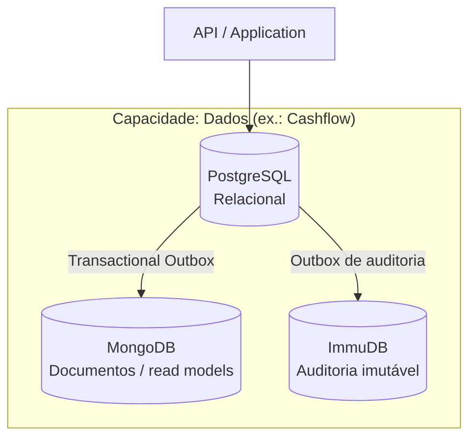

# Dados em microsserviços — Visão por capacidade

Em arquiteturas orientadas a serviços, **dados** raramente se reduzem a um único tipo de armazenamento: costumam combinar **persistência relacional** (fonte de escrita e consistência transacional), **armazenamento não relacional** (read models, caches materializados) e, quando há requisitos de conformidade, **armazenamento imutável** (trilhas verificáveis). Esta página fixa esse **mapa conceitual** para o monorepo; o detalhe de implementação por serviço continua nas camadas e ADRs ligados a cada bounded context.

**Referência neste repositório:** o **Cashflow** documenta o padrão de ponta a ponta (PostgreSQL + MongoDB + ImmuDB). Novos microsserviços podem reutilizar a mesma ideia de capacidade, substituindo ou acrescentando leituras conforme o contexto.

---

## Resumo em uma linha

| Abordagem | Tecnologia (ex.: Cashflow) | Papel típico |
|-----------|----------------------------|--------------|
| **Relacional** | PostgreSQL (EF Core) | Fonte de verdade transacional, outboxes, invariantes de domínio |
| **Não relacional** | MongoDB | Projeções / read models para consultas e listagens |
| **Imutável** | ImmuDB | Trilha de auditoria append-only, verificável criptograficamente |

---

## Capacidade “Dados” — onde cada peça se encaixa

Fluxo ilustrativo (comando → persistência → projeção → auditoria imutável), alinhado ao desenho do **Cashflow**:

**Leitura rápida do fluxo:**

- Escritas de negócio e consistência transacional permanecem no **PostgreSQL**.
- Eventos de outbox alimentam **MongoDB** de forma assíncrona (consistência eventual para leitura).
- Registros de auditoria saem de um outbox relacional e são **materializados** no **ImmuDB** por um worker dedicado.

---

## Sumário — detalhe no Cashflow (implementação de referência)

| # | Abordagem | O que ler |
|---|-----------|-----------|
| 1 | **Dados relacionais** | [layer-04-relational.md](../architecture/cashflow/layer-04-relational.md) — EF Core, `UnitOfWork`, outbox de projeção, tabelas transacionais |
| 2 | **Dados não relacionais (documentos)** | [layer-05-documents.md](../architecture/cashflow/layer-05-documents.md) — MongoDB, `TransactionDocument`, projeção idempotente |
| 3 | **Dados imutáveis (auditoria)** | [layer-09-immutable.md](../architecture/cashflow/layer-09-immutable.md) — pipeline de auditoria, `TB_OUTBOX_AUDIT_EVENT`, ImmuDB, worker `OutboxAudit` |

---

## Relacional (PostgreSQL)

**Resumo:** agregados, regras de domínio e **commit** transacional; filas locais (**outbox**) para não perder eventos nem registros de auditoria antes do processamento assíncrono.

**Ir ao detalhe (Cashflow):** [layer-04-relational.md](../architecture/cashflow/layer-04-relational.md)

---

## Não relacional (MongoDB)

**Resumo:** **read models** derivados do domínio, otimizados para consultas; em geral populados por workers a partir do relacional, sem substituir a fonte de verdade OLTP.

**Ir ao detalhe (Cashflow):** [layer-05-documents.md](../architecture/cashflow/layer-05-documents.md)

---

## Imutável (ImmuDB — auditoria)

**Resumo:** trilha **append-only** com verificação criptográfica; em geral a API não grava direto no ImmuDB — o vínculo com o transacional é um **outbox de auditoria** na mesma transação que o agregado.

**Ir ao detalhe (Cashflow):** [layer-09-immutable.md](../architecture/cashflow/layer-09-immutable.md)

---

## Decisões e contexto

| ADR | Relação com dados |
|-----|-------------------|
| [ADR-006](../decisions/ADR-006-postgresql-database-per-service.md) | PostgreSQL e database per service |
| [ADR-003](../decisions/ADR-003-comunicacao-assincrona-rabbitmq.md) | Outbox e mensageria (inclui padrão de projeção assíncrona) |
| [ADR-016](../decisions/ADR-016-immudb-armazenamento-imutavel-auditoria.md) | ImmuDB como armazenamento imutável para auditoria (trilha verificável) |

Para segregação de schemas no PostgreSQL (Cashflow), ver [ADR-015](../decisions/ADR-015-segregacao-schemas-postgresql.md).

---

## Outros documentos em `docs/data/`

Notas e convenções complementares no mesmo diretório: [database-naming-conventions.md](./database-naming-conventions.md), [local-connections.md](./local-connections.md), [data-layer-split.md](./data-layer-split.md).
