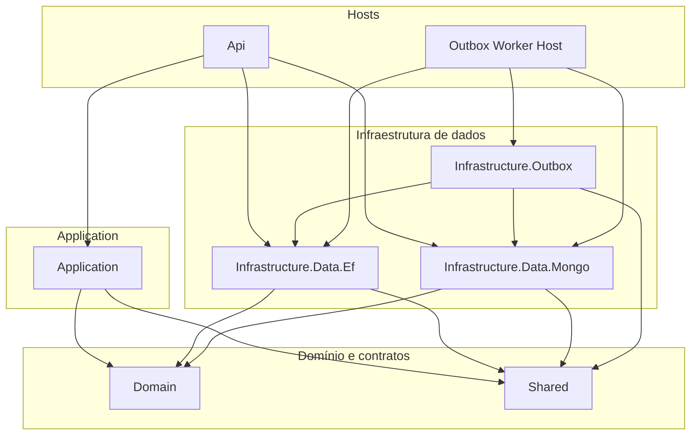
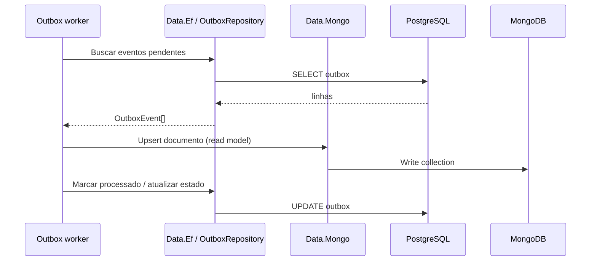

# Esboço: divisão Data (EF + Mongo) e projeto Outbox

> **Implementação atual no serviço CashFlow:** projetos em `services/cashflow/src/Relational`, `Documents`, `Immutable` e workers em `Agents/Outbox` (assemblies `ArchChallenge.CashFlow.Infrastructure.Data.*`). Use [data/README.md](./README.md) e [architecture/cashflow/](../architecture/cashflow/README.md) como referência principal; o texto abaixo permanece como esboço conceitual de divisão de responsabilidades.

Este documento descreve uma possível organização alinhada à conversa sobre **persistência EF**, **camada de leitura Mongo** e **worker de outbox** como processo ou biblioteca separada.

## Visão dos projetos

| Projeto sugerido | Responsabilidade |
|------------------|------------------|
| **Infrastructure.Data.Ef** | `DbContext`, migrations, repositórios EF (`Read`/`Write`), `UnitOfWork`, configurações de entidades, `OutboxRepository` (tabela de outbox no PostgreSQL). |
| **Infrastructure.Data.Mongo** | `IMongoClient` / `IMongoDatabase`, registro classe ↔ coleção (`AddMongoCollections`), `IMongoCollectionResolver`, repositórios de leitura/projeção em documentos. |
| **Infrastructure.Outbox** (ou **Worker.Outbox**) | `OutboxWorkerService` (ou `BackgroundService` equivalente), opções e validação, orquestração: **ler** eventos pendentes via abstrações do EF → **escrever** no Mongo → **marcar** processado no SQL. |

Contratos (`IReadRepository<>`, `IOutboxRepository`, documentos de leitura) continuam em **Domain** / **Shared**, conforme já fazem.

## Diagrama de dependências (referências entre projetos)

**Regra:** **Infrastructure.Outbox** não referencia **Api** nem **Application** (apenas orquestra infra e usa contratos de Shared/Domain). Se precisar de tipos de evento, ficam em Shared ou Domain.

## Fluxo do worker (outbox → Mongo)

## Onde registrar no DI

| Extensão | Conteúdo típico |
|----------|-----------------|
| `AddDataEf` (em **Data.Ef**) | `DbContext`, `IReadRepository<>`, `IWriteRepository<>`, `IUnitOfWork`, `IOutboxRepository`, connection string PostgreSQL. |
| `AddDataMongo` (em **Data.Mongo**) | `MongoClient`, `IMongoDatabase`, `ICollectionNameRegistry`, `IMongoCollectionResolver`, repositórios Mongo genéricos ou por documento. |
| `AddOutboxWorker` (em **Outbox**) | `OutboxWorkerOptions`, validador, `HostedService` — **somente** se o host for a Api; se for worker separado, o host chama `AddDataEf` + `AddDataMongo` + registro do worker. |

A **Api** atual pode continuar chamando os três se o outbox rodar no mesmo processo; caso contrário, a Api chama `AddDataEf` + `AddDataMongo` (se expuser leitura Mongo na API) e o **OutboxHost** chama `AddDataEf` + `AddDataMongo` + `AddOutboxWorker`.

## Mapeamento a partir do `Data` atual

| Local hoje (`src/Data`) | Destino sugerido |
|-------------------------|------------------|
| `Contexts/CashFlowDbContext.cs`, `Configurations/*`, `Migrations/*` | **Infrastructure.Data.Ef** |
| `Repositories/ReadRepository.cs`, `WriteRepository.cs`, `UnitOfWork`, `Specifications/*` | **Infrastructure.Data.Ef** |
| `Repositories/OutboxRepository.cs` | **Infrastructure.Data.Ef** (outbox é tabela relacional) |
| `Outbox/OutboxWorker*.cs` | **Infrastructure.Outbox** (ou projeto Worker) |
| `DependencyInjection.cs` | Dividir em `AddDataEf` / `AddDataMongo` / `AddOutboxWorker`; composição na Api ou Program do worker |
| Pacotes | **Data.Ef:** EF + Npgsql. **Data.Mongo:** MongoDB.Driver apenas. **Outbox:** Hosting.Abstractions + referências aos dois Data |

Código que hoje usa `IMongoDatabase` dentro de `OutboxWorkerService` passaria a depender de abstrações em **Data.Mongo** (por exemplo, `IMongoCollectionResolver` ou um serviço de projeção explícito).

## Pastas na solução (Solution Explorer)

Sugestão de pastas de solução (alinhadas ao `ArchChallenge.CashFlow.sln`):

- **3.2 Data**
  - `Infrastructure.Data.Ef`
  - `Infrastructure.Data.Mongo`
- **3. Infrastructure** (ou subpasta **Workers**)
  - `Infrastructure.Outbox`

## Nomes de assembly (exemplo)

- `ArchChallenge.CashFlow.Infrastructure.Data.Ef`
- `ArchChallenge.CashFlow.Infrastructure.Data.Mongo`
- `ArchChallenge.CashFlow.Infrastructure.Outbox`

Ajuste os nomes ao padrão que a solução `arch-challenge` usar nos outros serviços.

---

*Documento esboço — refinar ao implementar a divisão real de projetos.*
