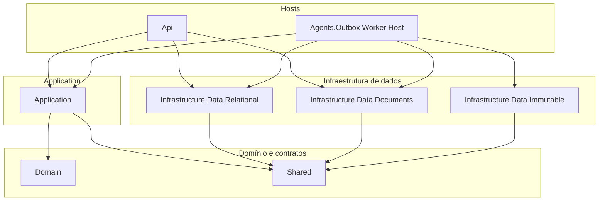
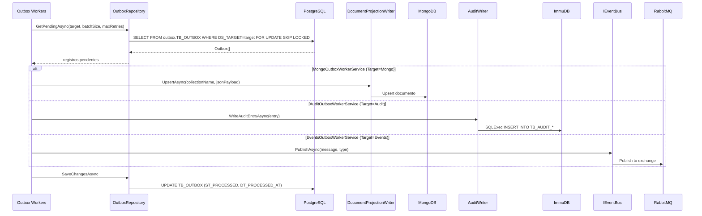

# Divisão de camadas de dados e projeto Outbox

> **Implementação real no serviço CashFlow:** projetos em `services/cashflow/src/Relational`, `Documents`, `Immutable` e workers em `Agents/Outbox` (assemblies `ArchChallenge.CashFlow.Infrastructure.Data.*` e `Infrastructure.Agents.Outbox`). Use [data/README.md](./README.md) e [architecture/cashflow/](../architecture/cashflow/README.md) como referência principal para detalhes de implementação.

Este documento descreve a organização dos projetos de **persistência EF**, **camada de leitura Mongo**, **auditoria imutável** e **workers de outbox** como processo separado.

## Visão dos projetos

| Projeto sugerido | Implementação real | Responsabilidade |
|------------------|---------------------|------------------|
| **Infrastructure.Data.Ef** | `Infrastructure.Data.Relational` | `DbContext`, migrations, repositórios EF (`Read`/`Write`), `UnitOfWork`, configurações de entidades, `OutboxRepository` (tabela de outbox no PostgreSQL). |
| **Infrastructure.Data.Mongo** | `Infrastructure.Data.Documents` | `IMongoClient` / `IMongoDatabase`, registro classe ↔ coleção (`AddMongoCollections`), `IDocumentsReadRepository<T>`, `DocumentProjectionWriter`, repositórios de leitura/projeção em documentos. |
| **Infrastructure.Outbox** (ou **Worker.Outbox**) | `Infrastructure.Agents.Outbox` (projeto `Agents/Outbox`) | Workers (`MongoOutboxWorkerService`, `EventsOutboxWorkerService`, `AuditOutboxWorkerService`), options e validação, orquestração: **ler** eventos pendentes via `IOutboxRepository` → **escrever** no Mongo/ImmuDB/RabbitMQ → **marcar** processado. |
| — | `Infrastructure.Data.Immutable` | `AuditWriter` (adaptador ImmuDB), `ImmuDbOptions`, `AuditTableConventions`, `ImmuDbHealthCheck` — persistência imutável de auditoria via SQL API. |

Contratos (`IReadRepository<>`, `IOutboxRepository`, documentos de leitura) continuam em **Domain** / **Shared**, conforme já fazem.

## Diagrama de dependências (referências entre projetos)

**Regra:** O projeto **Agents.Outbox** não referencia **Api** (apenas orquestra infra e usa contratos de Shared/Domain e abstrações da Application). Os workers dependem de `IOutboxRepository`, `IDocumentProjectionWriter`, `IAuditWriter` e `IEventBus`.

## Fluxo do worker (outbox → destinos)

## Onde registrar no DI

| Extensão | Implementação real | Conteúdo típico |
|----------|---------------------|----------------|
| `AddRelationalData` (em **Data.Relational**) | `DependencyInjection.cs` | `DbContext`, `IReadRepository<>`, `IWriteRepository<>`, `IUnitOfWork`, `IOutboxRepository`, connection string PostgreSQL, `MigrationsHistoryTable` no schema `control`. |
| `AddDocumentsData` (em **Data.Documents**) | `DependencyInjection.cs` | `MongoClient`, `IMongoDatabase`, `IDocumentsReadRepository<T>`, `IDocumentProjectionWriter`, coleções registradas por tipo. |
| `AddImmutableData` (em **Data.Immutable**) | `DependencyInjection.cs` | `IAuditWriter` (singleton), `ImmuDbOptions`, `ImmuDbHealthCheck`. |
| `AddOutboxAgent` (em **Agents.Outbox**) | `DependencyInjection.cs` | `OutboxWorkerOptions` + validação, `AuditWorkerOptions`, `CollectionMap`, `TypeMap`, três `HostedService`s. |

A **Api** chama `AddRelationalData` + `AddDocumentsData` + demais cross-cutting. O **Agents/Outbox** host (worker separado com `Program.cs` próprio) chama `AddRelationalData` + `AddDocumentsData` + `AddMessagingPublisher` + `AddImmutableData` + `AddOutboxAgent`.

## Mapeamento do código atual

| Local no código | Projeto / Namespace |
|-----------------|---------------------|
| `src/Relational/Contexts/CashFlowDbContext.cs`, `Configurations/*`, `Migrations/*` | **Infrastructure.Data.Relational** |
| `src/Relational/Repositories/ReadRepository.cs`, `WriteRepository.cs`, `UnitOfWork.cs`, `Specifications/*` | **Infrastructure.Data.Relational** |
| `src/Relational/Repositories/OutboxRepository.cs` | **Infrastructure.Data.Relational** (outbox é tabela relacional) |
| `src/Documents/` (Repositories, Models, ProjectionWriter) | **Infrastructure.Data.Documents** |
| `src/Immutable/` (Writers, Options, Conventions, Healthcheck) | **Infrastructure.Data.Immutable** |
| `src/Agents/Outbox/Workers/` (`Mongo`, `Events`, `Audit`) | **Infrastructure.Agents.Outbox** (worker separado) |
| `src/Agents/Outbox/DependencyInjection.cs` | Composição no `Program.cs` do worker |
| Pacotes | **Relational:** EF + Npgsql. **Documents:** MongoDB.Driver. **Immutable:** ImmuDB4Net. **Agents.Outbox:** Hosting.Abstractions + referências aos três Data + Messaging |

## Pastas na solução (Solution Explorer)

- **3.2 Data**
  - `Infrastructure.Data.Relational`
  - `Infrastructure.Data.Documents`
  - `Infrastructure.Data.Immutable`
- **3. Infrastructure** (ou subpasta **Workers**)
  - `Infrastructure.Agents.Outbox`

## Nomes de assembly (implementação real)

- `ArchChallenge.CashFlow.Infrastructure.Data.Relational`
- `ArchChallenge.CashFlow.Infrastructure.Data.Documents`
- `ArchChallenge.CashFlow.Infrastructure.Data.Immutable`
- `ArchChallenge.CashFlow.Infrastructure.Agents.Outbox`

Ajuste os nomes ao padrão que a solução `arch-challenge` usar nos outros serviços.

---

*Documento atualizado para refletir a implementação real dos projetos.*
