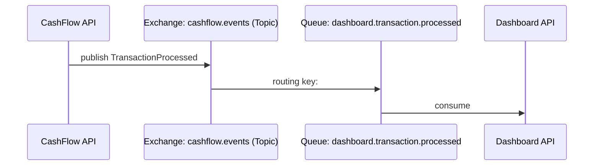

# ADR-003 — Comunicação Assíncrona via RabbitMQ

- **Status:** Aceito
- **Data:** 2026-04-03
- **Decisores:** Time de Arquitetura

---

## Contexto

Os dois bounded contexts do sistema — CashFlow e Dashboard — precisam se comunicar. Quando um lançamento é registrado no CashFlow, o Dashboard deve ser notificado para atualizar o consolidado diário.

O requisito não funcional mais crítico da solução determina que:

> "O serviço de controle de lançamentos não deve ficar indisponível caso o serviço de consolidado diário falhe."

Esse requisito elimina qualquer forma de comunicação síncrona entre os dois serviços, pois nesse modelo o CashFlow dependeria da disponibilidade do Dashboard.

Adicionalmente, o Dashboard deve suportar **50 requisições por segundo** com no máximo **5% de perda**.

---

## Decisão

Adotar **comunicação assíncrona baseada em eventos** utilizando **RabbitMQ** como broker de mensagens.

O CashFlow publica o evento `TransactionProcessed` em uma exchange do RabbitMQ após persistir a transação com sucesso. O Dashboard consome essa fila de forma independente e atualiza o consolidado diário.

### Topologia de mensagens



### Contrato do evento

O evento publicado na exchange `cashflow.events` segue a estrutura de `DomainEvent`. O campo `payload` contém o JSON serializado da entidade `Transaction`:

```json
{
  "eventId": "3fa85f64-5717-4562-b3fc-2c963f66afa6",
  "eventName": "TransactionProcessed",
  "occurredAt": "2026-04-03T10:00:00Z",
  "payload": {
    "Id": "3fa85f64-5717-4562-b3fc-2c963f66afa6",
    "Type": 1,
    "Amount": 150.00,
    "Description": "Venda à vista",
    "CreatedAt": "2026-04-03T10:00:00Z",
    "UpdatedAt": "2026-04-03T10:00:00Z",
    "Active": true
  }
}
```
> **Legenda de `Type`:** `1` = Credit, `2` = Debit.

---

## Alternativas Consideradas

### REST síncrono (HTTP)

**Prós:**
- Simplicidade de implementação
- Feedback imediato de sucesso/falha

**Contras:**
- Viola diretamente o requisito não funcional: se o Dashboard estiver indisponível, o CashFlow também seria impactado
- Acoplamento temporal entre os serviços
- Sem buffer para absorver picos de carga

**Descartado** por violação de requisito crítico.

### Kafka

**Prós:**
- Alta throughput, retenção de mensagens configurável
- Replay de eventos nativamente suportado
- Ecossistema maduro para event sourcing

**Contras:**
- Exige schema registry para uso com Avro (maior burocracia operacional)
- Overhead de infraestrutura maior (ZooKeeper ou KRaft, múltiplos brokers para HA)
- Curva de aprendizado maior para times não familiarizados
- Overengineering para o volume atual do sistema

**Descartado** em favor do RabbitMQ por menor burocracia nessa fase do projeto.

---

## Trade-offs Documentados

| Aspecto | Decisão | Trade-off |
|---|---|---|
| Formato de mensagem | JSON | Menos garantia de contrato que Avro/Protobuf, mas sem necessidade de schema registry |
| Durabilidade | Filas e mensagens persistentes | Leve overhead de I/O, mas garante não perda de mensagens em restart do broker |
| Confirmação | Ack manual no consumidor | Maior controle de reprocessamento, mas requer idempotência no Dashboard |
| Consistência | Eventual | O consolidado pode estar alguns segundos defasado em relação ao lançamento registrado |

---

## Consequências

**Positivas:**
- CashFlow continua operando independentemente do estado do Dashboard
- RabbitMQ funciona como buffer natural para picos de carga, suportando os 50 req/s exigidos
- Desacoplamento temporal entre os serviços
- Menor burocracia operacional em relação ao Kafka

**Negativas:**
- Consistência eventual: o consolidado pode não refletir imediatamente um lançamento recém-registrado
- O Dashboard precisa implementar idempotência no consumo para evitar duplicações em caso de reprocessamento
- Sem suporte nativo a replay de eventos históricos (diferente do Kafka)

---

## Referências

- [RabbitMQ — Publisher Confirms](https://www.rabbitmq.com/publishers.html#confirms)
- [Enterprise Integration Patterns — Hohpe & Woolf](https://www.enterpriseintegrationpatterns.com/)
- [Microservices.io — Event-Driven Architecture](https://microservices.io/patterns/data/event-driven-architecture.html)
