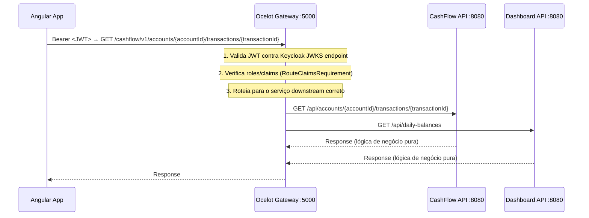

# ADR-009 — API Gateway com Ocelot

- **Status:** Aceito
- **Data:** 2026-04-05
- **Decisores:** Time de Arquitetura
- **Relacionado a:** [ADR-008 — Autenticação e Autorização com Keycloak](./ADR-008-autenticacao-autorizacao-keycloak.md), [ADR-002 — Separação em Dois Bounded Contexts](./ADR-002-separacao-cashflow-dashboard.md)

---

## Contexto

Com dois serviços backend independentes (CashFlow e Dashboard, internamente na porta 8080 e mapeados para 5001/5002 no host em desenvolvimento), o sistema apresentava os seguintes problemas:

- O frontend Angular precisava conhecer e gerenciar duas origens distintas
- Cada serviço implementava sua própria camada de autenticação JWT de forma duplicada
- Não havia um ponto único para aplicar políticas transversais (rate limiting, CORS, logging de acesso)
- A documentação Swagger estava fragmentada em dois endpoints separados
- Qualquer mudança de segurança (ex: troca de algoritmo JWT, rotação de chaves) precisava ser aplicada em ambos os serviços individualmente

Era necessária uma camada de entrada unificada que centralizasse essas responsabilidades sem acoplar os serviços entre si.

---

## Decisão

Introduzir um **API Gateway** usando **Ocelot** (ASP.NET Core) como ponto único de entrada para todas as requisições dos frontends, centralizando:

1. **Autenticação** — validação do JWT emitido pelo Keycloak (assinatura, issuer, audience, expiração)
2. **Roteamento** — mapeamento de rotas públicas para os serviços downstream
3. **Documentação** — Swagger UI agregado via `MMLib.SwaggerForOcelot`

### Fluxo atualizado



### Mapeamento de rotas

| Rota no Gateway (exemplos) | Serviço Downstream | Path Downstream | Porta interna |
|---|---|---|---|
| `GET /cashflow/v1/accounts/me` | CashFlow API | `/api/accounts/me` | 8080 |
| `POST /cashflow/v1/accounts/{accountId}/transactions` | CashFlow API | `/api/accounts/{accountId}/transactions` | 8080 |
| `GET /dashboard/v1/daily-balances` | Dashboard API | `/api/daily-balances` | 8080 |

> O template `DownstreamPathTemplate: "/api/{everything}"` mapeia qualquer path upstream `/cashflow/v1/*` para `/api/*` no serviço downstream. A rota CashFlow do gateway deve aceitar os verbos HTTP usados pela API (incluindo **`PATCH`** para ciclo de vida da conta).

### Configuração Ocelot (`ocelot.json`)

```json
{
  "Routes": [
    {
      "SwaggerKey": "cashflow",
      "UpstreamPathTemplate": "/cashflow/v1/{everything}",
      "UpstreamHttpMethod": [ "GET", "POST", "PUT", "DELETE", "PATCH" ],
      "DownstreamPathTemplate": "/api/{everything}",
      "DownstreamScheme": "http",
      "DownstreamHostAndPorts": [
        { "Host": "cashflow-api", "Port": 8080 }
      ],
      "AuthenticationOptions": {
        "AuthenticationProviderKey": "Bearer",
        "AllowedScopes": []
      },
      "RouteClaimsRequirement": {
        "roles": "comerciante,admin"
      },
      "RateLimitOptions": {
        "ClientWhitelist": [],
        "EnableRateLimiting": true,
        "Period": "1m",
        "PeriodTimespan": 60,
        "Limit": 60
      }
    },
    {
      "SwaggerKey": "dashboard",
      "UpstreamPathTemplate": "/dashboard/v1/{everything}",
      "UpstreamHttpMethod": [ "GET" ],
      "DownstreamPathTemplate": "/api/{everything}",
      "DownstreamScheme": "http",
      "DownstreamHostAndPorts": [
        { "Host": "dashboard-api", "Port": 8080 }
      ],
      "AuthenticationOptions": {
        "AuthenticationProviderKey": "Bearer",
        "AllowedScopes": []
      },
      "RouteClaimsRequirement": {
        "roles": "gestor,admin"
      },
      "RateLimitOptions": {
        "ClientWhitelist": [],
        "EnableRateLimiting": true,
        "Period": "1m",
        "PeriodTimespan": 60,
        "Limit": 30
      }
    }
  ],
  "GlobalConfiguration": {
    "BaseUrl": "http://localhost:5000",
    "RateLimitOptions": {
      "DisableRateLimitHeaders": false,
      "QuotaExceededMessage": "Too Many Requests — limite de requisições atingido. Tente novamente em instantes.",
      "HttpStatusCode": 429,
      "ClientIdHeader": "X-ClientId"
    }
  }
}
```

### Swagger agregado (`MMLib.SwaggerForOcelot`)

```json
{
  "SwaggerEndPoints": [
    {
      "Key": "cashflow",
      "Config": [
        {
          "Name": "CashFlow API",
          "Version": "v1",
          "Url": "http://cashflow-api:8080/swagger/v1/swagger.json"
        }
      ]
    },
    {
      "Key": "dashboard",
      "Config": [
        {
          "Name": "Dashboard API",
          "Version": "v1",
          "Url": "http://dashboard-api:8080/swagger/v1/swagger.json"
        }
      ]
    }
  ]
}
```

O Swagger UI unificado fica disponível em `http://localhost:5000/swagger`, com todos os endpoints das duas APIs roteados corretamente.

### Divisão de responsabilidades de segurança

| Camada | Responsabilidade |
|---|---|
| **Ocelot Gateway** | Validação do JWT (assinatura, issuer, audience, expiração), verificação de roles via `RouteClaimsRequirement`, CORS, rate limiting |
| **CashFlow API** | Validação do JWT Bearer na própria API (exceto modo `Security:Disabled`), `[Authorize]` em contas/transações, regras de ownership com `sub` |
| **Dashboard API** | Mesmo padrão de autenticação JWT na borda do serviço |

O gateway continua sendo o ponto de política de **roles** para o tráfego norte-sul. As APIs **não duplicam** a matriz de roles do Ocelot, mas **exigem usuário autenticado** e aplicam regras de domínio (ex.: transação só na conta do usuário). Em **produção**, apenas o gateway deve ser exposto externamente; as APIs permanecem na rede interna.

---

## Alternativas Consideradas

### Segurança em cada API individualmente (sem gateway)

**Prós:**
- Menor número de componentes na infraestrutura
- Cada serviço completamente autônomo sem dependência de componente central

**Contras:**
- Lógica de autenticação duplicada em cada serviço
- Qualquer mudança de política de segurança requer deploy coordenado de múltiplos serviços
- Frontend precisa conhecer múltiplas origens
- Sem ponto único para aplicar rate limiting e CORS de forma consistente
- Swagger fragmentado em dois endpoints distintos

**Descartado** pela duplicação de responsabilidades e dificuldade de evolução da política de segurança.

### NGINX como API Gateway (com Lua ou módulos)

**Prós:**
- Alta performance e amplamente utilizado em produção
- Suporte nativo a TLS termination e load balancing

**Contras:**
- Validação de JWT requer módulos externos ou Lua scripting — complexidade fora do ecossistema .NET
- Sem integração nativa com Swagger para agregação de documentação
- Configuração de autorização por roles é limitada comparada a uma solução programática

**Descartado** por falta de integração com o ecossistema ASP.NET Core e ausência de suporte nativo a Swagger.

### YARP (Yet Another Reverse Proxy)

**Prós:**
- Biblioteca oficial da Microsoft para ASP.NET Core
- Alta performance e suporte a configuração dinâmica

**Contras:**
- Não possui suporte nativo a agregação de Swagger como `MMLib.SwaggerForOcelot`
- Exige mais código de configuração manual para roteamento com autenticação
- Ecossistema de plugins menor que o Ocelot para este cenário específico

**Descartado** em favor do Ocelot pela maturidade do ecossistema e suporte nativo à agregação de Swagger.

---

## Consequências

**Positivas:**
- Ponto único de entrada: frontend conhece apenas `localhost:5000`
- **Política de roles** (`RouteClaimsRequirement`) e limites de taxa ficam no gateway — mudanças de quem pode acessar cada prefixo não exigem deploy das APIs
- As APIs **validam JWT Bearer** e aplicam `[Authorize]` nos recursos protegidos; o gateway complementa (e não remove) esse modelo nas topologias onde o tráfego público passa primeiro pelo Ocelot
- Swagger UI unificado com todas as APIs documentadas em `localhost:5000/swagger`
- CORS e rate limiting configurados uma única vez no gateway

**Negativas:**
- O gateway é componente crítico para **políticas de borda** (roles, rate limit); exposição direta das APIs sem ele reduz o controle unificado dessas regras — por isso, em produção, prefere-se tráfego externo apenas via Ocelot
- O gateway se torna um componente crítico de infraestrutura — em produção requer alta disponibilidade (múltiplas instâncias + load balancer)
- Uma falha no gateway torna ambas as APIs inacessíveis pelos frontends, mesmo que os serviços downstream estejam saudáveis
- Hop adicional na rede (latência marginal, desprezível para este cenário)

---

## Estrutura do serviço Gateway

```
services/
└── gateway/
    ├── ArchChallenge.Gateway.csproj
    ├── Program.cs
    ├── ocelot.json
    ├── ocelot.Development.json
    ├── appsettings.json
    ├── appsettings.Development.json
    ├── Authorization/
    ├── Security/
    └── Dockerfile
```

---

## Referências

- [Ocelot — Documentação oficial](https://ocelot.readthedocs.io/)
- [MMLib.SwaggerForOcelot](https://github.com/Moxuanyu/MMLib.SwaggerForOcelot)
- [API Gateway Pattern — microservices.io](https://microservices.io/patterns/apigateway.html)
- [ADR-008 — Autenticação e Autorização com Keycloak](./ADR-008-autenticacao-autorizacao-keycloak.md)
