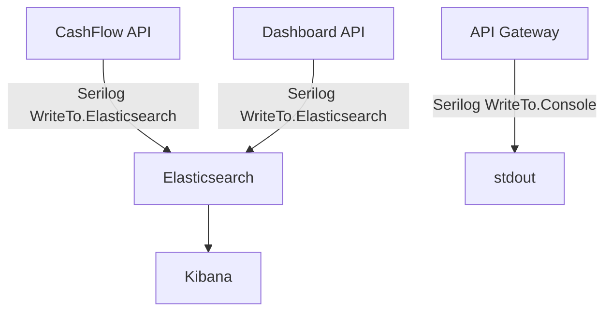
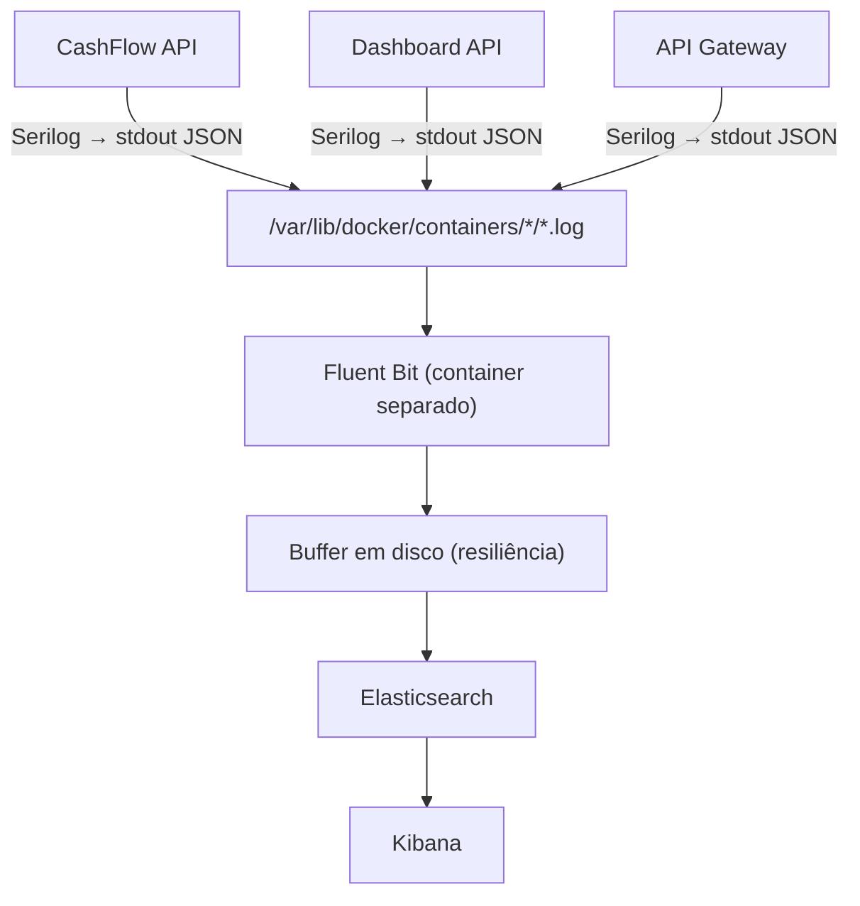

# ADR-011 — Ingestão de Logs com Serilog e Fluent Bit

- **Status:** Aceito (atualizado em 2026-05-07)
- **Data:** 2026-04-05
- **Decisores:** Time de Arquitetura

---

## Contexto

O sistema é composto por três serviços que precisam gerar logs estruturados para fins de observabilidade, debugging e auditoria operacional:

- **CashFlow API** — registra lançamentos financeiros
- **Dashboard API** — consolida saldo diário
- **API Gateway (Ocelot)** — ponto único de entrada, roteia requisições

A stack de observabilidade adotada utiliza **Elasticsearch** como backend de armazenamento e indexação de logs, e **Kibana** como ferramenta de visualização.

A questão arquitetural central é: **como os logs das aplicações chegam ao Elasticsearch?**

Existem duas abordagens principais:

1. **Serilog com sink direto para Elasticsearch** — a aplicação escreve diretamente no Elasticsearch via biblioteca cliente.
2. **Aplicação escreve em stdout + agente de coleta** — um processo externo (Fluent Bit, Filebeat, etc.) lê os logs e encaminha ao Elasticsearch.

---

## Decisão

Adotar uma estratégia em **duas fases**:

### Fase atual — Serilog com sink direto para Elasticsearch

Na implementação corrente, as aplicações utilizam **`Serilog.Sinks.Elasticsearch`** para gravar logs diretamente no Elasticsearch. Cada serviço configura o sink via `DependencyInjection.cs` do projeto `Logging`, com filtros dedicados para excluir logs de ciclos de poll dos outbox workers (`ElasticsearchOutboxFilters`).

Essa abordagem foi adotada pela **simplicidade de setup** no ambiente de desenvolvimento local (docker-compose) e pela **baixa latência** de entrega de logs ao Kibana.

### Fase futura — Fluent Bit como agente de coleta

Os arquivos de configuração do **Fluent Bit** já estão preparados em `infra/fluent-bit/` (`fluent-bit.conf`, `parsers.conf`), com buffer em disco (`storage.type filesystem`) e input configurado para ler logs do Docker (`/var/lib/docker/containers/*/*.log`). A migração para o modelo desacoplado (apps → stdout → Fluent Bit → Elasticsearch) é recomendada para **produção**, onde a resiliência a quedas do Elasticsearch é crítica.

A transição requer:
1. Remover o sink `Serilog.Sinks.Elasticsearch` e manter apenas `WriteTo.Console` (JSON estruturado)
2. Adicionar o container Fluent Bit ao `docker-compose.yml`
3. Montar o volume de logs Docker no container Fluent Bit

---

## Alternativas Consideradas

### Serilog com sink direto para Elasticsearch (`Serilog.Sinks.Elasticsearch`)

> **Nota:** esta é a abordagem **atualmente implementada** no ambiente de desenvolvimento.

**Prós:**
- Zero componentes adicionais na infraestrutura
- Logs aparecem no Kibana com baixíssima latência
- Correlação com Elastic APM funciona nativamente

**Contras:**
- **Acoplamento direto entre a aplicação e o Elasticsearch** — se o Elasticsearch estiver lento ou indisponível, as tentativas de escrita do sink podem impactar threads e latência da aplicação
- **Sem buffer persistente nativo** — uma queda do Elasticsearch pode causar perda de logs não entregues, a menos que seja configurado manualmente um buffer em arquivo (o que recria parcialmente o que um agente já oferece nativamente)
- **Não é a abordagem recomendada pelo Elastic** — o próprio Elastic recomenda a cadeia `App → agente de coleta → Elasticsearch` para ambientes de produção
- **Enriquecimento de metadados manual** — metadados de infraestrutura (nome do container, imagem Docker, labels) precisam ser adicionados via Serilog Enrichers; um agente adiciona isso automaticamente

**Mantido para desenvolvimento** pela simplicidade; **recomendado migrar para Fluent Bit em produção** para ganhar resiliência e desacoplamento.

### Filebeat (Elastic)

**Prós:**
- Integração nativa e otimizada com toda a stack Elastic (Elasticsearch, Kibana, Elastic APM)
- Autodiscovery de containers Docker com enriquecimento automático de metadados
- Suporte a módulos pré-configurados para tecnologias comuns

**Contras:**
- **Mais pesado** — consome significativamente mais memória que o Fluent Bit (~60MB vs ~1MB em repouso)
- **Menos flexível para múltiplos destinos** — projetado primariamente para a stack Elastic; adicionar outros destinos (ex: Grafana Loki, S3) é mais trabalhoso
- **Não é o padrão cloud-native** — Kubernetes e os principais provedores de nuvem (EKS, GKE, AKS) adotam Fluent Bit como agente padrão de coleta de logs

**Descartado** em favor do Fluent Bit por menor footprint e maior flexibilidade.

### OpenTelemetry Collector

**Prós:**
- Padrão aberto e vendor-neutral (CNCF)
- Coleta logs, métricas e traces em um único agente
- Suporte nativo ao protocolo OTLP

**Contras:**
- **Maior complexidade de configuração** para o escopo atual
- **Curva de aprendizado** mais alta para a equipe
- Benefícios são maiores em ambientes com múltiplos backends de observabilidade

**Não descartado para o futuro** — a migração para OpenTelemetry Collector é uma evolução natural se a stack crescer para múltiplos destinos (ex: Datadog, Jaeger, Grafana Cloud). O uso do Fluent Bit não bloqueia essa transição.

---

## Trade-offs Documentados

| Aspecto | Fase atual (Serilog direto) | Fase futura (Fluent Bit) |
|---|---|---|
| Acoplamento das apps | Apps acopladas ao Elasticsearch via sink | Apps escrevem apenas em stdout — desacoplamento total |
| Resiliência | Sem buffer persistente; queda do ES pode perder logs | Buffer em disco no Fluent Bit; logs sobrevivem a quedas |
| Latência | Mínima (escrita direta) | Levemente maior (intermediário) |
| Componentes extras | Nenhum | Container Fluent Bit adicional |
| Enriquecimento | Via Serilog Enrichers (manual) | Automático via Docker metadata |
| Portabilidade | Vinculada ao Elasticsearch | Fluent Bit é padrão em Kubernetes |

---

## Consequências

### Estado atual (Serilog → Elasticsearch direto)

**Positivas:**
- Setup simples para desenvolvimento local — sem containers adicionais
- Logs aparecem no Kibana com baixíssima latência
- Correlação nativa com Elastic APM
- Filtros customizados (`ElasticsearchOutboxFilters`) excluem logs de polling do outbox, evitando ruído

**Negativas:**
- Acoplamento direto: indisponibilidade do Elasticsearch pode impactar threads da aplicação
- Sem buffer persistente: logs não entregues são perdidos em queda do ES
- Enriquecimento de metadados Docker requer Serilog Enrichers manuais

### Estado futuro (Fluent Bit — recomendado para produção)

**Positivas:**
- As aplicações ficam completamente desacopladas do backend de observabilidade — uma troca de Elasticsearch por outro destino não exige nenhuma mudança no código
- Em caso de indisponibilidade do Elasticsearch, os logs são preservados em disco e entregues automaticamente na recuperação, sem qualquer impacto nas aplicações
- O enriquecimento automático de metadados Docker (nome do container, imagem, labels) melhora a rastreabilidade sem poluir o código das aplicações
- O Fluent Bit é leve (~1MB de footprint), adequado para ambientes locais de desenvolvimento
- A abordagem é alinhada com as boas práticas cloud-native e prepara a solução para uma eventual migração para Kubernetes

**Negativas:**
- Um container adicional precisa ser gerenciado no `docker-compose` e nas pipelines de infraestrutura
- A garantia de entrega é **at-least-once**, não **exactly-once** — pode haver duplicatas de logs em cenários de reconexão (aceitável para observabilidade)
- O buffer em disco tem tamanho configurável e finito — em indisponibilidades prolongadas do Elasticsearch pode haver perda de logs mais antigos se o buffer atingir o limite

---

## Referências

- [Fluent Bit — Official Documentation](https://docs.fluentbit.io/)
- [Fluent Bit — Buffering & Storage](https://docs.fluentbit.io/manual/administration/buffering-and-storage)
- [Fluent Bit — Docker Log Driver](https://docs.fluentbit.io/manual/pipeline/inputs/tail)
- [Elastic — Getting logs into Elasticsearch (recomendações oficiais)](https://www.elastic.co/guide/en/elasticsearch/reference/current/getting-started.html)
- [CNCF Landscape — Logging](https://landscape.cncf.io/card-mode?category=logging&grouping=category)
- [12-Factor App — Logs](https://12factor.net/logs)
