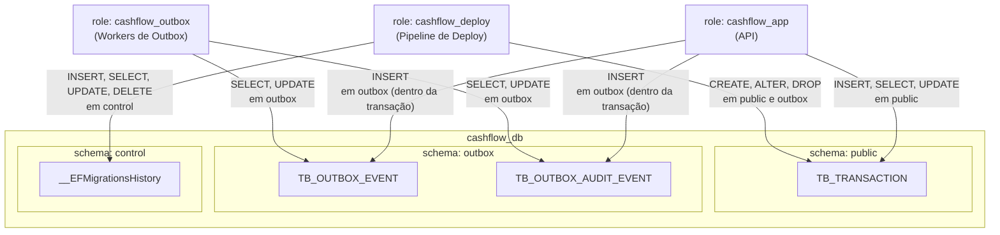

# ADR-015 — Segregação de Schemas PostgreSQL por Responsabilidade e Controle de Acesso

- **Status:** Aceito
- **Data:** 2026-04-15
- **Decisores:** Time de Arquitetura

---

## Contexto

O banco de dados `cashflow_db` hospeda três categorias distintas de objetos com perfis de acesso completamente diferentes:

| Categoria | Exemplos | Quem precisa de acesso |
|-----------|----------|------------------------|
| Dados de domínio | `TB_TRANSACTION` | API, workers de outbox (leitura) |
| Outbox transacional | `TB_OUTBOX_EVENT`, `TB_OUTBOX_AUDIT_EVENT` | Workers de outbox (leitura/escrita), API (somente escrita dentro da transação) |
| Metadados de infraestrutura EF | `__EFMigrationsHistory` | Role de deploy/migrations exclusivamente |

Manter todos os objetos no schema `public` elimina a possibilidade de conceder privilégios granulares por perfil de role, expondo objetos sensíveis (como o histórico de migrations) a roles que não deveriam interagir com eles.

Dois riscos concretos foram identificados:

1. **Migration acidental em ambiente compartilhado**: um desenvolvedor que aponta a connection string para um ambiente compartilhado (QA, staging) pode rodar `dotnet ef database update` localmente e alterar o schema sem passar pelo processo de deploy formal — desde que o usuário do banco tenha permissão de escrita no schema `control`.

2. **Acesso indevido entre workers**: o worker responsável apenas por processar a fila de outbox não precisa ler ou escrever em `TB_TRANSACTION`. Conceder acesso mínimo por schema impede que uma falha ou comprometimento desse processo afete os dados de domínio.

---

## Decisão

Adotar **três schemas** no banco `cashflow_db`, cada um com um role dedicado e privilégios mínimos:



### Schemas e finalidades

| Schema | Finalidade | Role com acesso pleno |
|--------|------------|----------------------|
| `public` | Dados de domínio da aplicação | `cashflow_app`, `cashflow_deploy` |
| `outbox` | Tabelas do Transactional Outbox Pattern | `cashflow_outbox`, `cashflow_app` (INSERT), `cashflow_deploy` |
| `control` | Histórico de migrations EF Core (`__EFMigrationsHistory`) | `cashflow_deploy` exclusivamente |

### Configuração no EF Core

A tabela de histórico é redirecionada para o schema `control` no `DependencyInjection.cs`:

```csharp
options.UseNpgsql(
    connectionString,
    npgsql => npgsql.MigrationsHistoryTable("__EFMigrationsHistory", "control"));
```

As entidades de outbox são mapeadas explicitamente para o schema `outbox` nas configurations do EF:

```csharp
// OutboxEventConfiguration
builder.ToTable("TB_OUTBOX_EVENT", schema: "outbox");

// AuditOutboxEventConfiguration
builder.ToTable("TB_OUTBOX_AUDIT_EVENT", schema: "outbox");
```

### Exemplo de grants por role (referência)

```sql
-- role de deploy: acesso a tudo para aplicar migrations
GRANT USAGE, CREATE ON SCHEMA public, outbox, control TO cashflow_deploy;
GRANT ALL ON ALL TABLES IN SCHEMA public, outbox, control TO cashflow_deploy;
ALTER DEFAULT PRIVILEGES IN SCHEMA public, outbox, control
    GRANT ALL ON TABLES TO cashflow_deploy;

-- role da API: escrita em public, insert restrito em outbox, sem acesso a control
GRANT USAGE ON SCHEMA public, outbox TO cashflow_app;
GRANT SELECT, INSERT, UPDATE, DELETE ON ALL TABLES IN SCHEMA public TO cashflow_app;
GRANT INSERT ON ALL TABLES IN SCHEMA outbox TO cashflow_app;
ALTER DEFAULT PRIVILEGES IN SCHEMA public
    GRANT SELECT, INSERT, UPDATE, DELETE ON TABLES TO cashflow_app;
ALTER DEFAULT PRIVILEGES IN SCHEMA outbox
    GRANT INSERT ON TABLES TO cashflow_app;

-- role dos workers de outbox: sem acesso a public nem a control
GRANT USAGE ON SCHEMA outbox TO cashflow_outbox;
GRANT SELECT, UPDATE ON ALL TABLES IN SCHEMA outbox TO cashflow_outbox;
ALTER DEFAULT PRIVILEGES IN SCHEMA outbox
    GRANT SELECT, UPDATE ON TABLES TO cashflow_outbox;
```

> Os grants acima são referência de intenção; a aplicação efetiva dos roles deve ocorrer no script de provisionamento de infraestrutura (Terraform, Ansible, init SQL do Docker, etc.), não nas migrations EF.

---

## Alternativas Consideradas

### Manter tudo em `public` com controle de acesso por tabela

**Prós:**
- Simplicidade de configuração no EF Core (comportamento padrão)
- Sem necessidade de `EnsureSchema` nas migrations

**Contras:**
- Grants por tabela são frágeis: novas tabelas criadas por migrations não herdam automaticamente os privilégios corretos sem `ALTER DEFAULT PRIVILEGES` cuidadosamente configurado por table type
- Não isola visualmente as responsabilidades dos objetos
- Um role com `USAGE` no schema tem visibilidade de todos os objetos, mesmo sem permissão de leitura — aumenta a superfície de descoberta

**Descartado** por maior risco de configuração incorreta de grants e ausência de isolamento semântico.

### Schema único por serviço (`cashflow`)

**Prós:**
- Um nível de isolamento entre serviços
- Mais simples que três schemas

**Contras:**
- Não resolve o problema de acesso indevido entre workers do mesmo serviço
- Não impede que o role da API acesse a tabela `__EFMigrationsHistory`

**Descartado** por não atender ao requisito de segregação por perfil de acesso interno ao serviço.

---

## Consequências

**Positivas:**
- Um desenvolvedor com acesso ao banco compartilhado usando o role `cashflow_app` não consegue escrever em `control`, tornando `dotnet ef database update` ineficaz mesmo apontando para um ambiente remoto
- O worker de outbox (`cashflow_outbox`) não pode ler nem escrever em `TB_TRANSACTION`, limitando o raio de impacto de falhas ou comprometimento
- A separação semântica dos schemas torna imediata a compreensão da finalidade de cada tabela

**Negativas:**
- Adiciona complexidade ao provisionamento de banco: três roles e três schemas precisam ser criados antes do primeiro `MigrateAsync`
- `EnsureSchema` nas migrations garante a criação dos schemas, mas não cria os roles nem aplica os grants — isso deve ser feito fora do EF

---

## Referências

- [PostgreSQL — Schemas and Privileges](https://www.postgresql.org/docs/current/ddl-schemas.html)
- [PostgreSQL — ALTER DEFAULT PRIVILEGES](https://www.postgresql.org/docs/current/sql-alterdefaultprivileges.html)
- [EF Core — MigrationsHistoryTable](https://learn.microsoft.com/en-us/ef/core/managing-schemas/migrations/history-table)
- [ADR-006 — PostgreSQL com Padrão Database per Service](./ADR-006-postgresql-database-per-service.md)
