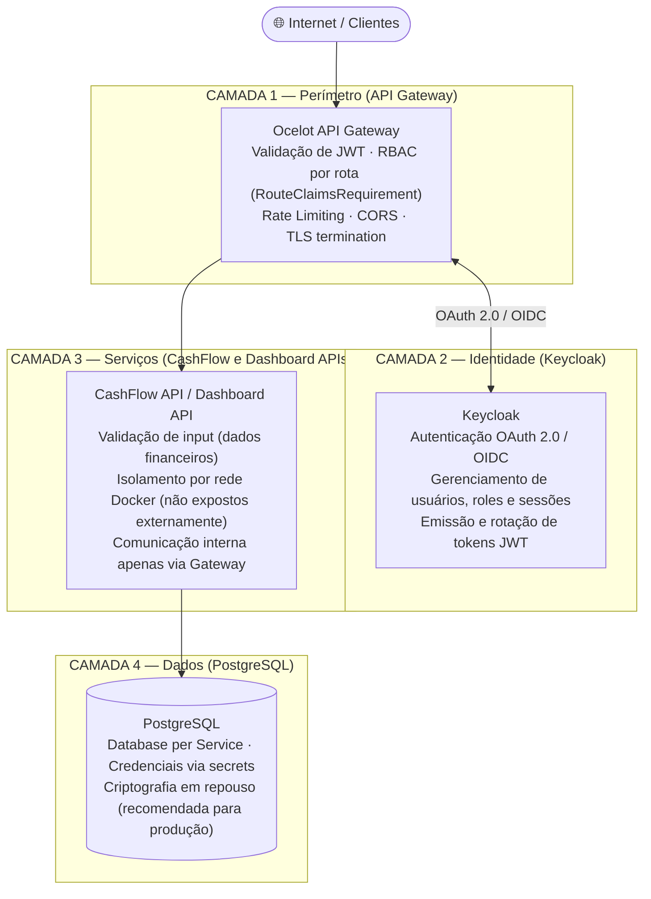

# Segurança — Visão Geral

Este diretório contém a documentação completa da estratégia de segurança adotada no sistema de controle de fluxo de caixa. A segurança é tratada em múltiplas camadas, cobrindo desde a autenticação do usuário até a proteção dos dados em repouso.

---

## Modelo de segurança em camadas

---

## Índice da documentação de segurança

| Documento | Conteúdo |
|---|---|
| [authentication.md](./authentication.md) | Fluxo OAuth 2.0 / OIDC, tokens JWT, sessão e refresh |
| [authorization.md](./authorization.md) | RBAC com Keycloak e Ocelot, roles, claims, mapeamento e bypass para ambiente Local |
| [api-protection.md](./api-protection.md) | Rate limiting, CORS, validação de input, proteção contra ataques |
| [data-protection.md](./data-protection.md) | Criptografia, TLS, proteção de dados sensíveis, secrets |
| [service-to-service.md](./service-to-service.md) | Comunicação M2M, Client Credentials, isolamento de rede |

---

## Decisões arquiteturais relacionadas

| ADR | Decisão |
|---|---|
| [ADR-008](../decisions/ADR-008-autenticacao-autorizacao-keycloak.md) | Autenticação e autorização com Keycloak |
| [ADR-009](../decisions/ADR-009-api-gateway-ocelot.md) | API Gateway com Ocelot — ponto único de segurança |

---

## Requisitos de segurança atendidos

| Requisito | Como é atendido | Documento |
|---|---|---|
| Autenticação | OAuth 2.0 Authorization Code Flow + PKCE via Keycloak | [authentication.md](./authentication.md) |
| Autorização | RBAC com roles no JWT validadas pelo Ocelot | [authorization.md](./authorization.md) |
| Proteção de APIs | Rate limiting, CORS e validação de JWT no Gateway | [api-protection.md](./api-protection.md) |
| Proteção de dados sensíveis | Dados financeiros protegidos em trânsito (TLS) e em repouso | [data-protection.md](./data-protection.md) |
| Estratégia de criptografia | TLS 1.2+ obrigatório, HTTPS end-to-end em produção | [data-protection.md](./data-protection.md) |
| Controle de acesso entre serviços | Client Credentials para M2M, isolamento de rede Docker | [service-to-service.md](./service-to-service.md) |
| Proteção contra ataques | Rate limiting, validação de input, CORS, HTTPS | [api-protection.md](./api-protection.md) |
