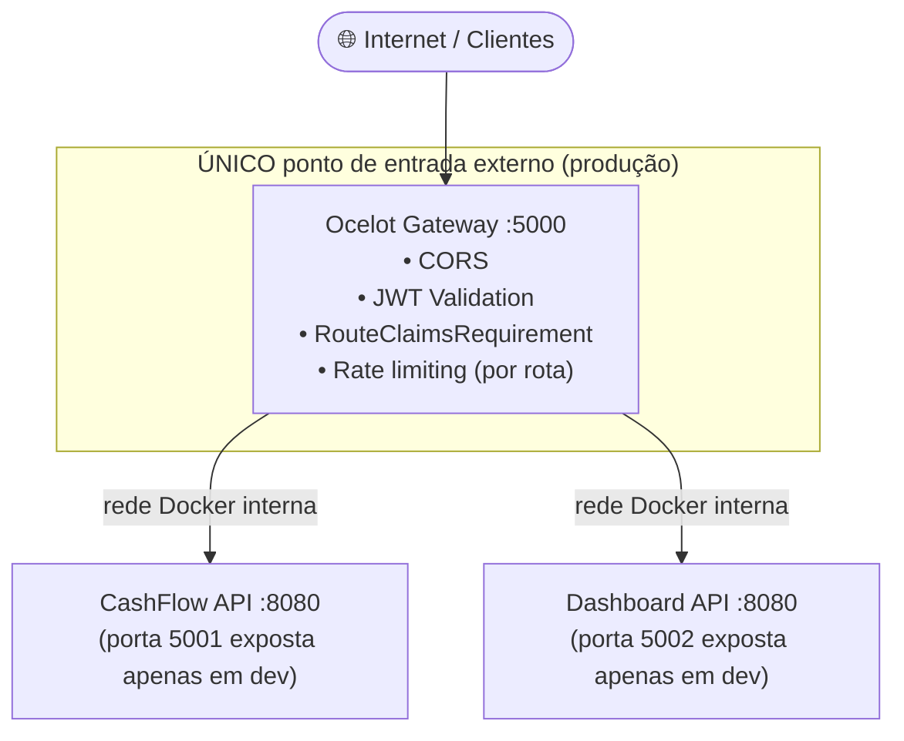

# Proteção de APIs — Rate Limiting, CORS, Validação e Defesa contra Ataques

## Visão geral

A proteção das APIs é responsabilidade primária do **Ocelot API Gateway**, que atua como único ponto de entrada externo. As APIs downstream ficam isoladas na rede interna Docker e nunca recebem tráfego direto do exterior.



---

## Rate Limiting

### Por que é necessário

Sem rate limiting, um atacante pode:
- Realizar ataques de **força bruta** contra endpoints de autenticação
- Causar **DoS (Denial of Service)** sobrecarregando os serviços com requisições legítimas falsas
- **Enumerar dados** fazendo milhares de requisições para coletar informações

### Configuração atual (`ocelot.json`)

O rate limiting está **ativo** nas rotas do gateway (`EnableRateLimiting: true`). A janela é **por minuto** (`Period: "1m"`), não por segundo — valores distintos de um sketch antigo por segundo no mesmo documento.

Exemplo espelhado do repositório:

```json
{
  "Routes": [
    {
      "UpstreamPathTemplate": "/cashflow/v1/{everything}",
      "RateLimitOptions": {
        "ClientWhitelist": [],
        "EnableRateLimiting": true,
        "Period": "1m",
        "PeriodTimespan": 60,
        "Limit": 60
      }
    },
    {
      "UpstreamPathTemplate": "/dashboard/v1/{everything}",
      "RateLimitOptions": {
        "ClientWhitelist": [],
        "EnableRateLimiting": true,
        "Period": "1m",
        "PeriodTimespan": 60,
        "Limit": 30
      }
    }
  ],
  "GlobalConfiguration": {
    "RateLimitOptions": {
      "DisableRateLimitHeaders": false,
      "QuotaExceededMessage": "Too Many Requests — limite de requisições atingido. Tente novamente em instantes.",
      "HttpStatusCode": 429,
      "ClientIdHeader": "X-ClientId"
    }
  }
}
```

### Limites por contexto

| Rota | Limite | Janela | Observação |
|---|---|---|---|
| `/cashflow/v1/**` | 60 requisições | 1 minuto | Cobre escritas de lançamento e demais operações sob o mesmo prefixo |
| `/dashboard/v1/**` | 30 requisições | 1 minuto | Proteção por borda distinta da rota Cashflow |

O requisito de **aproximadamente 50 req/s** para o consolidado refere-se sobretudo à **capacidade do serviço Dashboard** e da leitura; o limite atual do gateway está em **janelas de um minuto** e pode ser afinado independentemente sem alterar a API downstream. O RabbitMQ continua amortecendo picos no fluxo assíncrono relacionado ao Cashflow.

### Headers de resposta

Quando o limite é excedido, o gateway responde com **429** e os headers configurados pelo Ocelot (`X-Rate-Limit-*`, `Retry-After` conforme o pacote versão/implementação), alinhados ao `QuotaExceededMessage` global.

---

## CORS (Cross-Origin Resource Sharing)

### Configuração no Ocelot / ASP.NET Core

CORS é configurado no Gateway para permitir apenas origens conhecidas:

```csharp
builder.Services.AddCors(options =>
{
    options.AddPolicy("AllowFrontend", policy =>
    {
        policy
            .WithOrigins(
                "http://localhost:4200",     // desenvolvimento local
                "https://app.empresa.com"   // produção
            )
            .WithMethods("GET", "POST", "PUT", "PATCH", "DELETE", "OPTIONS")
            .WithHeaders("Authorization", "Content-Type", "Accept")
            .AllowCredentials();
    });
});

app.UseCors("AllowFrontend");
```

### Por que não usar `AllowAnyOrigin()`

Usar `*` (qualquer origem) em combinação com `AllowCredentials()` é explicitamente proibido pelo padrão CORS e o ASP.NET Core lança exceção. Além disso, permitir qualquer origem possibilitaria ataques CSRF onde sites maliciosos fazem requisições autenticadas em nome do usuário.

---

## Validação de Input

### Nas APIs downstream (ASP.NET Core)

A validação de input é a última linha de defesa contra dados maliciosos. As APIs utilizam **Data Annotations** e **FluentValidation** para validar todos os dados de entrada:

```csharp
public class CriarLancamentoRequest
{
    [Required]
    [JsonConverter(typeof(JsonStringEnumConverter))]
    public TipoLancamento Tipo { get; set; }  // CREDITO | DEBITO

    [Required]
    [Range(0.01, 999_999_999.99, ErrorMessage = "Valor deve ser positivo e no máximo R$ 999.999.999,99")]
    [Column(TypeName = "decimal(18,2)")]
    public decimal Valor { get; set; }

    [Required]
    [MaxLength(500)]
    [NoHtmlContent]  // previne XSS em campos de texto
    public string Descricao { get; set; } = string.Empty;

    [Required]
    [DataType(DataType.Date)]
    public DateOnly DataLancamento { get; set; }
}
```

### Proteção contra SQL Injection

O sistema usa **Entity Framework Core** com parâmetros tipados — consultas parametrizadas são geradas automaticamente pelo ORM, eliminando o risco de SQL Injection por construção.

Exemplo gerado pelo EF Core:
```sql
-- Consulta parametrizada (segura)
SELECT * FROM lancamentos WHERE data_lancamento = @p0 AND tipo = @p1
-- @p0 e @p1 são parâmetros, nunca interpolados diretamente
```

### Proteção contra Mass Assignment

Os DTOs de entrada são classes separadas dos modelos de domínio. A aplicação nunca aceita o objeto de domínio diretamente via binding do controller, evitando que campos sensíveis (ex: `Id`, `CreatedAt`, `UserId`) sejam sobrescritos por clientes maliciosos.

---

## Proteção contra ataques comuns

### Injeção (Injection)

| Tipo | Proteção |
|---|---|
| SQL Injection | EF Core com queries parametrizadas |
| XSS (Cross-Site Scripting) | Validação e sanitização de campos de texto, Content-Security-Policy header |
| Command Injection | Sem execução de comandos externos baseados em input do usuário |

### CSRF (Cross-Site Request Forgery)

O sistema usa tokens JWT no header `Authorization: Bearer` — diferente de cookies, tokens em header não são enviados automaticamente pelo browser em requisições cross-origin. Isso elimina o vetor CSRF por design.

### Enumeração de usuários

O Keycloak por padrão não revela se um email existe na base em respostas de erro de login — retorna apenas "credenciais inválidas" sem especificar qual campo está errado.

### Exposição de informações sensíveis em erros

As APIs retornam apenas mensagens de erro genéricas em produção. Stack traces, queries SQL e detalhes internos nunca são expostos nas respostas da API:

```csharp
app.UseExceptionHandler(errorApp =>
{
    errorApp.Run(async context =>
    {
        context.Response.StatusCode = 500;
        context.Response.ContentType = "application/json";
        await context.Response.WriteAsJsonAsync(new
        {
            error = "Ocorreu um erro interno. Por favor, tente novamente."
            // sem stack trace, sem mensagem original da exceção
        });
    });
});
```

### Headers de segurança HTTP

O Gateway adiciona os seguintes headers de segurança em todas as respostas:

```csharp
app.Use(async (context, next) =>
{
    context.Response.Headers["X-Content-Type-Options"]    = "nosniff";
    context.Response.Headers["X-Frame-Options"]           = "DENY";
    context.Response.Headers["X-XSS-Protection"]          = "1; mode=block";
    context.Response.Headers["Referrer-Policy"]           = "strict-origin-when-cross-origin";
    context.Response.Headers["Content-Security-Policy"]   = "default-src 'self'";
    context.Response.Headers["Strict-Transport-Security"] = "max-age=31536000; includeSubDomains";
    await next();
});
```

| Header | Proteção |
|---|---|
| `X-Content-Type-Options: nosniff` | Previne MIME type sniffing |
| `X-Frame-Options: DENY` | Previne clickjacking via iframe |
| `X-XSS-Protection` | Ativa filtro XSS em browsers legados |
| `Referrer-Policy` | Controla informações enviadas no header Referer |
| `Content-Security-Policy` | Restringe origens de scripts, estilos e recursos |
| `Strict-Transport-Security` | Força HTTPS (HSTS) |

---

## Swagger em produção

A documentação Swagger (`/swagger`) deve ser **desabilitada em ambientes de produção** para não expor informações sobre a estrutura interna das APIs:

```csharp
if (app.Environment.IsDevelopment())
{
    app.UseSwagger();
    app.UseSwaggerUI();
}
```

---

## Referências

- [OWASP Top 10](https://owasp.org/www-project-top-ten/)
- [OWASP — API Security Top 10](https://owasp.org/www-project-api-security/)
- [Ocelot — Rate Limiting](https://ocelot.readthedocs.io/en/latest/features/ratelimiting.html)
- [ASP.NET Core — CORS](https://learn.microsoft.com/en-us/aspnet/core/security/cors)
- [OWASP — Input Validation Cheat Sheet](https://cheatsheetseries.owasp.org/cheatsheets/Input_Validation_Cheat_Sheet.html)
