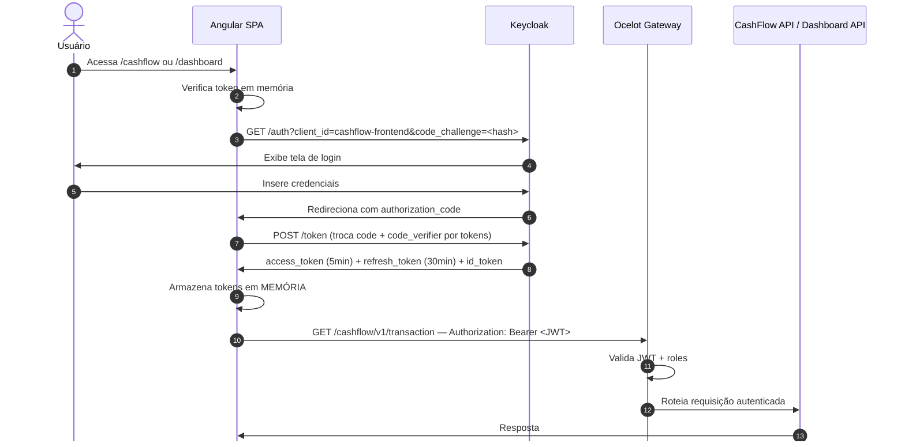
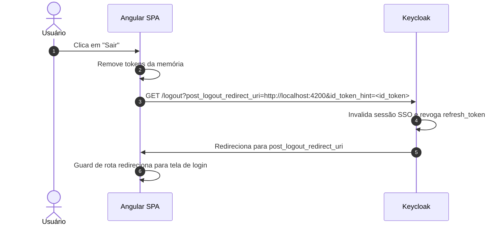

# Autenticação — OAuth 2.0 / OIDC com Keycloak

## Visão geral

A autenticação do sistema é baseada no protocolo **OAuth 2.0** com extensão **OpenID Connect (OIDC)**, implementada pelo **Keycloak** como Identity Provider (IdP) central.

Todos os clientes (Angular frontend) utilizam o **Authorization Code Flow com PKCE** — o fluxo mais seguro para aplicações públicas (SPAs), que elimina a necessidade de armazenar client secrets no browser.

---

## Fluxo de autenticação detalhado

> Diagrama de sequência completo: [`diagrams/auth-oidc-flow.mmd`](./diagrams/auth-oidc-flow.mmd)



---

## Tokens emitidos pelo Keycloak

### Access Token (JWT)

Usado para autorizar requisições às APIs. Validade curta (5 minutos) para minimizar o risco em caso de interceptação.

```json
{
  "iss": "http://localhost:8080/realms/cashflow",
  "sub": "uuid-do-usuario",
  "aud": ["cashflow-api", "dashboard-api"],
  "exp": 1712345678,
  "iat": 1712345378,
  "jti": "uuid-do-token",
  "typ": "Bearer",
  "azp": "cashflow-frontend",
  "session_state": "uuid-da-sessao",
  "realm_access": {
    "roles": ["comerciante", "offline_access"]
  },
  "resource_access": {
    "cashflow-api": {
      "roles": ["registrar_lancamento", "visualizar_lancamento"]
    }
  },
  "scope": "openid profile email",
  "preferred_username": "joao.comerciante",
  "email": "joao@empresa.com",
  "name": "João da Silva"
}
```

> **Atenção:** As roles ficam dentro de `realm_access.roles`, não no nível raiz do token. O Ocelot e as APIs precisam de um **claims transformer** para mapear esse caminho para o claim padrão `roles`. Ver [authorization.md](./authorization.md).

### Refresh Token

Token opaco (não é JWT) com validade maior (30 minutos). Usado para obter um novo `access_token` sem exigir novo login do usuário. Rotacionado a cada uso (Refresh Token Rotation).

### ID Token

JWT contendo os dados de perfil do usuário (nome, e-mail). Usado exclusivamente pelo Angular para exibir informações de perfil na UI — **nunca enviado às APIs**.

---

## Configuração de sessão e tokens no Keycloak

| Parâmetro | Valor recomendado | Justificativa |
|---|---|---|
| Access Token Lifespan | 5 minutos | Minimiza janela de exposição em caso de interceptação |
| Refresh Token Lifespan | 30 minutos | Balanceia usabilidade e segurança |
| SSO Session Idle | 30 minutos | Encerra sessão após inatividade |
| SSO Session Max | 8 horas | Força novo login após jornada de trabalho |
| Refresh Token Rotation | Habilitado | Invalida refresh token anterior após cada uso |

---

## Proteção do frontend Angular

### Por que tokens em memória e não em localStorage?

| Armazenamento | Vulnerabilidade | Recomendação |
|---|---|---|
| `localStorage` | Acessível por qualquer script JavaScript — vulnerável a XSS | Não recomendado |
| `sessionStorage` | Mesma vulnerabilidade do localStorage | Não recomendado |
| **Memória (variável JS)** | Inacessível por scripts externos — destruído ao fechar a aba | **Adotado** |
| Cookie HttpOnly | Inacessível por JS, mas vulnerável a CSRF | Alternativa válida com proteção CSRF |

O trade-off do armazenamento em memória é que o usuário precisa fazer login novamente ao recarregar a página. Isso é mitigado pelo `refresh_token` — enquanto a sessão no Keycloak estiver ativa, o Angular obtém novos tokens silenciosamente (silent refresh via iframe oculto ou refresh endpoint).

### Configuração do `angular-auth-oidc-client`

```typescript
export const authConfig: PassedInitialConfig = {
  config: {
    authority: 'http://localhost:8080/realms/cashflow',
    redirectUrl: window.location.origin + '/callback',
    postLogoutRedirectUri: window.location.origin,
    clientId: 'cashflow-frontend',
    scope: 'openid profile email',
    responseType: 'code',
    silentRenew: true,
    useRefreshToken: true,
    renewTimeBeforeTokenExpiresInSeconds: 30,
    secureRoutes: ['http://localhost:5000'],  // injeta Bearer token automaticamente
  }
};
```

---

## Logout

O logout deve ser realizado tanto no Angular quanto no Keycloak para garantir que a sessão SSO seja encerrada.

> Diagrama de sequência completo: [`diagrams/logout-flow.mmd`](./diagrams/logout-flow.mmd)



Isso garante que um logout no módulo CashFlow também encerra a sessão no módulo Dashboard (SSO).

---

## Referências

- [OAuth 2.0 Authorization Code Flow with PKCE — RFC 7636](https://tools.ietf.org/html/rfc7636)
- [OpenID Connect Core 1.0](https://openid.net/specs/openid-connect-core-1_0.html)
- [Keycloak — Server Administration Guide](https://www.keycloak.org/docs/latest/server_admin/)
- [angular-auth-oidc-client](https://github.com/damienbod/angular-auth-oidc-client)
- [OWASP — Session Management Cheat Sheet](https://cheatsheetseries.owasp.org/cheatsheets/Session_Management_Cheat_Sheet.html)
