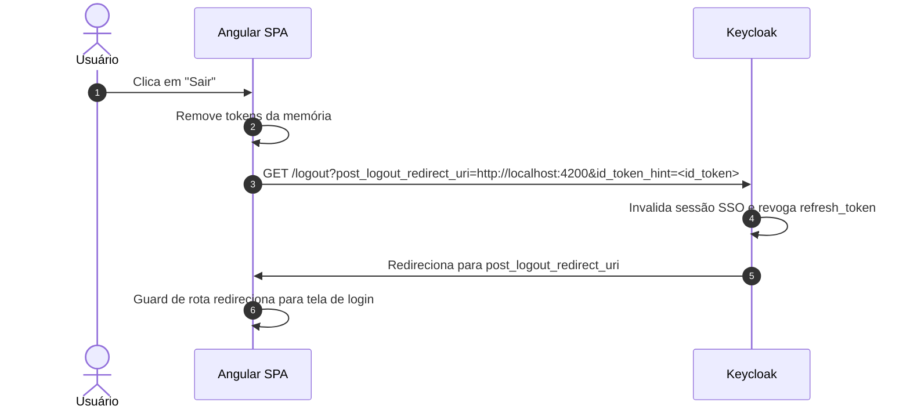
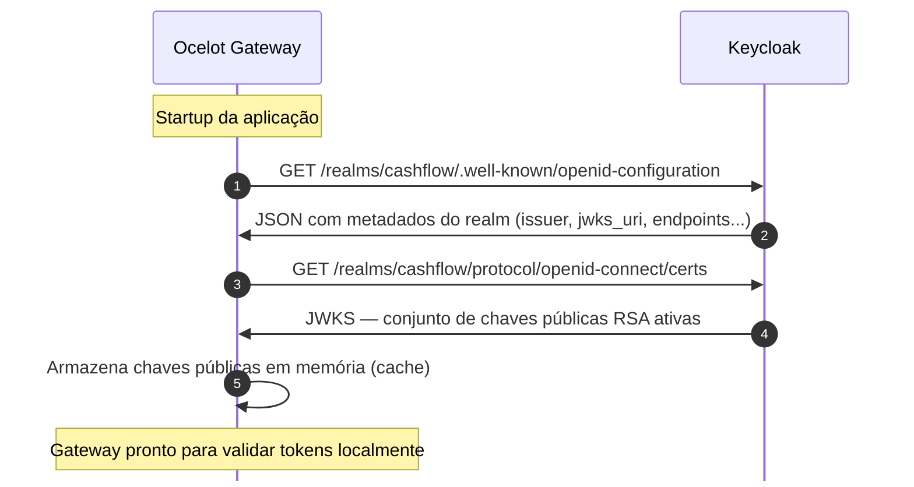
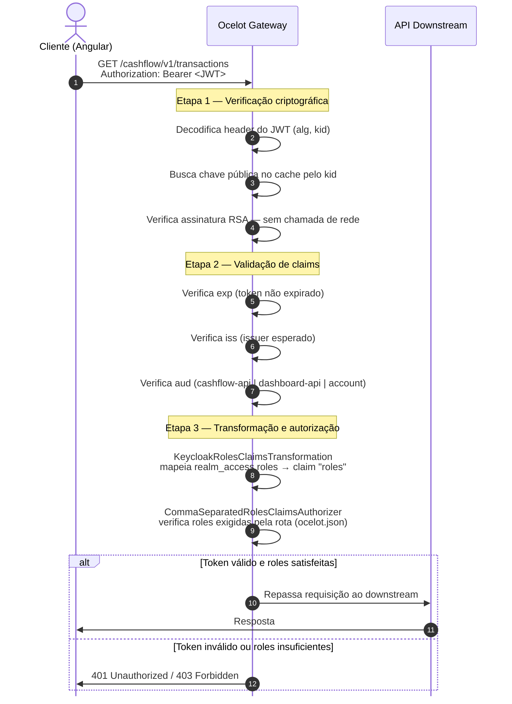
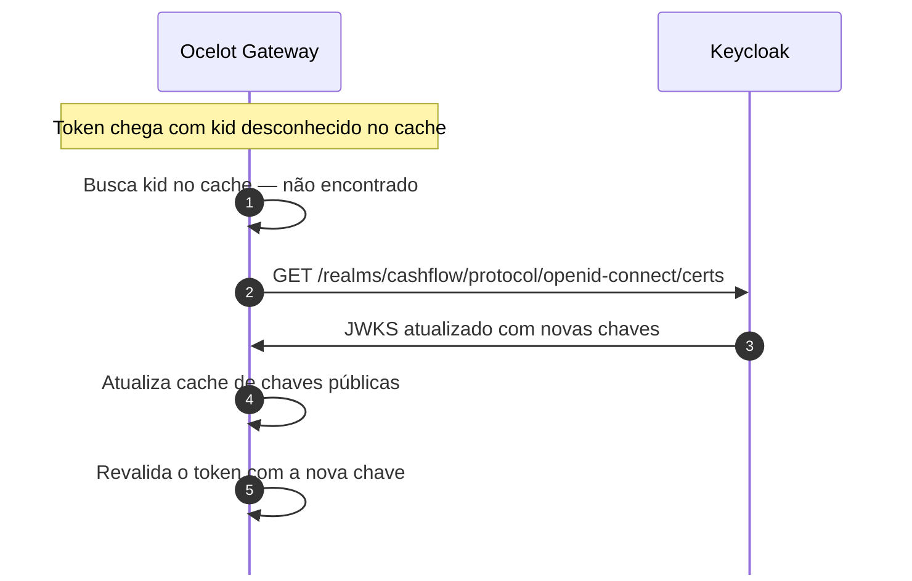

# Autenticação — OAuth 2.0 / OIDC com Keycloak

## Visão geral

A autenticação do sistema é baseada no protocolo **OAuth 2.0** com extensão **OpenID Connect (OIDC)**, implementada pelo **Keycloak** como Identity Provider (IdP) central.

Todos os clientes (Angular frontend) utilizam o **Authorization Code Flow com PKCE** — o fluxo mais seguro para aplicações públicas (SPAs), que elimina a necessidade de armazenar client secrets no browser.

---

## Fluxo de autenticação detalhado


---

## Tokens emitidos pelo Keycloak

### Access Token (JWT)

Usado para autorizar requisições às APIs. Validade curta (5 minutos) para minimizar o risco em caso de interceptação.

```json
{
  "iss": "http://localhost:8080/realms/cashflow",
  "sub": "uuid-do-usuario",
  "aud": ["cashflow-api", "dashboard-api"],
  "exp": 1712345678,
  "iat": 1712345378,
  "jti": "uuid-do-token",
  "typ": "Bearer",
  "azp": "cashflow-frontend",
  "session_state": "uuid-da-sessao",
  "realm_access": {
    "roles": ["comerciante", "offline_access"]
  },
  "resource_access": {
    "cashflow-api": {
      "roles": ["registrar_lancamento", "visualizar_lancamento"]
    }
  },
  "scope": "openid profile email",
  "preferred_username": "joao.comerciante",
  "email": "joao@empresa.com",
  "name": "João da Silva"
}
```

> **Atenção:** As roles ficam dentro de `realm_access.roles`, não no nível raiz do token. O Ocelot e as APIs precisam de um **claims transformer** para mapear esse caminho para o claim padrão `roles`. Ver [authorization.md](./authorization.md).

### Refresh Token

Token opaco (não é JWT) com validade maior (30 minutos). Usado para obter um novo `access_token` sem exigir novo login do usuário. Rotacionado a cada uso (Refresh Token Rotation).

### ID Token

JWT contendo os dados de perfil do usuário (nome, e-mail). Usado exclusivamente pelo Angular para exibir informações de perfil na UI — **nunca enviado às APIs**.

---

## Configuração de sessão e tokens no Keycloak

| Parâmetro | Valor recomendado | Justificativa |
|---|---|---|
| Access Token Lifespan | 5 minutos | Minimiza janela de exposição em caso de interceptação |
| Refresh Token Lifespan | 30 minutos | Balanceia usabilidade e segurança |
| SSO Session Idle | 30 minutos | Encerra sessão após inatividade |
| SSO Session Max | 8 horas | Força novo login após jornada de trabalho |
| Refresh Token Rotation | Habilitado | Invalida refresh token anterior após cada uso |

---

## Proteção do frontend Angular

### Por que tokens em memória e não em localStorage?

| Armazenamento | Vulnerabilidade | Recomendação |
|---|---|---|
| `localStorage` | Acessível por qualquer script JavaScript — vulnerável a XSS | Não recomendado |
| `sessionStorage` | Mesma vulnerabilidade do localStorage | Não recomendado |
| **Memória (variável JS)** | Inacessível por scripts externos — destruído ao fechar a aba | **Adotado** |
| Cookie HttpOnly | Inacessível por JS, mas vulnerável a CSRF | Alternativa válida com proteção CSRF |

O trade-off do armazenamento em memória é que o usuário precisa fazer login novamente ao recarregar a página. Isso é mitigado pelo `refresh_token` — enquanto a sessão no Keycloak estiver ativa, o Angular obtém novos tokens silenciosamente (silent refresh via iframe oculto ou refresh endpoint).

### Implementação OIDC/PKCE no Angular

A autenticação é implementada de forma **manual** (sem biblioteca de terceiros), utilizando os serviços nativos do Angular (`HttpClient`, `Router`) e a Web Crypto API do browser para gerar o `code_verifier`/`code_challenge` do PKCE.

Os principais artefatos estão em `services/frontend/src/app/core/auth/`:

| Arquivo | Responsabilidade |
|---|---|
| `auth.service.ts` | Orquestra o fluxo OIDC: geração de PKCE, redirect para Keycloak, troca do code por tokens, renovação via refresh token |
| `auth.guard.ts` | Route guard — redireciona para login se não houver token válido em memória |
| `auth-callback.component.ts` | Processa o retorno do Keycloak (extrai `code` da URL e realiza a troca de tokens) |
| `token.interceptor.ts` | Interceptor HTTP — injeta `Authorization: Bearer <token>` em todas as requisições para o gateway |

Configuração mínima (variáveis de ambiente em `environment.ts`):

```typescript
export const environment = {
  keycloakAuthority: 'http://localhost:8080/realms/cashflow',
  keycloakClientId: 'cashflow-frontend',
  gatewayBaseUrl: 'http://localhost:5000',
  redirectUri: 'http://localhost:4200/callback',
};
```

---

## Logout

O logout deve ser realizado tanto no Angular quanto no Keycloak para garantir que a sessão SSO seja encerrada.



Isso garante que um logout no módulo CashFlow também encerra a sessão no módulo Dashboard (SSO).

---

## Validação do JWT no Gateway — JWKS Discovery e chave pública RSA

O gateway **nunca envia o token ao Keycloak para validar**. A validação é feita **localmente**, usando criptografia assimétrica RSA: o Keycloak assina o token com sua chave privada e o gateway verifica a assinatura com a chave pública correspondente.

### Startup — OIDC Discovery e cache das chaves públicas

Ao iniciar, o middleware `AddJwtBearer` do ASP.NET Core realiza automaticamente o fluxo de descoberta OIDC:



> O Keycloak só é contactado nesse momento. Nenhuma requisição de usuário depende de chamada ao Keycloak para validação.

---

### Por request — Validação local do JWT

Cada requisição autenticada tem seu token validado inteiramente no processo do gateway:



---

### Renovação automática de chaves (JWKS Rotation)

O Keycloak pode rotacionar suas chaves RSA (ex.: por política de segurança). O gateway lida com isso automaticamente:



> Tokens assinados com chaves antigas (removidas do JWKS) passam a ser rejeitados automaticamente após a rotação.

---

### Por que não é necessário um secret

| Abordagem | Funcionamento | Risco |
|---|---|---|
| Simétrica (HS256) | Um único secret compartilhado entre KC e gateway — quem tem o secret pode assinar e verificar | Secret vazado compromete todo o sistema |
| **Assimétrica (RS256) — adotada** | KC assina com chave privada (nunca sai do KC); gateway verifica com chave pública (pode ser distribuída livremente) | Vazamento da chave pública não permite forjar tokens |

O gateway só precisa da **chave pública RSA**, que é pública por definição — disponível abertamente no endpoint `/certs` do Keycloak.

---

### Comportamento com Keycloak offline

| Situação | Comportamento |
|---|---|
| KC offline após startup | Gateway continua validando tokens com as chaves em cache |
| KC offline no startup | Gateway falha ao iniciar (sem chaves para validar) |
| Token expirado + KC offline | Token rejeitado normalmente pelo `exp` — sem impacto |
| Rotação de chave + KC offline | Tokens com o novo `kid` são rejeitados até o KC voltar e o cache ser atualizado |

---

## Referências

- [OAuth 2.0 Authorization Code Flow with PKCE — RFC 7636](https://tools.ietf.org/html/rfc7636)
- [OpenID Connect Core 1.0](https://openid.net/specs/openid-connect-core-1_0.html)
- [Keycloak — Server Administration Guide](https://www.keycloak.org/docs/latest/server_admin/)
- [OWASP — Session Management Cheat Sheet](https://cheatsheetseries.owasp.org/cheatsheets/Session_Management_Cheat_Sheet.html)
