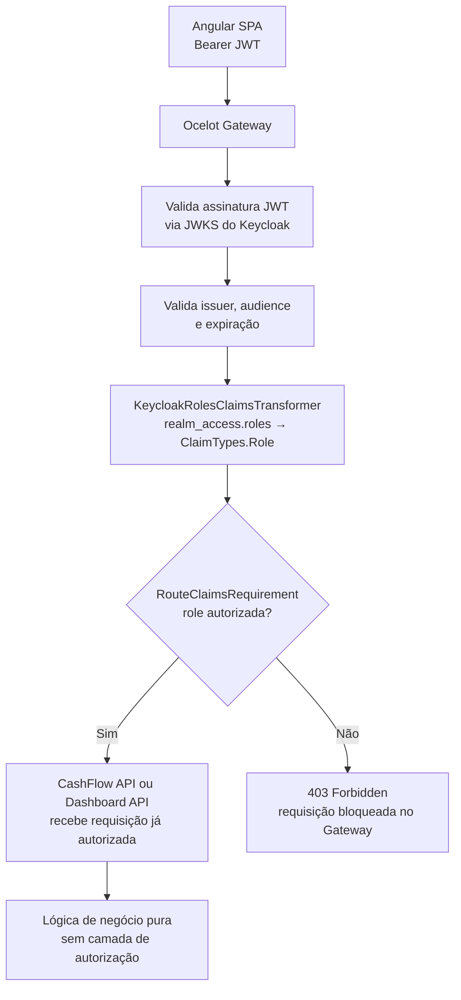

# Autorização — RBAC com Keycloak e Ocelot

## Visão geral

A autorização do sistema é baseada em **RBAC (Role-Based Access Control)**, com roles definidas no **Keycloak** e aplicadas pelo **Ocelot API Gateway** antes de qualquer requisição chegar aos serviços de negócio.

A responsabilidade está completamente centralizada no Gateway — as APIs downstream (CashFlow e Dashboard) não implementam nenhuma lógica de autorização, funcionando como serviços de negócio puros dentro da rede interna.

---

## Roles do sistema

| Role | Quem é | O que pode fazer |
|---|---|---|
| `comerciante` | Usuário operacional — registra transações no dia a dia | Criar, listar e visualizar lançamentos (débitos/créditos) |
| `gestor` | Usuário gerencial — acompanha resultados | Visualizar consolidado diário e relatórios de saldo |
| `admin` | Administrador do sistema | Acesso completo: lançamentos + consolidado + gestão |

---

## Mapeamento de acesso por rota

| Rota no Gateway | Método | Roles permitidas |
|---|---|---|
| `/cashflow/v1/transaction` | `GET` | `comerciante`, `admin` |
| `/cashflow/v1/transaction` | `POST` | `comerciante`, `admin` |
| `/cashflow/v1/transaction/{id}` | `GET` | `comerciante`, `admin` |
| `/dashboard/v1/consolidate` | `GET` | `gestor`, `admin` |

---

## Problema: estrutura de roles no JWT do Keycloak

O Keycloak não coloca as roles de realm no campo `roles` do nível raiz do JWT. Elas ficam aninhadas em `realm_access.roles`:

```json
{
  "realm_access": {
    "roles": ["comerciante", "offline_access", "uma_authorization"]
  }
}
```

O Ocelot, por padrão, lê o claim `roles` no nível raiz. Se não houver mapeamento, o `RouteClaimsRequirement` **nunca vai encontrar a role** e todas as requisições serão rejeitadas com 403 — mesmo com um token válido.

### Solução: Claims Transformer no Gateway

É necessário implementar um `IClaimsTransformation` no projeto do Gateway para copiar as roles de `realm_access.roles` para o claim padrão `roles`:

```csharp
public class KeycloakRolesClaimsTransformer : IClaimsTransformation
{
    public Task<ClaimsPrincipal> TransformAsync(ClaimsPrincipal principal)
    {
        var identity = (ClaimsIdentity)principal.Identity!;

        var realmAccessClaim = identity.FindFirst("realm_access");
        if (realmAccessClaim is null)
            return Task.FromResult(principal);

        var realmAccess = JsonDocument.Parse(realmAccessClaim.Value);
        if (!realmAccess.RootElement.TryGetProperty("roles", out var roles))
            return Task.FromResult(principal);

        foreach (var role in roles.EnumerateArray())
        {
            var roleName = role.GetString();
            if (roleName is not null && !identity.HasClaim(ClaimTypes.Role, roleName))
                identity.AddClaim(new Claim(ClaimTypes.Role, roleName));
        }

        return Task.FromResult(principal);
    }
}
```

Registro no `Program.cs` do Gateway:

```csharp
builder.Services.AddSingleton<IClaimsTransformation, KeycloakRolesClaimsTransformer>();
```

---

## Configuração do Ocelot (`ocelot.json`)

Com o claims transformer aplicado, o `RouteClaimsRequirement` passa a funcionar corretamente:

```json
{
  "Routes": [
    {
      "UpstreamPathTemplate": "/cashflow/v1/{everything}",
      "UpstreamHttpMethod": ["GET", "POST", "PUT", "DELETE"],
      "DownstreamPathTemplate": "/v1/{everything}",
      "DownstreamScheme": "http",
      "DownstreamHostAndPorts": [
        { "Host": "cashflow-api", "Port": 8080 }
      ],
      "AuthenticationOptions": {
        "AuthenticationProviderKey": "Bearer"
      },
      "RouteClaimsRequirement": {
        "roles": "comerciante,admin"
      }
    },
    {
      "UpstreamPathTemplate": "/dashboard/v1/{everything}",
      "UpstreamHttpMethod": ["GET"],
      "DownstreamPathTemplate": "/v1/{everything}",
      "DownstreamScheme": "http",
      "DownstreamHostAndPorts": [
        { "Host": "dashboard-api", "Port": 8080 }
      ],
      "AuthenticationOptions": {
        "AuthenticationProviderKey": "Bearer"
      },
      "RouteClaimsRequirement": {
        "roles": "gestor,admin"
      }
    }
  ],
  "GlobalConfiguration": {
    "BaseUrl": "http://gateway:5000"
  }
}
```

> **Comportamento do `RouteClaimsRequirement`:** O Ocelot verifica se **ao menos uma** das roles listadas está presente nos claims do token. Um usuário com role `comerciante` tem acesso ao `/cashflow/**` mas recebe `403 Forbidden` ao tentar acessar `/dashboard/**`.

---

## Validação do JWT no Gateway

Antes mesmo de verificar as roles, o Ocelot valida o JWT contra o endpoint JWKS público do Keycloak:

```csharp
builder.Services
    .AddAuthentication(JwtBearerDefaults.AuthenticationScheme)
    .AddJwtBearer("Bearer", options =>
    {
        options.Authority = "http://keycloak:8080/realms/cashflow";
        options.Audience  = "cashflow-api";
        options.RequireHttpsMetadata = false; // apenas em desenvolvimento

        options.TokenValidationParameters = new TokenValidationParameters
        {
            ValidateIssuer           = true,
            ValidIssuer              = "http://keycloak:8080/realms/cashflow",
            ValidateAudience         = true,
            ValidAudience            = "cashflow-api",
            ValidateLifetime         = true,
            ClockSkew                = TimeSpan.FromSeconds(30),
            ValidateIssuerSigningKey = true,
            // Chave pública obtida automaticamente via JWKS endpoint do Keycloak
        };
    });
```

O Keycloak disponibiliza as chaves públicas em:
```
GET http://keycloak:8080/realms/cashflow/protocol/openid-connect/certs
```

O ASP.NET Core busca e rotaciona essas chaves automaticamente, sem necessidade de configuração manual.

---

## Divisão de responsabilidades de segurança

> Diagrama de sequência do fluxo RBAC completo: [`diagrams/authz-rbac-flow.mmd`](./diagrams/authz-rbac-flow.mmd)



### Trade-off: ausência de defense in depth nas APIs downstream

As APIs downstream não revalidam autorização. Isso é um trade-off documentado consciente:

**Justificativa:** As APIs só são acessíveis dentro da rede Docker interna — as portas 8080 do CashFlow e Dashboard **não são publicadas** no `docker-compose.yml`. Qualquer requisição que chegar a elas necessariamente passou pelo Gateway.

**Risco residual:** Um acesso direto à rede Docker (ex: comprometimento de outro container) poderia chamar as APIs sem autenticação. Em produção com Kubernetes, isso seria mitigado por Network Policies que restringem a comunicação apenas entre pods autorizados.

**Mitigação futura:** Adicionar `[Authorize]` nas APIs downstream como segunda camada de verificação (defense in depth), lendo o contexto de segurança propagado pelo Gateway nos headers internos.

---

## Configuração no Keycloak

Em ambiente local com Docker Compose, o realm `cashflow` é importado automaticamente a partir de [`infra/keycloak/cashflow-realm.json`](../../infra/keycloak/cashflow-realm.json) na primeira inicialização do Keycloak (ver `README.md` na raiz do repositório).

### Realm: `cashflow`

```
Realm Settings:
  - Realm: cashflow
  - Display Name: Sistema de Fluxo de Caixa
  - Token Lifespan: Access Token = 5min, Refresh Token = 30min
  - SSL Required: external requests (produção) / none (desenvolvimento)
```

### Clients

| Client ID | Tipo | Fluxo | Uso |
|---|---|---|---|
| `cashflow-frontend` | Public | Authorization Code + PKCE | SPA Angular |
| `cashflow-api` | Confidential | Client Credentials | M2M (futuro) |
| `dashboard-api` | Confidential | Client Credentials | M2M (futuro) |

### Configuração do client `cashflow-frontend`

```
Client ID: cashflow-frontend
Access Type: public
Valid Redirect URIs: http://localhost:4200/*
Web Origins: http://localhost:4200
Standard Flow Enabled: true
Implicit Flow Enabled: false      ← fluxo implícito é inseguro, desabilitado
Direct Access Grants: false       ← Resource Owner Password desabilitado
```

### Roles de Realm

```
Roles:
  - comerciante
  - gestor
  - admin

Composite roles (admin herda):
  - admin → inclui comerciante + gestor
```

---

## Referências

- [Keycloak — Role-Based Access Control](https://www.keycloak.org/docs/latest/server_admin/#assigning-permissions-using-roles-and-groups)
- [Ocelot — Claims Transformation](https://ocelot.readthedocs.io/en/latest/features/claimstransformation.html)
- [Ocelot — Route Claims Requirement](https://ocelot.readthedocs.io/en/latest/features/authorization.html)
- [OWASP — Access Control Cheat Sheet](https://cheatsheetseries.owasp.org/cheatsheets/Access_Control_Cheat_Sheet.html)
