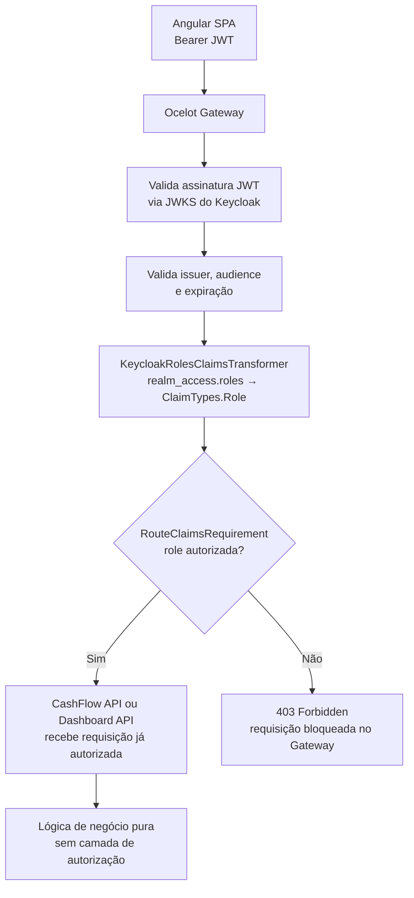

# Autorização — RBAC com Keycloak e Ocelot

## Visão geral

A autorização do sistema é baseada em **RBAC (Role-Based Access Control)**, com roles definidas no **Keycloak** e aplicadas pelo **Ocelot API Gateway** antes de qualquer requisição chegar aos serviços de negócio.

A responsabilidade está completamente centralizada no Gateway — as APIs downstream (CashFlow e Dashboard) não implementam nenhuma lógica de autorização, funcionando como serviços de negócio puros dentro da rede interna.

---

## Roles do sistema

| Role | Quem é | O que pode fazer |
|---|---|---|
| `comerciante` | Usuário operacional — registra transações no dia a dia | Criar, listar e visualizar lançamentos (débitos/créditos) |
| `gestor` | Usuário gerencial — acompanha resultados | Visualizar consolidado diário e relatórios de saldo |
| `admin` | Administrador do sistema | Acesso completo: lançamentos + consolidado + gestão |

---

## Mapeamento de acesso por rota

| Rota no Gateway | Método | Roles permitidas |
|---|---|---|
| `/cashflow/v1/transactions` | `GET` | `comerciante`, `admin` |
| `/cashflow/v1/transactions` | `POST` | `comerciante`, `admin` |
| `/cashflow/v1/transactions/{id}` | `GET` | `comerciante`, `admin` |
| `/dashboard/v1/daily-balances` | `GET` | `gestor`, `admin` |

> O Ocelot mapeia o prefixo `/cashflow/v1/` para `/api/` no serviço downstream. Portanto, `/cashflow/v1/transactions` → `cashflow-api:8080/api/transactions`.

---

## Problema: estrutura de roles no JWT do Keycloak

O Keycloak não coloca as roles de realm no campo `roles` do nível raiz do JWT. Elas ficam aninhadas em `realm_access.roles`:

```json
{
  "realm_access": {
    "roles": ["comerciante", "offline_access", "uma_authorization"]
  }
}
```

O Ocelot, por padrão, lê o claim `roles` no nível raiz. Se não houver mapeamento, o `RouteClaimsRequirement` **nunca vai encontrar a role** e todas as requisições serão rejeitadas com 403 — mesmo com um token válido.

### Solução: Claims Transformer no Gateway

É necessário implementar um `IClaimsTransformation` no projeto do Gateway para copiar as roles de `realm_access.roles` para o claim padrão `roles`:

```csharp
public class KeycloakRolesClaimsTransformer : IClaimsTransformation
{
    public Task<ClaimsPrincipal> TransformAsync(ClaimsPrincipal principal)
    {
        var identity = (ClaimsIdentity)principal.Identity!;

        var realmAccessClaim = identity.FindFirst("realm_access");
        if (realmAccessClaim is null)
            return Task.FromResult(principal);

        var realmAccess = JsonDocument.Parse(realmAccessClaim.Value);
        if (!realmAccess.RootElement.TryGetProperty("roles", out var roles))
            return Task.FromResult(principal);

        foreach (var role in roles.EnumerateArray())
        {
            var roleName = role.GetString();
            if (roleName is not null && !identity.HasClaim(ClaimTypes.Role, roleName))
                identity.AddClaim(new Claim(ClaimTypes.Role, roleName));
        }

        return Task.FromResult(principal);
    }
}
```

Registro no `Program.cs` do Gateway:

```csharp
builder.Services.AddSingleton<IClaimsTransformation, KeycloakRolesClaimsTransformer>();
```

---

## Configuração do Ocelot (`ocelot.json`)

Com o claims transformer aplicado, o `RouteClaimsRequirement` passa a funcionar corretamente:

```json
{
  "Routes": [
    {
      "UpstreamPathTemplate": "/cashflow/v1/{everything}",
      "UpstreamHttpMethod": ["GET", "POST", "PUT", "DELETE"],
      "DownstreamPathTemplate": "/api/{everything}",
      "DownstreamScheme": "http",
      "DownstreamHostAndPorts": [
        { "Host": "cashflow-api", "Port": 8080 }
      ],
      "AuthenticationOptions": {
        "AuthenticationProviderKey": "Bearer"
      },
      "RouteClaimsRequirement": {
        "roles": "comerciante,admin"
      }
    },
    {
      "UpstreamPathTemplate": "/dashboard/v1/{everything}",
      "UpstreamHttpMethod": ["GET"],
      "DownstreamPathTemplate": "/api/{everything}",
      "DownstreamScheme": "http",
      "DownstreamHostAndPorts": [
        { "Host": "dashboard-api", "Port": 8080 }
      ],
      "AuthenticationOptions": {
        "AuthenticationProviderKey": "Bearer"
      },
      "RouteClaimsRequirement": {
        "roles": "gestor,admin"
      }
    }
  ],
  "GlobalConfiguration": {
    "BaseUrl": "http://localhost:5000"
  }
}
```

> **Comportamento do `RouteClaimsRequirement`:** O Ocelot verifica se **ao menos uma** das roles listadas está presente nos claims do token. Um usuário com role `comerciante` tem acesso ao `/cashflow/**` mas recebe `403 Forbidden` ao tentar acessar `/dashboard/**`.

---

## Validação do JWT no Gateway

Antes mesmo de verificar as roles, o Ocelot valida o JWT contra o endpoint JWKS público do Keycloak:

```csharp
builder.Services
    .AddAuthentication(JwtBearerDefaults.AuthenticationScheme)
    .AddJwtBearer("Bearer", options =>
    {
        options.Authority = "http://keycloak:8080/realms/cashflow";
        options.Audience  = "cashflow-api";
        options.RequireHttpsMetadata = false; // apenas em desenvolvimento

        options.TokenValidationParameters = new TokenValidationParameters
        {
            ValidateIssuer           = true,
            ValidIssuer              = "http://keycloak:8080/realms/cashflow",
            ValidateAudience         = true,
            ValidAudience            = "cashflow-api",
            ValidateLifetime         = true,
            ClockSkew                = TimeSpan.FromSeconds(30),
            ValidateIssuerSigningKey = true,
            // Chave pública obtida automaticamente via JWKS endpoint do Keycloak
        };
    });
```

O Keycloak disponibiliza as chaves públicas em:
```
GET http://keycloak:8080/realms/cashflow/protocol/openid-connect/certs
```

O ASP.NET Core busca e rotaciona essas chaves automaticamente, sem necessidade de configuração manual.

---

## Divisão de responsabilidades de segurança

> Diagrama de sequência do fluxo RBAC completo: [`diagrams/authz-rbac-flow.mmd`](./diagrams/authz-rbac-flow.mmd)



### Defense in depth: autenticação na API downstream

A API CashFlow implementa sua própria camada de autenticação JWT como segunda linha de defesa. Essa camada é **independente do Gateway** — valida a assinatura, o issuer, a audience e a expiração do token diretamente contra o JWKS endpoint do Keycloak.

**O que a API verifica:**
- Assinatura RSA do JWT (via JWKS do Keycloak)
- `iss` (issuer), `aud` (audience `cashflow-api`), `exp` (expiração)
- Presença de token válido em qualquer requisição (`[Authorize]` no controller)

**O que a API deliberadamente não verifica:**
- Roles específicas (`comerciante`, `admin`) — essa responsabilidade permanece **exclusivamente no Gateway** via `RouteClaimsRequirement`

**Justificativa da separação:** Verificar roles em dois lugares criaria acoplamento — qualquer mudança de role exigiria atualização tanto no `ocelot.json` quanto no controller. O Gateway é a fonte única de verdade da política de acesso (quem pode fazer o quê). A API garante apenas que toda requisição carrega um token válido, protegendo o serviço mesmo em cenários de bypass do Gateway (comprometimento de container, misconfiguration de Network Policy, etc.).

```
Acesso direto à rede interna (bypass do Gateway):
  └─ Sem token ou token inválido ──► API: 401  ✓
  └─ Token válido, role errada   ──► API: 200  (papel do Gateway foi bypassado —
                                                risco residual aceito e documentado)
```

**Implementação** (`src/Api/Security/`):
- `SecurityExtensions.cs` — registra JWT Bearer e `IClaimsTransformation`
- `KeycloakRolesClaimsTransformation.cs` — mapeia `realm_access.roles` → claim `roles`
- `TransactionsController` — `[Authorize]` sem roles explícitas

---

## Configuração no Keycloak

Em ambiente local com Docker Compose, o realm `cashflow` é importado automaticamente a partir de [`infra/keycloak/cashflow-realm.json`](../../infra/keycloak/cashflow-realm.json) na primeira inicialização do Keycloak (ver `README.md` na raiz do repositório).

### Realm: `cashflow`

```
Realm Settings:
  - Realm: cashflow
  - Display Name: Sistema de Fluxo de Caixa
  - Token Lifespan: Access Token = 5min, Refresh Token = 30min
  - SSL Required: external requests (produção) / none (desenvolvimento)
```

### Clients

| Client ID | Tipo | Fluxo | Uso |
|---|---|---|---|
| `cashflow-frontend` | Public | Authorization Code + PKCE | SPA Angular unificada |
| `cashflow-api` | Confidential | Client Credentials | M2M (futuro) |
| `dashboard-api` | Confidential | Client Credentials | M2M (futuro) |

### Configuração do client `cashflow-frontend`

```
Client ID: cashflow-frontend
Access Type: public
Valid Redirect URIs: http://localhost:4200/*
Web Origins: http://localhost:4200
Standard Flow Enabled: true
Implicit Flow Enabled: false      ← fluxo implícito é inseguro, desabilitado
Direct Access Grants: false       ← Resource Owner Password desabilitado
```

### Roles de Realm

```
Roles:
  - comerciante
  - gestor
  - admin

Composite roles (admin herda):
  - admin → inclui comerciante + gestor
```

---

## Autenticação desabilitada no perfil Local

Para facilitar testes locais sem a necessidade de um token JWT válido, a autenticação pode ser desabilitada via configuração no perfil `Local`. Nesse modo, um handler substituto (`LocalAuthenticationHandler`) auto-autentica toda requisição com um usuário fictício, sem nenhuma chamada ao Keycloak.

### Ativação

Em `appsettings.Local.json`:

```json
{
  "Security": {
    "Disabled": true
  }
}
```

### Comportamento por ambiente

| Ambiente | `Security:Disabled` | Autenticação |
|---|---|---|
| `Local` | `true` | `LocalAuthenticationHandler` — passa sempre, sem token |
| `Development` | `false` (padrão) | JWT Bearer validado contra Keycloak |
| `Production` | `false` (padrão) | JWT Bearer validado contra Keycloak |

### Como funciona

O `AddSecurityConfiguration` no projeto `Security` verifica o flag na inicialização. Se `true`, registra o `LocalAuthenticationHandler` no lugar do `JwtBearerHandler`:

```csharp
if (configuration.GetValue<bool>("Security:Disabled"))
{
    services
        .AddAuthentication(LocalAuthenticationHandler.SchemeName)
        .AddScheme<AuthenticationSchemeOptions, LocalAuthenticationHandler>(...);
}
else
{
    // JWT Bearer + Keycloak
}
```

O handler entrega ao pipeline um `ClaimsPrincipal` com as roles `comerciante` e `admin` pré-populadas, de forma que qualquer lógica que inspecione `User.IsInRole(...)` também funcione localmente sem alteração.

### Garantias de segurança

- O `LocalAuthenticationHandler` está no projeto `Security` e **nunca** é registrado automaticamente em outros ambientes — a ativação é estritamente opt-in via `Security:Disabled: true`
- O `[Authorize]` permanece no controller em todos os ambientes; apenas o mecanismo de autenticação é trocado
- Em `Development` e `Production`, o comportamento é idêntico: JWT obrigatório, validado contra o JWKS do Keycloak

> **Atenção:** nunca defina `Security:Disabled: true` em `appsettings.json` ou `appsettings.Production.json`. O flag deve existir apenas em arquivos de configuração local que não são commitados (ou explicitamente em `appsettings.Local.json`, que é de uso pessoal do desenvolvedor).

---

## Referências

- [Keycloak — Role-Based Access Control](https://www.keycloak.org/docs/latest/server_admin/#assigning-permissions-using-roles-and-groups)
- [Ocelot — Claims Transformation](https://ocelot.readthedocs.io/en/latest/features/claimstransformation.html)
- [Ocelot — Route Claims Requirement](https://ocelot.readthedocs.io/en/latest/features/authorization.html)
- [OWASP — Access Control Cheat Sheet](https://cheatsheetseries.owasp.org/cheatsheets/Access_Control_Cheat_Sheet.html)
