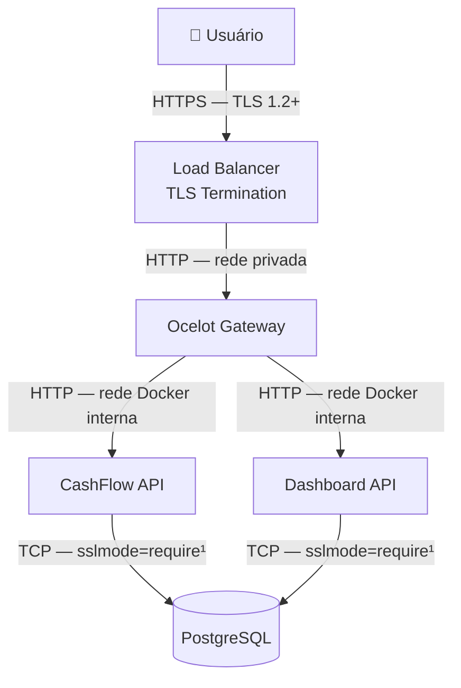

# Proteção de Dados — Criptografia, TLS e Dados Sensíveis

## Visão geral

O sistema lida com dados financeiros sensíveis — valores de transações, saldos consolidados e informações de usuários comerciantes. A estratégia de proteção de dados cobre três dimensões:

1. **Dados em trânsito** — protegidos por TLS/HTTPS
2. **Dados em repouso** — protegidos por criptografia no banco de dados
3. **Dados de configuração (secrets)** — gerenciados fora do código-fonte

---

## Dados em trânsito — TLS

### Arquitetura de TLS

> Diagrama completo da arquitetura de rede e TLS: [`diagrams/tls-architecture.mmd`](./diagrams/tls-architecture.mmd)



> ¹ `sslmode=require` recomendado para produção. Em desenvolvimento local usa-se `sslmode=disable` por conveniência.

### TLS Termination no perímetro

Em produção, o TLS é terminado no **Load Balancer / Reverse Proxy** (ex: NGINX, AWS ALB, Azure Application Gateway). O tráfego interno entre containers trafega em HTTP dentro da rede Docker privada — modelo aceito pois a rede interna não é acessível externamente.

**Configuração mínima em produção:**

| Parâmetro | Valor |
|---|---|
| Versão mínima de TLS | TLS 1.2 (TLS 1.3 preferido) |
| Cipher suites | Apenas suites modernas (ECDHE, AES-GCM, ChaCha20) |
| HSTS | `max-age=31536000; includeSubDomains; preload` |
| Certificado | Let's Encrypt (gratuito) ou CA corporativa |
| Renovação automática | Certbot ou ACME protocol |

### Desenvolvimento local

Em desenvolvimento, o ASP.NET Core usa certificados auto-assinados via `dotnet dev-certs`:

```bash
dotnet dev-certs https --trust
```

> `RequireHttpsMetadata = false` é configurado apenas no ambiente de desenvolvimento para facilitar testes locais. Em produção, deve ser `true`.

---

## Dados em repouso — PostgreSQL

### Estratégia de criptografia

| Camada | Abordagem | Status |
|---|---|---|
| **Criptografia de disco (filesystem)** | Gerenciada pelo provedor de nuvem (AWS EBS Encryption, Azure Disk Encryption) | Recomendado para produção |
| **Criptografia de coluna** | Para campos altamente sensíveis (ex: CPF, dados bancários) | Não aplicável neste escopo (sem PII crítico) |
| **Criptografia de backup** | Backups do PostgreSQL criptografados com AES-256 | Recomendado para produção |
| **Conexão criptografada** | `sslmode=require` nas connection strings | Em produção |

### Dados classificados por sensibilidade

| Dado | Classificação | Proteção |
|---|---|---|
| Valores de lançamentos (débito/crédito) | Confidencial | TLS em trânsito, acesso via autenticação |
| Saldo consolidado diário | Confidencial | TLS em trânsito, acesso restrito por role (`gestor`) |
| Descrição do lançamento | Interno | Validação de tamanho e sanitização |
| `user_id` (referência ao Keycloak) | Interno | Nunca exposto diretamente nas respostas da API |
| Dados de perfil do usuário | Gerenciado pelo Keycloak | Fora do escopo das APIs de negócio |

> **Nota:** O sistema deliberadamente não armazena dados pessoais identificáveis (PII) como nome, CPF ou e-mail nos bancos de dados das APIs. Esses dados ficam exclusivamente no Keycloak, que é o sistema de identidade. As APIs de negócio apenas persistem o `sub` (subject) do JWT como identificador anônimo do usuário.

### Isolamento de dados por serviço

Cada serviço possui seu **banco de dados dedicado** (Database per Service — ADR-006):

| Serviço | Banco | Acesso |
|---|---|---|
| CashFlow API | `cashflow_db` | Apenas o serviço CashFlow |
| Dashboard API | `dashboard_db` | Apenas o serviço Dashboard |
| Keycloak | `keycloak_db` | Apenas o Keycloak |

Isso garante que uma vulnerabilidade no Dashboard API, por exemplo, não expõe os dados brutos de lançamentos do CashFlow.

---

## Secrets e dados de configuração

### O problema dos secrets no `docker-compose.yml`

O arquivo `docker-compose.yml` atual contém credenciais em texto claro por conveniência de desenvolvimento:

```yaml
POSTGRES_PASSWORD: postgres      # ⚠️ apenas para desenvolvimento
RABBITMQ_DEFAULT_PASS: rabbit    # ⚠️ apenas para desenvolvimento
KEYCLOAK_ADMIN_PASSWORD: admin   # ⚠️ apenas para desenvolvimento
```

**Este arquivo NUNCA deve ser usado em produção com essas credenciais.**

### Estratégia para produção

| Ambiente | Estratégia de secrets |
|---|---|
| **Docker Compose (dev)** | Variáveis de ambiente via `.env` local (não versionado no git) |
| **Docker Swarm** | Docker Secrets (`docker secret create`) |
| **Kubernetes** | Kubernetes Secrets (preferencialmente com Sealed Secrets ou External Secrets Operator) |
| **AWS** | AWS Secrets Manager ou Parameter Store |
| **Azure** | Azure Key Vault |

### `.env` para desenvolvimento local

```bash
# .env (não versionado — adicionado ao .gitignore)
POSTGRES_PASSWORD=senha-forte-local
RABBITMQ_DEFAULT_PASS=senha-rabbitmq-local
KEYCLOAK_ADMIN_PASSWORD=senha-keycloak-local
```

```yaml
# docker-compose.yml referencia as variáveis
environment:
  POSTGRES_PASSWORD: ${POSTGRES_PASSWORD}
```

### O que nunca deve ir para o repositório

```
# .gitignore
.env
*.pfx
*.pem
*.key
appsettings.Production.json
secrets/
```

---

## Proteção de dados nas APIs ASP.NET Core

### ASP.NET Core Data Protection API

O ASP.NET Core usa a **Data Protection API** internamente para criptografar cookies de sessão, tokens antiforgery e outros dados sensíveis em memória. A configuração padrão é adequada para a maioria dos casos, mas em produção com múltiplas instâncias, as chaves devem ser compartilhadas e persistidas:

```csharp
builder.Services.AddDataProtection()
    .PersistKeysToFileSystem(new DirectoryInfo("/app/keys"))  // ou Redis, Azure Blob
    .SetApplicationName("cashflow-system")
    .ProtectKeysWithCertificate(certificate); // ou Azure Key Vault
```

### Logs sem dados sensíveis

O Serilog é configurado para **nunca logar valores financeiros, tokens ou senhas**:

```csharp
Log.Logger = new LoggerConfiguration()
    .Destructure.ByTransforming<CriarLancamentoRequest>(r => new
    {
        r.Tipo,
        r.DataLancamento,
        Valor = "***"  // valor financeiro omitido dos logs
    })
    .WriteTo.Console(new ElasticsearchJsonFormatter())
    .CreateLogger();
```

---

## Conformidade e privacidade

| Aspecto | Abordagem |
|---|---|
| **LGPD (Lei Geral de Proteção de Dados)** | Dados pessoais ficam exclusivamente no Keycloak. As APIs de negócio trabalham com `user_id` anônimo |
| **Retenção de dados** | Logs retidos por 30 dias (hot) / 90 dias (delete). Dados financeiros: conforme política do negócio |
| **Direito ao esquecimento** | Remoção de conta no Keycloak — dados financeiros históricos mantidos para auditoria (sem PII) |
| **Minimização de dados** | APIs coletam apenas dados necessários para a operação (valor, tipo, data, descrição) |

---

## Referências

- [OWASP — Cryptographic Storage Cheat Sheet](https://cheatsheetseries.owasp.org/cheatsheets/Cryptographic_Storage_Cheat_Sheet.html)
- [ASP.NET Core — Data Protection](https://learn.microsoft.com/en-us/aspnet/core/security/data-protection/introduction)
- [PostgreSQL — SSL Support](https://www.postgresql.org/docs/current/ssl-tcp.html)
- [LGPD — Lei nº 13.709/2018](https://www.planalto.gov.br/ccivil_03/_ato2015-2018/2018/lei/l13709.htm)
- [OWASP — Secrets Management Cheat Sheet](https://cheatsheetseries.owasp.org/cheatsheets/Secrets_Management_Cheat_Sheet.html)
