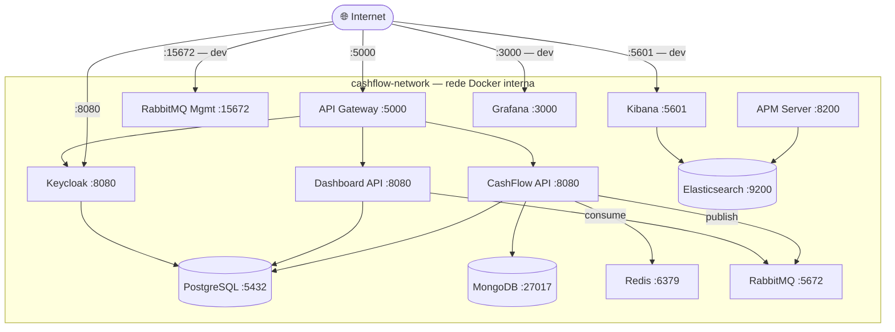
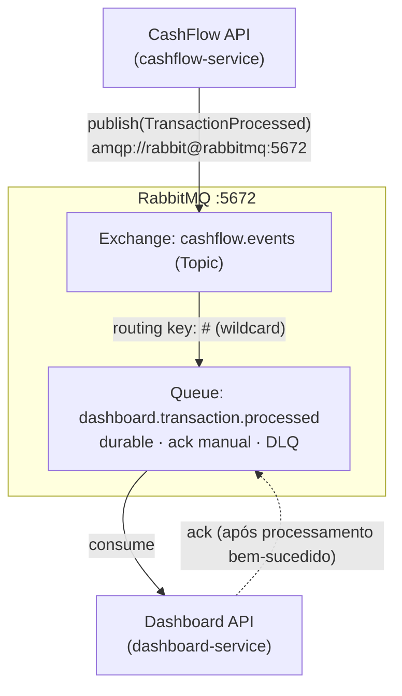
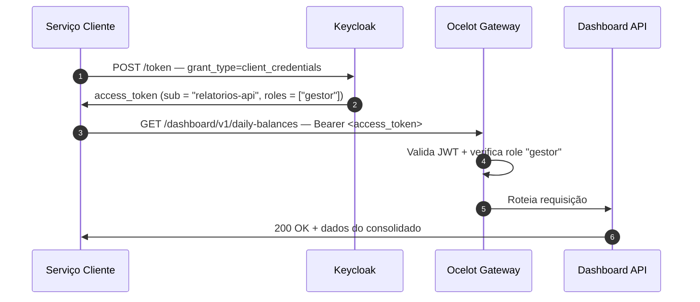
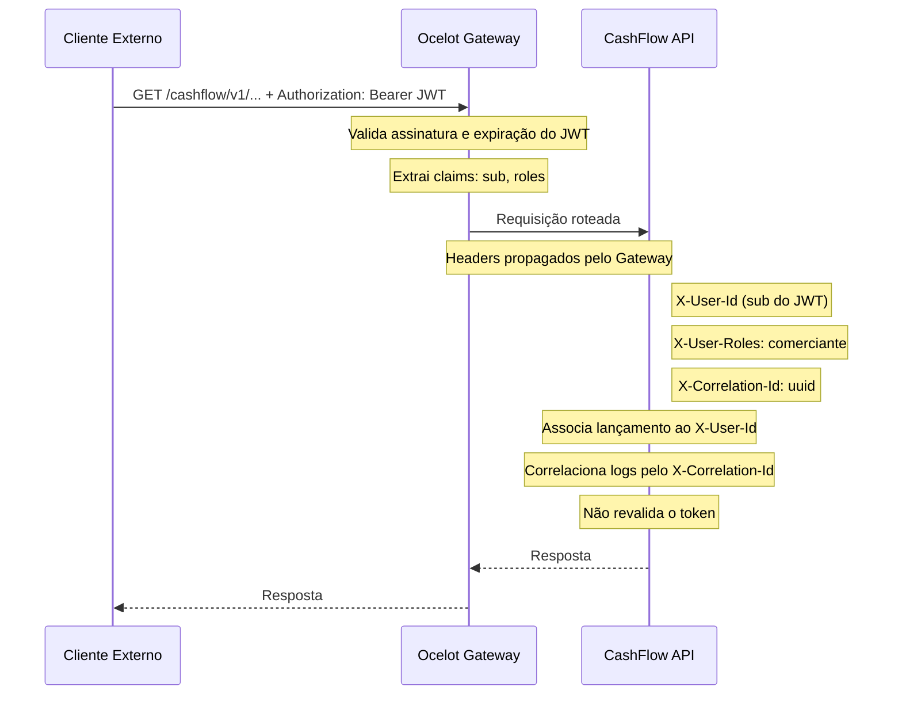

# Comunicação entre Serviços — M2M, Isolamento de Rede e Client Credentials

## Visão geral

Em uma arquitetura de microsserviços, o controle de acesso não se aplica apenas a usuários humanos — os próprios serviços precisam se autenticar uns com os outros. Este documento descreve como o isolamento de rede e a autenticação machine-to-machine (M2M) são gerenciados no sistema.

---

## Topologia de rede

Todos os serviços rodam na mesma rede Docker interna (`cashflow-network`). A segurança de rede é garantida por **não publicar as portas dos serviços downstream externamente**:



**Portas publicadas externamente** (mapeadas no `docker-compose.yml`):

| Serviço | Porta Externa | Porta Interna | Motivo |
|---|---|---|---|
| Gateway | 5000 | 5000 | Único ponto de entrada das APIs |
| Keycloak | 8080 | 8080 | UI de administração e OIDC discovery |
| CashFlow API | 5001 | 8080 | Acesso direto para testes em desenvolvimento |
| Dashboard API | 5002 | 8080 | Acesso direto para testes em desenvolvimento |
| RabbitMQ Management | 15672 | 15672 | UI de administração (apenas dev) |
| Kibana | 5601 | 5601 | Visualização de logs (apenas dev) |
| Grafana | 3000 | 3000 | Dashboards (apenas dev) |
| Elasticsearch | 9200 | 9200 | API REST (apenas dev) |
| Prometheus | 9090 | 9090 | UI de consulta (apenas dev) |

> **Importante:** Em **produção**, as portas das APIs (5001/5002), banco de dados, filas e observabilidade **não devem ser publicadas**. Apenas o Gateway (5000) e o Keycloak (8080) devem ser expostos externamente — preferencialmente atrás de um Load Balancer com TLS.

**Portas internas APENAS** (não publicadas mesmo em dev):

| Serviço | Porta Interna | Motivo |
|---|---|---|
| PostgreSQL | 5432 | Acessível apenas pelos serviços que precisam de banco |
| MongoDB | 27017 | Acessível apenas pela CashFlow API |
| Redis | 6379 | Acessível apenas pela CashFlow API |
| RabbitMQ AMQP | 5672 | Acessível apenas pelos produtores e consumidores |

> **Importante:** Em produção, as portas de administração (RabbitMQ Management, Kibana, Grafana) também devem ficar atrás de autenticação ou VPN, não expostas publicamente.

---

## Comunicação atual: CashFlow → Dashboard via RabbitMQ

A comunicação entre os dois serviços de negócio é **assíncrona via RabbitMQ** — os serviços não se chamam diretamente via HTTP.



### Autenticação no RabbitMQ

Em desenvolvimento, ambos os serviços usam as mesmas credenciais padrão do container RabbitMQ (`rabbit` / `rabbit`), injetadas via variáveis de ambiente no `docker-compose.yml`. Em produção, as credenciais devem ser diferenciadas por serviço e injetadas via secrets:

| Ambiente | Usuário RabbitMQ | Como injetar |
|---|---|---|
| Desenvolvimento | `rabbit` | Variável de ambiente no Compose |
| Produção (recomendado) | Usuário dedicado por serviço | Kubernetes Secrets / Vault |

Em produção, recomenda-se criar usuários dedicados `cashflow-service` e `dashboard-service` no RabbitMQ com permissões mínimas (publish / consume respectivamente), injetados via secrets gerenciados.

### Resiliência da fila

- Filas e mensagens configuradas como **durable** (persistência em disco)
- Consumo com **ack manual** — mensagem só é removida da fila após processamento bem-sucedido
- **Dead Letter Queue (DLQ)** para mensagens que falham repetidamente (não processadas após N tentativas)

---

## Comunicação M2M futura: Client Credentials Flow

Caso futuras integrações entre serviços precisem de comunicação HTTP síncrona (ex: um novo serviço de relatórios que consulta diretamente o Dashboard), o fluxo **Client Credentials** do OAuth 2.0 deve ser utilizado.

### Por que não reutilizar o token do usuário

Um serviço chamando outro serviço não representa um usuário — é uma comunicação entre sistemas. Repassar o token do usuário original seria:
- **Inseguro:** O serviço downstream não pode confiar que o token foi emitido para ele
- **Incorreto semanticamente:** O token representa um usuário, não um serviço

### Fluxo Client Credentials

> Diagrama de sequência completo: [`diagrams/client-credentials-m2m.mmd`](./diagrams/client-credentials-m2m.mmd)



### Configuração dos clients M2M no Keycloak

```
Client: relatorios-api
  Access Type: confidential
  Standard Flow Enabled: false
  Direct Access Grants Enabled: false
  Service Accounts Enabled: true     ← habilita Client Credentials
  
Service Account Roles:
  - gestor    ← apenas o necessário (princípio do mínimo privilégio)
```

### Princípio do mínimo privilégio

Cada serviço recebe apenas as permissões mínimas necessárias para sua função:

| Serviço | Roles M2M | Justificativa |
|---|---|---|
| `cashflow-api` | Nenhuma (apenas publica eventos) | Não precisa consumir outros serviços |
| `dashboard-api` | Nenhuma (apenas consome eventos) | Não precisa consumir outros serviços |
| `relatorios-api` (futuro) | `gestor` | Precisa ler consolidado diário |

---

## Propagação de contexto de usuário (User Context)

Quando o Gateway roteia uma requisição para uma API downstream, o contexto do usuário autenticado pode ser propagado via headers customizados:



> **Segurança:** Esses headers só devem ser aceitos pelas APIs quando vierem da rede Docker interna. Um cliente externo que tente injetar `X-User-Id` no header será bloqueado, pois a requisição passa pelo Gateway antes de chegar às APIs — e o Gateway sobrescreve esses headers com os valores do JWT validado.

### Configuração no Ocelot para propagação de claims

```json
{
  "AddHeadersToRequest": {
    "X-User-Id":    "Claims[sub] > value",
    "X-User-Roles": "Claims[roles] > value"
  }
}
```

---

## Referências

- [OAuth 2.0 — Client Credentials Grant (RFC 6749)](https://tools.ietf.org/html/rfc6749#section-4.4)
- [Keycloak — Service Accounts](https://www.keycloak.org/docs/latest/server_admin/#_service_accounts)
- [Ocelot — Headers Transformation](https://ocelot.readthedocs.io/en/latest/features/headerstransformation.html)
- [RabbitMQ — Access Control](https://www.rabbitmq.com/access-control.html)
- [OWASP — Microservices Security Cheat Sheet](https://cheatsheetseries.owasp.org/cheatsheets/Microservices_Security_Cheat_Sheet.html)
